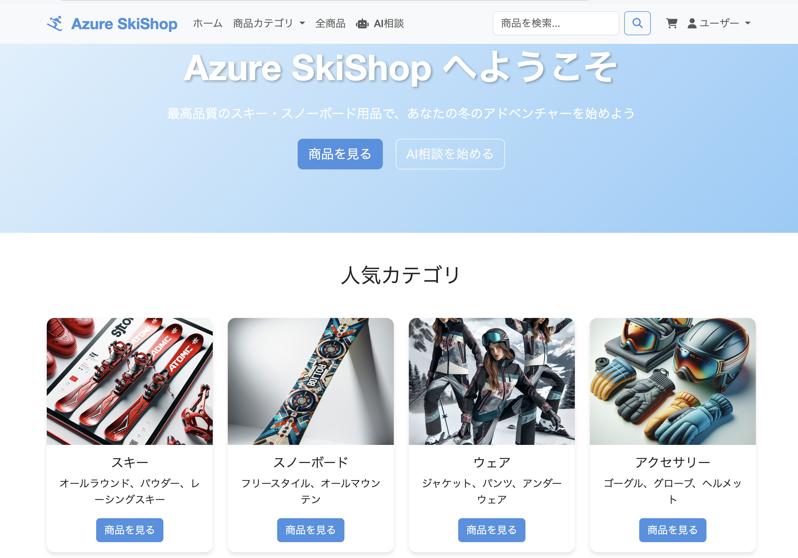

# スキー用品販売ショップ マイクロサービス

※ 未完成 : 現在全てを GitHub Copilot Agent Mode で実装する検証中

マイクロサービスアーキテクチャを採用したスキー用品Eコマースプラットフォームです。



## アーキテクチャ概要

本システムは以下の9つのマイクロサービスで構成されています：

### コアサービス
- **API Gateway** (Port: 8090) - 統一アクセスポイント、ルーティング、認証
- **Authentication Service** (Port: 8080) - 認証・認可管理
- **User Management Service** (Port: 8081) - ユーザー情報管理

### ビジネスサービス  
- **Inventory Management Service** (Port: 8082) - 商品・在庫管理
- **Sales Management Service** (Port: 8083) - 注文・販売管理
- **Payment & Cart Service** (Port: 8084) - 決済・カート処理
- **Point Service** (Port: 8085) - ポイント管理
- **Coupon Service** (Port: 8086) - クーポン管理
- **AI Support Service** (Port: 8087) - AI推奨・検索・チャットボット

### インフラサービス
- **PostgreSQL** (Port: 5432) - メインデータベース
- **Redis** (Port: 6379) - キャッシュ・セッション管理
- **Elasticsearch** (Port: 9200) - 検索・分析エンジン
- **Kafka** (Port: 9092) - イベントストリーミング
- **Prometheus** (Port: 9090) - メトリクス収集
- **Grafana** (Port: 3000) - 可視化ダッシュボード

## 技術スタック

- **言語**: Java 21 (LTS)
- **フレームワーク**: Spring Boot 3.2.3, Spring Cloud 2023.0.0
- **データベース**: PostgreSQL 15, Redis 7
- **メッセージング**: Apache Kafka
- **検索**: Elasticsearch 8.12
- **監視**: Prometheus & Grafana
- **コンテナ**: Docker & Docker Compose
- **ビルド**: Maven 3.9
- **テスト**: JUnit 5, Testcontainers

## 前提条件

- Docker Desktop
- Docker Compose
- Java 21 (開発用)
- Maven 3.9+ (開発用)

## 起動方法

### 1. リポジトリクローン
```bash
git clone <repository-url>
cd ski-shop-microservices
```

### 2. 環境変数設定
```bash
# .env ファイルを作成
cp .env.example .env

# 必要に応じて設定を編集
vim .env
```

### 3. 全サービス起動
```bash
# インフラサービスから起動
docker-compose up -d postgres redis kafka elasticsearch

# アプリケーションサービス起動
docker-compose up -d
```

### 4. 起動確認
```bash
# 全サービスの状態確認
docker-compose ps

# ログ確認
docker-compose logs -f api-gateway
```

## サービスエンドポイント

### API Gateway (メインエントリーポイント)
- **URL**: http://localhost:8090
- **Swagger UI**: http://localhost:8090/swagger-ui.html
- **Health Check**: http://localhost:8090/actuator/health

### 個別サービス
| サービス | URL | Swagger UI |
|---------|-----|-----------|
| Authentication | http://localhost:8080 | http://localhost:8080/swagger-ui.html |
| User Management | http://localhost:8081 | http://localhost:8081/swagger-ui.html |
| Inventory | http://localhost:8082 | http://localhost:8082/swagger-ui.html |
| Sales | http://localhost:8083 | http://localhost:8083/swagger-ui.html |
| Payment & Cart | http://localhost:8084 | http://localhost:8084/swagger-ui.html |
| Point | http://localhost:8085 | http://localhost:8085/swagger-ui.html |
| Coupon | http://localhost:8086 | http://localhost:8086/swagger-ui.html |
| AI Support | http://localhost:8087 | http://localhost:8087/swagger-ui.html |

### 監視・管理
- **Grafana**: http://localhost:3000 (admin/admin)
- **Prometheus**: http://localhost:9090
- **Elasticsearch**: http://localhost:9200

## API使用例

### 1. ユーザー登録
```bash
curl -X POST http://localhost:8090/api/users \
  -H "Content-Type: application/json" \
  -d '{
    "email": "test@example.com",
    "password": "Password123!",
    "confirmPassword": "Password123!",
    "firstName": "太郎",
    "lastName": "山田",
    "phoneNumber": "090-1234-5678"
  }'
```

### 2. ログイン
```bash
curl -X POST http://localhost:8090/api/auth/login \
  -H "Content-Type: application/json" \
  -d '{
    "email": "test@example.com",
    "password": "Password123!"
  }'
```

### 3. 商品検索
```bash
curl -X GET "http://localhost:8090/api/products/search?query=スキー板&page=0&size=10"
```

### 4. カートに商品追加
```bash
curl -X POST http://localhost:8090/api/cart/items \
  -H "Authorization: Bearer <JWT_TOKEN>" \
  -H "Content-Type: application/json" \
  -d '{
    "productId": "product-uuid",
    "quantity": 1,
    "size": "170cm"
  }'
```

## マルチモジュールMaven管理

本プロジェクトは、ルートディレクトリのpom.xmlでマルチモジュール構成を採用しています。

### ビルドコマンド

#### 全マイクロサービスのビルド

```bash
# プロジェクトルートディレクトリで実行
mvn clean compile
```

#### 全マイクロサービスのテスト

```bash
mvn clean test
```

#### 全マイクロサービスのパッケージング

```bash
mvn clean package
```

#### 特定のマイクロサービスのみビルド

```bash
# 特定のモジュールのみビルド
mvn clean compile -pl user-management-service

# 依存関係も含めてビルド
mvn clean compile -pl user-management-service -am
```

### プロファイル別ビルド

#### 開発環境（デフォルト）

```bash
mvn clean compile -Pdev
```

#### 本番環境

```bash
mvn clean compile -Pprod
```

#### Docker環境

```bash
mvn clean compile -Pdocker
```

#### テスト環境

```bash
mvn clean compile -Ptest
```

### 並列ビルド

```bash
# CPUコア数に応じて並列ビルド
mvn clean compile -T 1C

# 指定したスレッド数で並列ビルド
mvn clean compile -T 4
```

### JaCoCoカバレッジレポート生成

```bash
mvn clean test jacoco:report
```

レポートは各モジュールの `target/site/jacoco/index.html` で確認できます。

## 開発環境セットアップ

### 1. 個別サービス開発

```bash
# 特定のサービスを開発モードで起動
cd user-management-service
mvn spring-boot:run -Dspring-boot.run.profiles=local
```

### 2. テスト実行

```bash
# 単体テスト（全モジュール）
mvn clean test

# 統合テスト（全モジュール）
mvn clean failsafe:integration-test

# 特定のモジュールのみテスト
mvn clean test -pl user-management-service

# 全サービステスト
./scripts/run-tests.sh
```

### 3. コード品質チェック
```bash
# SonarQube分析
mvn sonar:sonar

# 依存関係脆弱性チェック
mvn dependency-check:check
```

## デプロイ

### Azure Container Apps デプロイ
```bash
# Azure CLI ログイン
az login

# リソースグループ作成
az group create --name ski-shop-rg --location japaneast

# Container Appsデプロイ
./scripts/deploy-azure.sh
```

### Kubernetes デプロイ
```bash
# Kubernetes クラスタにデプロイ
kubectl apply -f k8s/
```

## 監視とロギング

### メトリクス
- **Prometheus**: http://localhost:9090/targets
- **Grafana ダッシュボード**: 
  - システム概要: Dashboard ID 11074
  - Spring Boot アプリ: Dashboard ID 12900
  - JVM メトリクス: Dashboard ID 4701

### ログ
```bash
# 全サービスログ
docker-compose logs -f

# 特定サービスログ
docker-compose logs -f user-management-service

# エラーログフィルタ
docker-compose logs | grep ERROR
```

### 分散トレーシング
- **Jaeger UI**: http://localhost:16686 (有効化時)

## トラブルシューティング

### よくある問題

1. **サービス起動失敗**
   ```bash
   # ポート衝突確認
   lsof -i :8080
   
   # サービス再起動
   docker-compose restart authentication-service
   ```

2. **データベース接続エラー**
   ```bash
   # PostgreSQL接続確認
   docker-compose exec postgres psql -U skishop_user -d skishop_auth
   ```

3. **Kafka接続エラー**
   ```bash
   # Kafkaトピック確認
   docker-compose exec kafka kafka-topics --list --bootstrap-server localhost:9092
   ```

### ログレベル調整
```yaml
# application.yml
logging:
  level:
    com.skishop: DEBUG
    org.springframework.security: DEBUG
```

## 貢献方法

1. フォークを作成
2. フィーチャーブランチを作成 (`git checkout -b feature/amazing-feature`)
3. 変更をコミット (`git commit -m 'Add amazing feature'`)
4. ブランチにプッシュ (`git push origin feature/amazing-feature`)
5. プルリクエストを作成

## ライセンス

MIT License - 詳細は [LICENSE](LICENSE) ファイルを参照

## サポート

- **ドキュメント**: [Wiki](https://github.com/your-org/ski-shop/wiki)
- **Issues**: [GitHub Issues](https://github.com/your-org/ski-shop/issues)
- **Discussions**: [GitHub Discussions](https://github.com/your-org/ski-shop/discussions)
