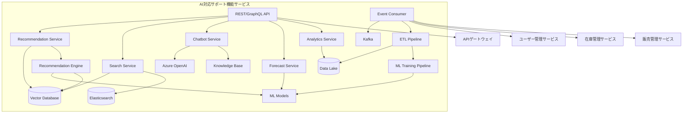
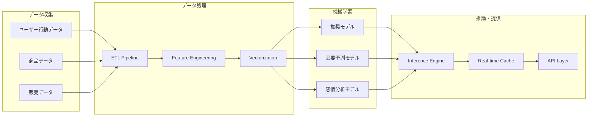
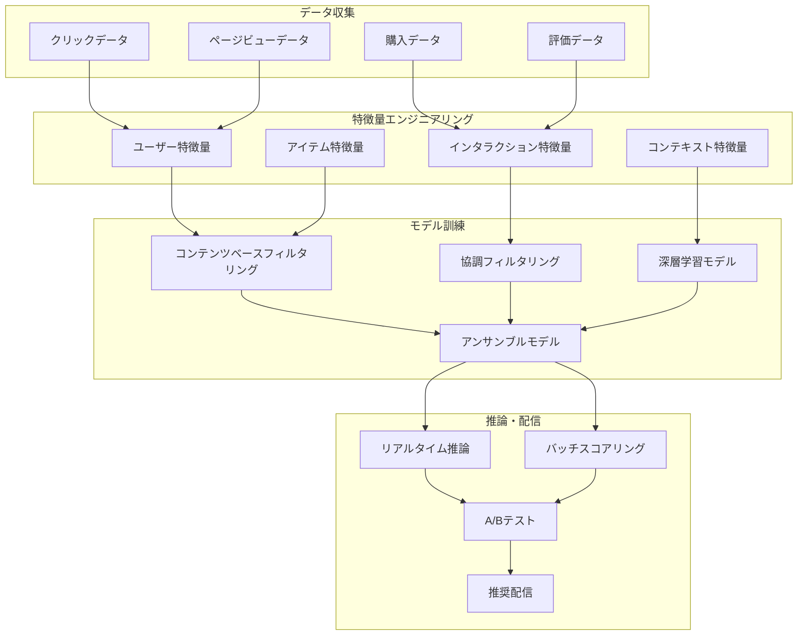
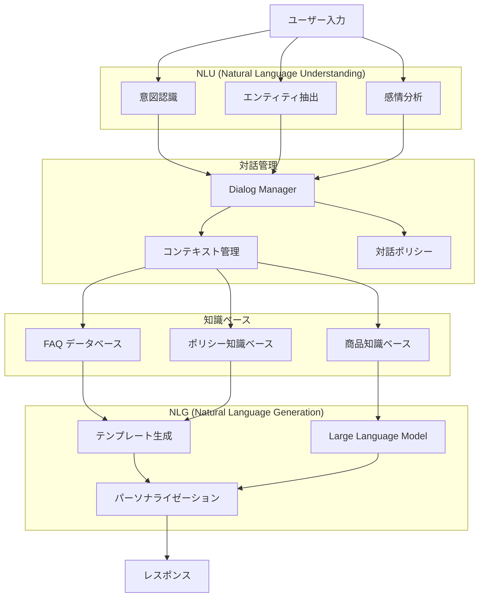

# AI対応サポート機能サービス 詳細設計書

## 1. 概要

AI対応サポート機能サービスは、Azure AI ServicesとAzure OpenAI Serviceを活用して、パーソナライズド商品推奨、検索最適化とオートコンプリート、チャットボットによる顧客サポート、需要予測、ユーザー行動分析の機能を提供するマイクロサービスです。機械学習とAI技術を組み合わせて、ユーザーエクスペリエンスの向上と業務効率化を実現します。

## 2. 技術スタック

### 開発環境

- **言語**: Java 21 (LTS)
- **フレームワーク**: Spring Boot 3.2.3
- **AI フレームワーク**: Spring AI 0.8.1
- **ビルドツール**: Maven 3.9.x
- **コンテナ化**: Docker 25.x
- **テスト**: JUnit 5.10.1、Spring Boot Test、Testcontainers 1.19.3

### 本番環境

- Azure Container Apps
- Azure OpenAI Service
- Azure AI Services
- Vector Database (Azure Cognitive Search)

### 主要ライブラリとバージョン

| ライブラリ | バージョン | 用途 |
|----------|----------|------|
| spring-ai-azure-openai-spring-boot-starter | 0.8.1 | Azure OpenAI Service 連携 |
| spring-boot-starter-web | 3.2.3 | REST API エンドポイント |
| spring-boot-starter-webflux | 3.2.3 | 非同期 HTTP クライアント |
| spring-boot-starter-data-mongodb | 3.2.3 | MongoDB データアクセス |
| spring-boot-starter-data-redis | 3.2.3 | Redis キャッシュ |
| spring-boot-starter-validation | 3.2.3 | 入力バリデーション |
| spring-boot-starter-security | 3.2.3 | セキュリティ設定 |
| spring-boot-starter-actuator | 3.2.3 | ヘルスチェック、メトリクス |
| spring-cloud-starter-stream-kafka | 4.1.0 | イベント発行・購読 |
| azure-ai-textanalytics | 5.4.0 | テキスト分析 |
| azure-ai-formrecognizer | 4.1.0 | フォーム認識 |
| azure-search-documents | 11.6.1 | Azure Cognitive Search |
| pinecone-client | 0.7.0 | Vector Database クライアント |
| sentence-transformers-java | 1.2.0 | 文章ベクトル化 |
| commons-csv | 1.10.0 | CSV データ処理 |
| mapstruct | 1.5.5.Final | オブジェクトマッピング |
| lombok | 1.18.30 | ボイラープレートコード削減 |
| micrometer-registry-prometheus | 1.12.2 | メトリクス収集 |
| springdoc-openapi-starter-webmvc-ui | 2.3.0 | API 文書化 |
| azure-identity | 1.11.1 | Azure 認証 |
| azure-security-keyvault-secrets | 4.6.2 | Azure Key Vault 連携 |
| azure-monitor-opentelemetry | 1.0.0-beta.15 | Azure 監視連携 |
| logback-json-classic | 0.1.5 | JSON 形式ログ出力 |

## 3. システム構成

### コンポーネント構成図



### AI パイプライン構成



## 4. データモデル

### データ構造設計

#### ユーザープロファイル

```json
{
  "userId": "550e8400-e29b-41d4-a716-446655440000",
  "demographics": {
    "ageGroup": "30-40",
    "gender": "MALE",
    "location": "Tokyo"
  },
  "preferences": {
    "categories": ["ski", "snowboard", "winter-sports"],
    "brands": ["atomic", "rossignol", "salomon"],
    "priceRange": {
      "min": 10000,
      "max": 100000
    },
    "skillLevel": "INTERMEDIATE"
  },
  "behaviorData": {
    "lastActiveDate": "2024-06-19T10:30:00Z",
    "sessionCount": 45,
    "avgSessionDuration": 1200,
    "viewedProducts": ["prod-001", "prod-002"],
    "purchaseHistory": ["order-001", "order-002"],
    "searchHistory": ["ski boots", "winter jacket"]
  },
  "embeddings": {
    "userVector": [0.1, 0.2, -0.3, ...],
    "lastUpdated": "2024-06-19T10:30:00Z"
  }
}
```

#### 商品ベクトル

```json
{
  "productId": "prod-001",
  "productInfo": {
    "name": "Atomic Bent 100 Ski",
    "category": "ski",
    "brand": "atomic",
    "price": 65000,
    "attributes": {
      "length": "180cm",
      "width": "100mm",
      "skillLevel": "intermediate-advanced"
    }
  },
  "embeddings": {
    "contentVector": [0.4, -0.2, 0.8, ...],
    "collaborativeVector": [0.1, 0.6, -0.4, ...],
    "hybridVector": [0.25, 0.2, 0.2, ...]
  },
  "statistics": {
    "viewCount": 1500,
    "purchaseCount": 120,
    "avgRating": 4.5,
    "conversionRate": 0.08
  },
  "lastUpdated": "2024-06-19T10:30:00Z"
}
```

#### チャットボット会話履歴

```json
{
  "conversationId": "conv-001",
  "userId": "550e8400-e29b-41d4-a716-446655440000",
  "sessionId": "session-001",
  "messages": [
    {
      "messageId": "msg-001",
      "timestamp": "2024-06-19T10:30:00Z",
      "role": "USER",
      "content": "初心者向けのスキー板を探しています",
      "intent": "PRODUCT_SEARCH",
      "entities": {
        "skillLevel": "BEGINNER",
        "productCategory": "SKI"
      }
    },
    {
      "messageId": "msg-002",
      "timestamp": "2024-06-19T10:30:05Z",
      "role": "ASSISTANT",
      "content": "初心者の方におすすめのスキー板をご紹介いたします...",
      "intent": "PRODUCT_RECOMMENDATION",
      "confidence": 0.95,
      "context": {
        "recommendedProducts": ["prod-005", "prod-012"],
        "searchFilters": {
          "skillLevel": "BEGINNER",
          "priceRange": {"max": 50000}
        }
      }
    }
  ],
  "status": "ACTIVE",
  "satisfaction": 4.0
}
```

## 5. API設計

### REST APIエンドポイント

#### 推奨システム API

| メソッド | パス | 説明 | 認証要件 |
|---------|-----|------|---------|
| GET | /api/v1/recommendations/{userId} | ユーザー向け商品推奨 | 要認証 |
| GET | /api/v1/recommendations/similar/{productId} | 類似商品推奨 | 不要 |
| GET | /api/v1/recommendations/trending | トレンド商品推奨 | 不要 |
| POST | /api/v1/recommendations/feedback | 推奨フィードバック記録 | 要認証 |
| GET | /api/v1/recommendations/explain/{userId}/{productId} | 推奨理由説明 | 要認証 |

#### 検索拡張 API

| メソッド | パス | 説明 | 認証要件 |
|---------|-----|------|---------|
| GET | /api/v1/search/suggest | 検索サジェスト | 不要 |
| POST | /api/v1/search/semantic | セマンティック検索 | 不要 |
| GET | /api/v1/search/autocomplete | オートコンプリート | 不要 |
| POST | /api/v1/search/visual | 画像検索 | 不要 |

#### チャットボット API

| メソッド | パス | 説明 | 認証要件 |
|---------|-----|------|---------|
| POST | /api/v1/chat/message | メッセージ送信 | 要認証 |
| GET | /api/v1/chat/conversations/{userId} | 会話履歴取得 | 要認証 |
| DELETE | /api/v1/chat/conversations/{conversationId} | 会話削除 | 要認証 |
| POST | /api/v1/chat/feedback | チャット評価 | 要認証 |

#### 分析・予測 API

| メソッド | パス | 説明 | 認証要件 |
|---------|-----|------|---------|
| GET | /api/v1/analytics/user-behavior/{userId} | ユーザー行動分析 | 要認証（管理者） |
| GET | /api/v1/forecast/demand/{productId} | 需要予測 | 要認証（管理者） |
| GET | /api/v1/analytics/sentiment/{productId} | 商品感情分析 | 要認証（管理者） |
| GET | /api/v1/analytics/trends | トレンド分析 | 要認証（管理者） |

### リクエスト・レスポンス例

#### 推奨API レスポンス

```json
{
  "userId": "550e8400-e29b-41d4-a716-446655440000",
  "requestId": "req-12345",
  "timestamp": "2024-06-19T10:30:00Z",
  "recommendations": [
    {
      "productId": "prod-001",
      "name": "Atomic Bent 100 Ski",
      "score": 0.95,
      "reason": "あなたの過去の購入履歴とスキルレベルに基づいてお勧めします",
      "category": "ski",
      "price": 65000,
      "imageUrl": "https://storage.skieshop.com/products/atomic-bent-100.jpg",
      "inStock": true,
      "context": {
        "algorithm": "hybrid",
        "factors": ["purchase_history", "skill_level", "price_preference"]
      }
    },
    {
      "productId": "prod-002",
      "name": "Rossignol Experience 88",
      "score": 0.87,
      "reason": "同じスキルレベルのユーザーに人気の商品です",
      "category": "ski",
      "price": 58000,
      "imageUrl": "https://storage.skieshop.com/products/rossignol-exp88.jpg",
      "inStock": true,
      "context": {
        "algorithm": "collaborative_filtering",
        "factors": ["collaborative", "trending"]
      }
    }
  ],
  "metadata": {
    "totalRecommendations": 10,
    "page": 1,
    "pageSize": 5,
    "algorithmVersion": "2.1.0",
    "diversityScore": 0.75
  }
}
```

#### チャットボット API レスポンス

```json
{
  "conversationId": "conv-001",
  "messageId": "msg-002",
  "timestamp": "2024-06-19T10:30:05Z",
  "response": {
    "text": "初心者の方におすすめのスキー板をご紹介いたします。まず、スキーのレンタルから始めることをお勧めしますが、購入をご希望でしたら以下の商品はいかがでしょうか：",
    "suggestedActions": [
      {
        "type": "PRODUCT_RECOMMENDATION",
        "title": "おすすめ商品を見る",
        "payload": {
          "products": ["prod-005", "prod-012", "prod-018"]
        }
      },
      {
        "type": "CATEGORY_BROWSE",
        "title": "初心者向けスキー板を見る",
        "payload": {
          "categoryId": "ski-beginner"
        }
      }
    ],
    "quickReplies": [
      "価格帯を教えて",
      "レンタルについて知りたい",
      "サイズの選び方を教えて"
    ]
  },
  "intent": {
    "name": "PRODUCT_SEARCH",
    "confidence": 0.95,
    "entities": {
      "skillLevel": "BEGINNER",
      "productCategory": "SKI"
    }
  },
  "context": {
    "conversationState": "PRODUCT_DISCOVERY",
    "userProfile": {
      "isNewUser": true,
      "previousConversations": 0
    }
  }
}
```

## 6. 機械学習パイプライン

### 推奨システムアーキテクチャ



### モデル学習プロセス

#### 1. コンテンツベースフィルタリング

```python
# 商品特徴量ベクトルの作成
def create_item_features(product):
    features = {
        'category_vector': one_hot_encode(product.category),
        'brand_vector': one_hot_encode(product.brand),
        'price_normalized': normalize_price(product.price),
        'attribute_vector': vectorize_attributes(product.attributes),
        'description_embedding': sentence_transformer(product.description)
    }
    return concatenate(features)

# ユーザープロファイルベクトルの作成
def create_user_profile(user_interactions):
    weighted_items = []
    for interaction in user_interactions:
        weight = get_interaction_weight(interaction.type)  # view: 1, cart: 3, purchase: 5
        item_vector = create_item_features(interaction.product)
        weighted_items.append(item_vector * weight)
    
    return mean(weighted_items)
```

#### 2. 協調フィルタリング（行列分解）

```python
# Matrix Factorization using ALS (Alternating Least Squares)
def train_collaborative_filtering(interactions_matrix):
    model = ALSModel(
        factors=100,
        regularization=0.01,
        iterations=15,
        alpha=40
    )
    
    user_factors, item_factors = model.fit(interactions_matrix)
    return user_factors, item_factors
```

#### 3. ハイブリッドモデル

```python
def hybrid_recommendation(user_id, content_score, collaborative_score, context):
    # コンテキストに基づく重み調整
    content_weight = get_content_weight(context)
    collaborative_weight = 1 - content_weight
    
    # スコアの正規化
    content_score_norm = min_max_normalize(content_score)
    collaborative_score_norm = min_max_normalize(collaborative_score)
    
    # ハイブリッドスコア計算
    hybrid_score = (content_weight * content_score_norm + 
                   collaborative_weight * collaborative_score_norm)
    
    # 多様性の確保
    diversified_recommendations = diversity_injection(hybrid_score, alpha=0.3)
    
    return diversified_recommendations
```

### モデル評価指標

| 指標 | 説明 | 目標値 |
|------|------|-------|
| Precision@K | 上位K件の的中率 | > 0.15 |
| Recall@K | 上位K件の再現率 | > 0.25 |
| NDCG@K | 正規化割引累積利得 | > 0.3 |
| Diversity | 推奨商品の多様性 | > 0.6 |
| Coverage | カタログカバレッジ | > 0.8 |
| Novelty | 新規性スコア | > 0.4 |
| Click-through Rate | クリック率 | > 0.05 |
| Conversion Rate | コンバージョン率 | > 0.02 |

## 7. 自然言語処理とチャットボット

### 対話システムアーキテクチャ



### 意図認識とエンティティ抽出

#### 意図定義

```yaml
intents:
  - name: PRODUCT_SEARCH
    examples:
      - "スキー板を探しています"
      - "初心者向けのブーツはありますか"
      - "赤いジャケットを見つけたい"
    
  - name: PRICE_INQUIRY
    examples:
      - "この商品の価格は？"
      - "セール情報を教えて"
      - "割引はありますか"
    
  - name: SIZE_GUIDE
    examples:
      - "サイズの選び方を教えて"
      - "175cmの場合は何センチのスキー板？"
      - "足のサイズが26cmです"
    
  - name: ORDER_STATUS
    examples:
      - "注文状況を確認したい"
      - "いつ届きますか"
      - "配送状況は？"

entities:
  - name: PRODUCT_CATEGORY
    values:
      - ski: ["スキー板", "スキー", "板"]
      - boots: ["ブーツ", "靴", "シューズ"]
      - jacket: ["ジャケット", "ウェア", "上着"]
  
  - name: SKILL_LEVEL
    values:
      - beginner: ["初心者", "ビギナー", "はじめて"]
      - intermediate: ["中級者", "中級", "普通"]
      - advanced: ["上級者", "上級", "エキスパート"]
  
  - name: SIZE
    patterns:
      - "[0-9]+cm"
      - "[0-9]+センチ"
      - "サイズ[0-9]+"
```

### Azure OpenAI Service統合

```java
@Service
@RequiredArgsConstructor
public class ChatbotService {
    
    private final AzureOpenAiChatClient chatClient;
    private final ConversationRepository conversationRepository;
    private final ProductService productService;
    
    public ChatResponse processMessage(String userId, String message, String conversationId) {
        // 会話コンテキストの取得
        Conversation conversation = getOrCreateConversation(userId, conversationId);
        
        // 意図とエンティティの抽出
        NluResult nluResult = extractIntentAndEntities(message);
        
        // コンテキスト構築
        ChatContext context = buildChatContext(conversation, nluResult);
        
        // Azure OpenAI Service呼び出し
        String systemPrompt = buildSystemPrompt(context);
        List<Message> messages = buildMessageHistory(conversation, message);
        
        ChatRequest request = ChatRequest.builder()
            .model("gpt-4")
            .messages(messages)
            .temperature(0.7)
            .maxTokens(500)
            .build();
        
        ChatResponse response = chatClient.call(request);
        
        // 会話履歴の保存
        saveConversationTurn(conversation, message, response.getResult().getOutput().getContent(), nluResult);
        
        // レスポンス強化（商品情報、アクション等）
        return enhanceResponse(response, context);
    }
    
    private String buildSystemPrompt(ChatContext context) {
        return """
            あなたはスキー用品専門店のAIアシスタントです。
            以下のガイドラインに従って回答してください：
            
            1. 丁寧で親しみやすい日本語で応答する
            2. 商品に関する質問には具体的な商品情報を提供する
            3. 初心者には親切で詳しい説明を行う
            4. 価格に関する質問には正確な情報を提供する
            5. 在庫がない場合は代替商品を提案する
            
            ユーザープロファイル：
            - スキルレベル: %s
            - 過去の購入: %s
            - 価格帯: %s
            
            利用可能な商品カテゴリ: スキー板、ブーツ、ウェア、アクセサリー
            """.formatted(
                context.getUserSkillLevel(),
                context.getPurchaseHistory(),
                context.getPriceRange()
            );
    }
}
```

## 8. イベント駆動アーキテクチャ

### イベント購読

| イベント | ソース | アクション |
|---------|--------|----------|
| UserRegistered | ユーザー管理サービス | 新規ユーザープロファイル作成 |
| ProductViewed | 在庫管理サービス | ユーザー行動データ更新 |
| ProductPurchased | 販売管理サービス | 購入履歴更新、推奨モデル再訓練トリガー |
| CartUpdated | カート処理サービス | リアルタイム推奨更新 |
| SearchPerformed | Webフロントエンド | 検索パターン分析 |

### イベント発行

| イベント | 説明 | ペイロード |
|---------|------|-----------|
| RecommendationGenerated | 推奨生成完了 | ユーザーID、推奨商品リスト、スコア |
| ChatbotInteraction | チャットボット対話 | ユーザーID、会話ID、意図、満足度 |
| ModelRetrained | モデル再訓練完了 | モデル名、バージョン、性能指標 |
| AnomalyDetected | 異常検知 | 異常タイプ、詳細情報、重要度 |

### イベント処理例

```java
@Component
@RequiredArgsConstructor
public class UserBehaviorEventHandler {
    
    private final UserProfileService userProfileService;
    private final RecommendationService recommendationService;
    private final VectorDatabaseService vectorDatabaseService;
    
    @KafkaListener(topics = "product-viewed", groupId = "ai-service")
    public void handleProductViewed(ProductViewedEvent event) {
        // ユーザー行動データの更新
        userProfileService.updateViewHistory(event.getUserId(), event.getProductId());
        
        // リアルタイム推奨の更新
        List<Recommendation> updatedRecommendations = 
            recommendationService.generateRealTimeRecommendations(event.getUserId());
        
        // ベクトルデータベースの更新
        vectorDatabaseService.updateUserVector(event.getUserId(), event.getProductId());
        
        log.info("Processed product view event: userId={}, productId={}", 
                event.getUserId(), event.getProductId());
    }
    
    @KafkaListener(topics = "order-completed", groupId = "ai-service")
    public void handleOrderCompleted(OrderCompletedEvent event) {
        // 購入履歴の更新
        userProfileService.updatePurchaseHistory(event.getUserId(), event.getOrderItems());
        
        // 協調フィルタリングモデルのオンライン更新
        recommendationService.updateCollaborativeModel(event.getUserId(), event.getOrderItems());
        
        // 商品人気度の更新
        event.getOrderItems().forEach(item -> 
            vectorDatabaseService.updateProductPopularity(item.getProductId()));
        
        log.info("Processed order completion event: userId={}, orderId={}", 
                event.getUserId(), event.getOrderId());
    }
}
```

## 9. セキュリティ設計

### データプライバシー

- **個人データの匿名化**：
  - ユーザーIDのハッシュ化
  - 行動データの集約と匿名化
  - k-匿名性の確保

- **モデルプライバシー**：
  - 差分プライバシーの適用
  - フェデレーテッドラーニングの検討
  - モデル逆算攻撃対策

### AIの公平性と倫理

- **バイアス検出と軽減**：
  - 推奨結果の公平性監査
  - 属性別性能格差の測定
  - アルゴリズムの透明性確保

- **説明可能AI**：
  - 推奨理由の可視化
  - モデル決定プロセスの説明
  - ユーザーフィードバックの活用

## 10. パフォーマンス最適化

### リアルタイム推論最適化

- **モデル軽量化**：
  - 知識蒸留によるモデル圧縮
  - 量子化とプルーニング
  - ONNXモデルの活用

- **推論キャッシュ**：
  - ユーザー別推奨結果のキャッシュ (TTL: 1時間)
  - 商品類似度の事前計算
  - ホットキーパターンの最適化

### スケーリング戦略

```yaml
scaling:
  recommendation_service:
    min_replicas: 2
    max_replicas: 10
    target_cpu: 70%
    target_memory: 80%
  
  chatbot_service:
    min_replicas: 1
    max_replicas: 5
    target_cpu: 60%
    
  vector_database:
    sharding_strategy: "user_based"
    replication_factor: 3
    
  model_serving:
    gpu_enabled: true
    batch_size: 32
    timeout: 2000ms
```

## 11. 監視とメトリクス

### ビジネスメトリクス

| メトリクス | 説明 | 目標値 |
|-----------|------|-------|
| Recommendation CTR | 推奨クリック率 | > 3% |
| Recommendation CVR | 推奨コンバージョン率 | > 1.5% |
| Chatbot Resolution Rate | チャットボット解決率 | > 80% |
| User Satisfaction | ユーザー満足度 | > 4.0/5.0 |
| Model Accuracy | モデル精度 | > 85% |

### 技術メトリクス

| メトリクス | 説明 | 目標値 |
|-----------|------|-------|
| Model Inference Latency | モデル推論遅延 | < 100ms |
| Vector Search Latency | ベクトル検索遅延 | < 50ms |
| API Response Time | API応答時間 | < 200ms |
| Cache Hit Rate | キャッシュヒット率 | > 85% |
| Error Rate | エラー率 | < 1% |

### アラート設定

```yaml
alerts:
  - name: "High Recommendation Latency"
    condition: "avg(recommendation_latency) > 200ms for 5m"
    severity: "warning"
    
  - name: "Model Accuracy Degradation"
    condition: "model_accuracy < 0.8"
    severity: "critical"
    
  - name: "Chatbot Error Rate High"
    condition: "chatbot_error_rate > 0.05 for 10m"
    severity: "warning"
    
  - name: "Vector Database Down"
    condition: "vector_db_health == 0"
    severity: "critical"
```

## 12. テスト戦略

### A/Bテストフレームワーク

```java
@Service
@RequiredArgsConstructor
public class ExperimentService {
    
    private final ExperimentRepository experimentRepository;
    private final UserSegmentService userSegmentService;
    
    public String getExperimentVariant(String userId, String experimentName) {
        Experiment experiment = experimentRepository.findByName(experimentName);
        
        if (!experiment.isActive()) {
            return experiment.getControlVariant();
        }
        
        // ユーザーセグメンテーション
        UserSegment segment = userSegmentService.getUserSegment(userId);
        if (!experiment.isEligibleSegment(segment)) {
            return experiment.getControlVariant();
        }
        
        // ハッシュベース割り当て
        int hash = (userId + experimentName).hashCode();
        double ratio = Math.abs(hash % 100) / 100.0;
        
        return experiment.getVariantByRatio(ratio);
    }
    
    public void trackConversion(String userId, String experimentName, String variant, 
                               String conversionType, double value) {
        ExperimentEvent event = ExperimentEvent.builder()
            .userId(userId)
            .experimentName(experimentName)
            .variant(variant)
            .conversionType(conversionType)
            .value(value)
            .timestamp(Instant.now())
            .build();
        
        experimentEventRepository.save(event);
    }
}
```

### モデル性能テスト

```java
@SpringBootTest
@Testcontainers
class RecommendationModelTest {
    
    @Container
    static PostgreSQLContainer<?> postgres = new PostgreSQLContainer<>("postgres:16")
            .withDatabaseName("test_ai_db")
            .withUsername("test")
            .withPassword("test");
    
    @Autowired
    private RecommendationService recommendationService;
    
    @Test
    void testRecommendationPrecision() {
        // テストデータの準備
        List<UserInteraction> testData = createTestData();
        
        // 推奨生成
        List<Recommendation> recommendations = 
            recommendationService.generateRecommendations("test-user", 10);
        
        // 精度計算
        double precision = calculatePrecision(recommendations, testData);
        
        assertThat(precision).isGreaterThan(0.15);
    }
    
    @Test
    void testModelLatency() {
        long startTime = System.currentTimeMillis();
        
        recommendationService.generateRecommendations("test-user", 10);
        
        long latency = System.currentTimeMillis() - startTime;
        
        assertThat(latency).isLessThan(100);
    }
}
```

## 13. デプロイメント

### Dockerfile

```dockerfile
FROM eclipse-temurin:21-jre-alpine

WORKDIR /app

# Python環境のセットアップ（ML関連ライブラリ用）
RUN apk add --no-cache python3 py3-pip

# Python依存関係のインストール
COPY requirements.txt .
RUN pip3 install --no-cache-dir -r requirements.txt

# JAR ファイルのコピー
COPY build/libs/ai-support-service-*.jar app.jar

# モデルファイルのコピー
COPY models/ /app/models/

ENV JAVA_OPTS="-Xms1g -Xmx2g -XX:+UseG1GC -XX:+UseContainerSupport"
ENV PYTHONPATH="/app/ml"

EXPOSE 8084

HEALTHCHECK --interval=30s --timeout=10s --retries=3 \
  CMD wget -q --spider http://localhost:8084/actuator/health || exit 1

ENTRYPOINT ["sh", "-c", "java $JAVA_OPTS -jar app.jar"]
```

### Kubernetes Deployment

```yaml
apiVersion: apps/v1
kind: Deployment
metadata:
  name: ai-support-service
  labels:
    app: ai-support-service
spec:
  replicas: 2
  selector:
    matchLabels:
      app: ai-support-service
  template:
    metadata:
      labels:
        app: ai-support-service
    spec:
      containers:
      - name: ai-support-service
        image: ${ACR_NAME}.azurecr.io/ai-support-service:${IMAGE_TAG}
        ports:
        - containerPort: 8084
        env:
        - name: SPRING_PROFILES_ACTIVE
          value: "prod"
        - name: AZURE_OPENAI_ENDPOINT
          valueFrom:
            secretKeyRef:
              name: ai-service-secrets
              key: openai-endpoint
        - name: AZURE_OPENAI_API_KEY
          valueFrom:
            secretKeyRef:
              name: ai-service-secrets
              key: openai-api-key
        - name: PINECONE_API_KEY
          valueFrom:
            secretKeyRef:
              name: ai-service-secrets
              key: pinecone-api-key
        - name: MONGODB_URI
          valueFrom:
            secretKeyRef:
              name: ai-service-secrets
              key: mongodb-uri
        resources:
          limits:
            cpu: "2"
            memory: "4Gi"
            nvidia.com/gpu: "1"
          requests:
            cpu: "1"
            memory: "2Gi"
        readinessProbe:
          httpGet:
            path: /actuator/health/readiness
            port: 8084
          initialDelaySeconds: 45
          periodSeconds: 10
        livenessProbe:
          httpGet:
            path: /actuator/health/liveness
            port: 8084
          initialDelaySeconds: 90
          periodSeconds: 30
        volumeMounts:
        - name: model-storage
          mountPath: /app/models
      volumes:
      - name: model-storage
        persistentVolumeClaim:
          claimName: ai-models-pvc
---
apiVersion: v1
kind: Service
metadata:
  name: ai-support-service
spec:
  selector:
    app: ai-support-service
  ports:
  - port: 80
    targetPort: 8084
  type: ClusterIP
```

## 14. 運用・保守

### モデルライフサイクル管理

```python
# MLOps パイプライン
class ModelLifecycleManager:
    def __init__(self):
        self.model_registry = ModelRegistry()
        self.experiment_tracker = ExperimentTracker()
        
    def train_model(self, model_type: str, training_data: DataFrame):
        # 実験開始
        experiment = self.experiment_tracker.start_experiment(
            name=f"{model_type}_training_{datetime.now().strftime('%Y%m%d_%H%M%S')}"
        )
        
        # データ前処理
        processed_data = preprocess_data(training_data)
        
        # モデル訓練
        model = self.train_recommendation_model(processed_data)
        
        # モデル評価
        metrics = self.evaluate_model(model, processed_data)
        
        # しきい値チェック
        if metrics['precision'] > 0.15 and metrics['recall'] > 0.25:
            # モデル登録
            model_version = self.model_registry.register_model(
                model=model,
                metrics=metrics,
                experiment_id=experiment.id
            )
            
            # A/Bテスト開始
            self.start_ab_test(model_version)
            
        return model_version
    
    def deploy_model(self, model_version: str):
        # モデルダウンロード
        model = self.model_registry.load_model(model_version)
        
        # カナリアデプロイ
        deployment = self.deploy_canary(model, traffic_percentage=10)
        
        # パフォーマンス監視
        metrics = self.monitor_deployment(deployment, duration_minutes=60)
        
        if metrics['latency_p95'] < 100 and metrics['error_rate'] < 0.01:
            # 全トラフィックにロールアウト
            self.deploy_full(deployment)
        else:
            # ロールバック
            self.rollback_deployment(deployment)
```

### 継続的改善プロセス

| 活動 | 頻度 | 責任者 |
|------|------|-------|
| モデル性能評価 | 週次 | データサイエンティスト |
| A/Bテスト結果分析 | 週次 | プロダクトマネージャー |
| データ品質チェック | 日次 | データエンジニア |
| ユーザーフィードバック分析 | 月次 | UXリサーチャー |
| モデル再訓練 | 月次または性能低下時 | MLエンジニア |
| アルゴリズム改善 | 四半期 | データサイエンティスト |

## 15. 開発環境セットアップ

### ローカル開発環境

```bash
# リポジトリクローン
git clone https://github.com/example/ski-shop-ai-service.git
cd ski-shop-ai-service

# Python環境セットアップ
python -m venv venv
source venv/bin/activate  # Windows: venv\Scripts\activate
pip install -r requirements.txt

# Java依存関係インストール
mvn dependency:resolve

# Docker Composeで依存サービス起動
docker-compose -f docker-compose.dev.yml up -d

# 環境変数設定
cp .env.example .env
# .envファイルを編集してAPI キーを設定

# アプリケーション実行
mvn spring-boot:run -Dspring-boot.run.arguments="--spring.profiles.active=dev"
```

### Docker Compose設定（開発用）

```yaml
version: '3.8'

services:
  mongodb:
    image: mongo:7
    container_name: ai-mongodb
    environment:
      MONGO_INITDB_ROOT_USERNAME: ai_user
      MONGO_INITDB_ROOT_PASSWORD: ai_pass
    ports:
      - "27018:27017"
    volumes:
      - ai-mongo-data:/data/db

  redis:
    image: redis:7.2-alpine
    container_name: ai-redis
    ports:
      - "6380:6379"
    volumes:
      - ai-redis-data:/data

  elasticsearch:
    image: elasticsearch:8.12.0
    container_name: ai-elasticsearch
    environment:
      - discovery.type=single-node
      - xpack.security.enabled=false
      - "ES_JAVA_OPTS=-Xms1g -Xmx1g"
    ports:
      - "9201:9200"
    volumes:
      - ai-es-data:/usr/share/elasticsearch/data

  pinecone-mock:
    image: wiremock/wiremock:latest
    container_name: pinecone-mock
    ports:
      - "8090:8080"
    volumes:
      - ./wiremock/pinecone:/home/wiremock

  jupyter:
    image: jupyter/datascience-notebook:latest
    container_name: ai-jupyter
    ports:
      - "8888:8888"
    volumes:
      - ./notebooks:/home/jovyan/work
    environment:
      JUPYTER_ENABLE_LAB: "yes"

volumes:
  ai-mongo-data:
  ai-redis-data:
  ai-es-data:
```

## 16. 今後の拡張計画

### 短期的な拡張（3-6ヶ月）

- **マルチモーダルAI**：
  - 画像と テキストを組み合わせた商品検索
  - 音声によるチャットボット操作
  - 動画コンテンツの自動分析

- **リアルタイム パーソナライゼーション**：
  - セッション内での動的推奨更新
  - ページ滞在時間に基づく関心度推定
  - リアルタイム価格最適化連携

### 中長期的な拡張（6-12ヶ月）

- **説明可能AI（XAI）**：
  - 推奨理由の詳細な説明機能
  - モデル決定過程の可視化
  - ユーザーが理解しやすい説明文の生成

- **フェデレーテッドラーニング**：
  - プライバシー保護学習の実装
  - 複数テナント間でのモデル共有
  - エッジデバイスでの推論実行

### 長期的な拡張（12ヶ月以上）

- **AGI統合**：
  - より高度な推論能力を持つAIエージェント
  - 複雑な顧客要求の理解と対応
  - 予測的顧客サービス

- **メタバース対応**：
  - 3D空間での商品推奨
  - 仮想試着とAI推奨の組み合わせ
  - VR/AR環境での対話型ショッピング

## 17. 参考資料とドキュメント

### 内部文書
- モデル設計書: `/docs/models/`
- API仕様書: `/docs/api/`
- 運用手順書: `/docs/operations/`

### 外部リソース
- Azure OpenAI Service: <https://docs.microsoft.com/azure/cognitive-services/openai/>
- Spring AI: <https://docs.spring.io/spring-ai/docs/current/reference/html/>
- Pinecone Documentation: <https://docs.pinecone.io/>

### 開発ツール
- モデル実験環境: Jupyter Notebook (<http://localhost:8888>)
- API テスト: Swagger UI (<http://localhost:8084/swagger-ui.html>)
- 監視ダッシュボード: Grafana (<http://localhost:3000>)
