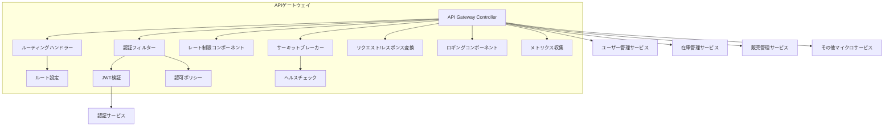

# APIゲートウェイサービス 詳細設計書

## 1. 概要

APIゲートウェイサービスは、クライアントからのリクエストを適切なマイクロサービスにルーティングし、認証・認可、レート制限、リクエスト/レスポンス変換などの横断的な関心事を一元管理するサービスです。外部からのアクセスに対する単一のエントリーポイントとして機能し、バックエンドサービスを保護します。

## 2. 技術スタック

### 開発環境
- **言語**: Java 21 (LTS)
- **フレームワーク**: Spring Boot 3.2.3、Spring Cloud Gateway 4.1.1
- **ビルドツール**: Maven 3.9.x
- **コンテナ化**: Docker 25.x
- **テスト**: JUnit 5.10.1、Spring Boot Test、Testcontainers 1.19.3

### 本番環境
- Azure API Management (APIM)
- Azure Container Apps

### 主要ライブラリとバージョン
| ライブラリ | バージョン | 用途 |
|----------|----------|------|
| spring-cloud-starter-gateway | 4.1.1 | APIゲートウェイ機能 |
| spring-cloud-starter-circuitbreaker-reactor-resilience4j | 3.1.0 | サーキットブレーカー |
| spring-boot-starter-actuator | 3.2.3 | ヘルスチェック、メトリクス |
| spring-boot-starter-oauth2-resource-server | 3.2.3 | OAuth2/JWT認証 |
| spring-boot-starter-security | 3.2.3 | セキュリティ設定 |
| spring-cloud-starter-sleuth | 3.1.9 | 分散トレーシング |
| spring-cloud-starter-stream-kafka | 4.1.0 | イベント発行 |
| micrometer-registry-prometheus | 1.12.2 | メトリクス収集 |
| springdoc-openapi-starter-webflux-ui | 2.3.0 | API文書化 |
| azure-identity | 1.11.1 | Azure認証 |
| azure-monitor-opentelemetry | 1.0.0-beta.15 | Azure監視連携 |
| logback-json-classic | 0.1.5 | JSON形式ログ出力 |

## 3. システム構成

### コンポーネント構成図



### クラス構成

#### 主要クラス
- `ApiGatewayApplication`: アプリケーションのエントリーポイント
- `RouteConfig`: ルーティング設定クラス
- `SecurityConfig`: セキュリティ設定クラス
- `JwtAuthenticationFilter`: JWT認証フィルター
- `RateLimiterConfig`: レート制限設定
- `CircuitBreakerConfig`: サーキットブレーカー設定
- `LoggingFilter`: リクエスト/レスポンスロギング
- `MetricsConfig`: メトリクス収集設定
- `GlobalExceptionHandler`: 例外ハンドリング

## 4. API設計

### ルーティング設計

APIゲートウェイは、パスベースのルーティングを提供し、各エンドポイントを適切なマイクロサービスにマッピングします。

#### 基本ルーティングパターン

| パスパターン | 転送先サービス | 説明 | 認証要件 |
|------------|--------------|------|----------|
| `/api/users/**` | ユーザー管理サービス | ユーザー関連API | 要認証 |
| `/api/products/**` | 在庫管理サービス | 商品・在庫関連API | 部分認証 |
| `/api/inventory/**` | 在庫管理サービス | 在庫操作API | 要認証（管理者） |
| `/api/orders/**` | 販売管理サービス | 注文関連API | 要認証 |
| `/api/cart/**` | 支払い・カート処理サービス | カート関連API | 要認証 |
| `/api/payments/**` | 支払い・カート処理サービス | 支払い関連API | 要認証 |
| `/api/auth/**` | 認証サービス | 認証関連API | 不要 |
| `/api/recommendations/**` | AI対応サポート機能サービス | 商品推奨API | 部分認証 |
| `/api/search/**` | AI対応サポート機能サービス | 検索・オートコンプリートAPI | 不要 |
| `/api/chat/**` | AI対応サポート機能サービス | チャットボットAPI | 要認証 |
| `/api/analytics/**` | AI対応サポート機能サービス | 分析・予測API | 要認証（管理者） |
| `/api/coupons/**` | クーポン提供機能サービス | クーポン関連API | 部分認証 |
| `/api/campaigns/**` | クーポン提供機能サービス | キャンペーン管理API | 要認証（管理者） |
| `/api/points/**` | ポイント提供管理機能サービス | ポイント関連API | 要認証 |
| `/api/tiers/**` | ポイント提供管理機能サービス | ティア管理API | 要認証 |
| `/health` | 各サービス | ヘルスチェック | 不要 |
| `/actuator/**` | APIゲートウェイ | 監視・メトリクス | 要認証（管理者） |

#### サンプルルート設定 (application.yml)

```yaml
spring:
  cloud:
    gateway:
      routes:
        # ユーザー管理サービス
        - id: user-service
          uri: lb://user-service
          predicates:
            - Path=/api/users/**
          filters:
            - RewritePath=/api/users/(?<segment>.*), /$\{segment}
            - name: CircuitBreaker
              args:
                name: userServiceCircuitBreaker
                fallbackUri: forward:/fallback/user-service
            - name: RequestRateLimiter
              args:
                redis-rate-limiter.replenishRate: 50
                redis-rate-limiter.burstCapacity: 100
        
        # 在庫管理サービス
        - id: inventory-service-products
          uri: lb://inventory-service
          predicates:
            - Path=/api/products/**
          filters:
            - RewritePath=/api/products/(?<segment>.*), /$\{segment}
            - name: CircuitBreaker
              args:
                name: inventoryServiceCircuitBreaker
                fallbackUri: forward:/fallback/inventory-service
        
        - id: inventory-service-admin
          uri: lb://inventory-service
          predicates:
            - Path=/api/inventory/**
          filters:
            - RewritePath=/api/inventory/(?<segment>.*), /$\{segment}
            - name: CircuitBreaker
              args:
                name: inventoryServiceCircuitBreaker
                fallbackUri: forward:/fallback/inventory-service
        
        # 販売管理サービス
        - id: sales-service
          uri: lb://sales-service
          predicates:
            - Path=/api/orders/**
          filters:
            - RewritePath=/api/orders/(?<segment>.*), /$\{segment}
            - name: CircuitBreaker
              args:
                name: salesServiceCircuitBreaker
                fallbackUri: forward:/fallback/sales-service
        
        # 支払い・カートサービス
        - id: payment-cart-service-cart
          uri: lb://payment-cart-service
          predicates:
            - Path=/api/cart/**
          filters:
            - RewritePath=/api/cart/(?<segment>.*), /$\{segment}
            - name: CircuitBreaker
              args:
                name: paymentCartServiceCircuitBreaker
                fallbackUri: forward:/fallback/payment-cart-service
        
        - id: payment-cart-service-payments
          uri: lb://payment-cart-service
          predicates:
            - Path=/api/payments/**
          filters:
            - RewritePath=/api/payments/(?<segment>.*), /$\{segment}
            - name: CircuitBreaker
              args:
                name: paymentCartServiceCircuitBreaker
                fallbackUri: forward:/fallback/payment-cart-service
        
        # 認証サービス
        - id: authentication-service
          uri: lb://authentication-service
          predicates:
            - Path=/api/auth/**
          filters:
            - RewritePath=/api/auth/(?<segment>.*), /$\{segment}
            - name: CircuitBreaker
              args:
                name: authServiceCircuitBreaker
                fallbackUri: forward:/fallback/auth-service
        
        # AI対応サポート機能サービス
        - id: ai-support-service-recommendations
          uri: lb://ai-support-service
          predicates:
            - Path=/api/recommendations/**
          filters:
            - RewritePath=/api/recommendations/(?<segment>.*), /$\{segment}
            - name: CircuitBreaker
              args:
                name: aiSupportServiceCircuitBreaker
                fallbackUri: forward:/fallback/ai-support-service
        
        - id: ai-support-service-search
          uri: lb://ai-support-service
          predicates:
            - Path=/api/search/**
          filters:
            - RewritePath=/api/search/(?<segment>.*), /$\{segment}
            - name: CircuitBreaker
              args:
                name: aiSupportServiceCircuitBreaker
                fallbackUri: forward:/fallback/ai-support-service
        
        - id: ai-support-service-chat
          uri: lb://ai-support-service
          predicates:
            - Path=/api/chat/**
          filters:
            - RewritePath=/api/chat/(?<segment>.*), /$\{segment}
            - name: CircuitBreaker
              args:
                name: aiSupportServiceCircuitBreaker
                fallbackUri: forward:/fallback/ai-support-service
        
        - id: ai-support-service-analytics
          uri: lb://ai-support-service
          predicates:
            - Path=/api/analytics/**
          filters:
            - RewritePath=/api/analytics/(?<segment>.*), /$\{segment}
            - name: CircuitBreaker
              args:
                name: aiSupportServiceCircuitBreaker
                fallbackUri: forward:/fallback/ai-support-service
        
        # クーポンサービス
        - id: coupon-service-coupons
          uri: lb://coupon-service
          predicates:
            - Path=/api/coupons/**
          filters:
            - RewritePath=/api/coupons/(?<segment>.*), /$\{segment}
            - name: CircuitBreaker
              args:
                name: couponServiceCircuitBreaker
                fallbackUri: forward:/fallback/coupon-service
        
        - id: coupon-service-campaigns
          uri: lb://coupon-service
          predicates:
            - Path=/api/campaigns/**
          filters:
            - RewritePath=/api/campaigns/(?<segment>.*), /$\{segment}
            - name: CircuitBreaker
              args:
                name: couponServiceCircuitBreaker
                fallbackUri: forward:/fallback/coupon-service
        
        # ポイントサービス
        - id: point-service-points
          uri: lb://point-service
          predicates:
            - Path=/api/points/**
          filters:
            - RewritePath=/api/points/(?<segment>.*), /$\{segment}
            - name: CircuitBreaker
              args:
                name: pointServiceCircuitBreaker
                fallbackUri: forward:/fallback/point-service
        
        - id: point-service-tiers
          uri: lb://point-service
          predicates:
            - Path=/api/tiers/**
          filters:
            - RewritePath=/api/tiers/(?<segment>.*), /$\{segment}
            - name: CircuitBreaker
              args:
                name: pointServiceCircuitBreaker
                fallbackUri: forward:/fallback/point-service

# レート制限設定
  redis:
    host: localhost
    port: 6379
    timeout: 2000ms
    
management:
  endpoints:
    web:
      exposure:
        include: health,info,metrics,prometheus
  endpoint:
    health:
      show-details: always
```

### 認証・認可設計

#### セキュリティ設定

```java
@Configuration
@EnableWebFluxSecurity
public class SecurityConfig {

    @Bean
    public SecurityWebFilterChain securityWebFilterChain(ServerHttpSecurity http) {
        return http
                .csrf(ServerHttpSecurity.CsrfSpec::disable)
                .authorizeExchange(exchanges -> exchanges
                        // 認証不要のパス
                        .pathMatchers("/api/auth/**", "/actuator/health", "/health").permitAll()
                        .pathMatchers(HttpMethod.GET, "/api/products/**").permitAll()
                        .pathMatchers(HttpMethod.GET, "/api/search/**").permitAll()
                        .pathMatchers(HttpMethod.POST, "/api/coupons/validate").permitAll()
                        
                        // 認証必須のパス
                        .pathMatchers("/api/users/**").authenticated()
                        .pathMatchers("/api/orders/**").authenticated()
                        .pathMatchers("/api/cart/**").authenticated()
                        .pathMatchers("/api/payments/**").authenticated()
                        .pathMatchers("/api/points/**").authenticated()
                        .pathMatchers("/api/tiers/**").authenticated()
                        .pathMatchers("/api/chat/**").authenticated()
                        .pathMatchers(HttpMethod.GET, "/api/recommendations/**").authenticated()
                        
                        // 管理者権限が必要なパス
                        .pathMatchers("/api/admin/**").hasRole("ADMIN")
                        .pathMatchers("/api/inventory/**").hasRole("ADMIN")
                        .pathMatchers("/api/campaigns/**").hasRole("ADMIN")
                        .pathMatchers("/api/analytics/**").hasRole("ADMIN")
                        .pathMatchers("/actuator/**").hasRole("ADMIN")
                        .pathMatchers(HttpMethod.POST, "/api/coupons").hasRole("ADMIN")
                        .pathMatchers(HttpMethod.PUT, "/api/coupons/**").hasRole("ADMIN")
                        .pathMatchers(HttpMethod.DELETE, "/api/coupons/**").hasRole("ADMIN")
                        
                        // その他全てのリクエストには認証が必要
                        .anyExchange().authenticated()
                )
                .oauth2ResourceServer(oauth2 -> oauth2
                        .jwt(jwt -> jwt.jwtAuthenticationConverter(jwtAuthenticationConverter()))
                )
                .exceptionHandling(exceptionHandling -> exceptionHandling
                        .authenticationEntryPoint(new HttpStatusServerEntryPoint(HttpStatus.UNAUTHORIZED))
                )
                .build();
    }
    
    @Bean
    public ReactiveJwtDecoder jwtDecoder() {
        // JWT検証のための設定
        return ReactiveJwtDecoders.fromIssuerLocation("https://auth-service/oauth2/jwks");
    }
    
    @Bean
    public Converter<Jwt, Mono<AbstractAuthenticationToken>> jwtAuthenticationConverter() {
        JwtGrantedAuthoritiesConverter authoritiesConverter = new JwtGrantedAuthoritiesConverter();
        authoritiesConverter.setAuthorityPrefix("ROLE_");
        authoritiesConverter.setAuthoritiesClaimName("roles");
        
        ReactiveJwtAuthenticationConverterAdapter jwtAuthenticationConverter = 
                new ReactiveJwtAuthenticationConverterAdapter(new JwtAuthenticationConverter());
        return jwtAuthenticationConverter;
    }
}
```

### サーキットブレーカー設定

```java
@Configuration
public class CircuitBreakerConfig {

    @Bean
    public ReactiveResilience4JCircuitBreakerFactory reactiveResilience4JCircuitBreakerFactory(
            CircuitBreakerRegistry circuitBreakerRegistry) {
        
        ReactiveResilience4JCircuitBreakerFactory factory = 
                new ReactiveResilience4JCircuitBreakerFactory();
        
        factory.configureCircuitBreakerRegistry(circuitBreakerRegistry);
        
        factory.configure(builder -> builder
                .timeLimiterConfig(TimeLimiterConfig.custom()
                        .timeoutDuration(Duration.ofSeconds(3))
                        .build())
                .circuitBreakerConfig(CircuitBreakerConfig.custom()
                        .slidingWindowSize(10)
                        .failureRateThreshold(50)
                        .waitDurationInOpenState(Duration.ofSeconds(10))
                        .permittedNumberOfCallsInHalfOpenState(5)
                        .build()), 
                "userServiceCircuitBreaker", "inventoryServiceCircuitBreaker");
        
        return factory;
    }
    
    @Bean
    public CircuitBreakerRegistry circuitBreakerRegistry() {
        return CircuitBreakerRegistry.of(CircuitBreakerConfig.custom()
                .slidingWindowSize(10)
                .failureRateThreshold(50)
                .waitDurationInOpenState(Duration.ofSeconds(5))
                .permittedNumberOfCallsInHalfOpenState(3)
                .build());
    }
}
```

### レート制限設定

```java
@Configuration
public class RateLimiterConfig {

    @Bean
    public RedisRateLimiter redisRateLimiter(ReactiveRedisTemplate<String, String> redisTemplate) {
        return new RedisRateLimiter(10, 20, redisTemplate);
    }
    
    @Bean
    public KeyResolver ipKeyResolver() {
        return exchange -> Mono.just(
                Objects.requireNonNull(exchange.getRequest().getRemoteAddress())
                        .getHostString()
        );
    }
}
```

## 5. エラー処理

### エラーレスポンス形式

```json
{
  "timestamp": "2025-06-19T10:15:30.123Z",
  "status": 400,
  "error": "Bad Request",
  "message": "Invalid request parameters",
  "path": "/api/users",
  "traceId": "a1b2c3d4e5f6",
  "details": [
    {
      "field": "email",
      "message": "メールアドレスの形式が正しくありません"
    }
  ]
}
```

### グローバルエラーハンドラー

```java
@Component
public class GlobalErrorWebExceptionHandler extends AbstractErrorWebExceptionHandler {

    public GlobalErrorWebExceptionHandler(ErrorAttributes errorAttributes,
                                         WebProperties webProperties,
                                         ApplicationContext applicationContext) {
        super(errorAttributes, webProperties.getResources(), applicationContext);
    }

    @Override
    protected RouterFunction<ServerResponse> getRoutingFunction(ErrorAttributes errorAttributes) {
        return RouterFunctions.route(
                RequestPredicates.all(), this::renderErrorResponse);
    }

    private Mono<ServerResponse> renderErrorResponse(ServerRequest request) {
        Map<String, Object> errorPropertiesMap = getErrorAttributes(request,
                ErrorAttributeOptions.of(ErrorAttributeOptions.Include.MESSAGE));
        
        int status = (int) errorPropertiesMap.getOrDefault("status", 500);
        
        return ServerResponse.status(status)
                .contentType(MediaType.APPLICATION_JSON)
                .body(BodyInserters.fromValue(errorPropertiesMap));
    }
}
```

### フォールバック処理

```java
@RestController
public class FallbackController {

    @GetMapping("/fallback/user-service")
    public Mono<Map<String, String>> userServiceFallback() {
        Map<String, String> response = new HashMap<>();
        response.put("timestamp", Instant.now().toString());
        response.put("status", "503");
        response.put("error", "Service Unavailable");
        response.put("message", "ユーザーサービスが一時的に利用できません。しばらく経ってからお試しください。");
        return Mono.just(response);
    }
    
    @GetMapping("/fallback/inventory-service")
    public Mono<Map<String, String>> inventoryServiceFallback() {
        Map<String, String> response = new HashMap<>();
        response.put("timestamp", Instant.now().toString());
        response.put("status", "503");
        response.put("error", "Service Unavailable");
        response.put("message", "在庫管理サービスが一時的に利用できません。しばらく経ってからお試しください。");
        return Mono.just(response);
    }
    
    // 他のサービスのフォールバック
}
```

## 6. ロギングとモニタリング

### ロギング設定

#### logback-spring.xml

```xml
<?xml version="1.0" encoding="UTF-8"?>
<configuration>
    <appender name="CONSOLE" class="ch.qos.logback.core.ConsoleAppender">
        <encoder class="net.logstash.logback.encoder.LogstashEncoder">
            <includeMdcKeyName>traceId</includeMdcKeyName>
            <includeMdcKeyName>spanId</includeMdcKeyName>
            <includeMdcKeyName>userId</includeMdcKeyName>
            <includeMdcKeyName>clientIp</includeMdcKeyName>
        </encoder>
    </appender>
    
    <appender name="FILE" class="ch.qos.logback.core.rolling.RollingFileAppender">
        <file>logs/api-gateway.log</file>
        <rollingPolicy class="ch.qos.logback.core.rolling.TimeBasedRollingPolicy">
            <fileNamePattern>logs/api-gateway-%d{yyyy-MM-dd}.log</fileNamePattern>
            <maxHistory>30</maxHistory>
        </rollingPolicy>
        <encoder class="net.logstash.logback.encoder.LogstashEncoder">
            <includeMdcKeyName>traceId</includeMdcKeyName>
            <includeMdcKeyName>spanId</includeMdcKeyName>
            <includeMdcKeyName>userId</includeMdcKeyName>
            <includeMdcKeyName>clientIp</includeMdcKeyName>
        </encoder>
    </appender>
    
    <root level="INFO">
        <appender-ref ref="CONSOLE" />
        <appender-ref ref="FILE" />
    </root>
    
    <logger name="com.skistore.apigateway" level="DEBUG" />
    <logger name="org.springframework.cloud.gateway" level="DEBUG" />
    <logger name="org.springframework.security" level="DEBUG" />
</configuration>
```

### メトリクス収集

```java
@Configuration
public class MetricsConfig {

    @Bean
    public MeterRegistryCustomizer<MeterRegistry> metricsCommonTags() {
        return registry -> registry.config()
                .commonTags("application", "api-gateway")
                .meterFilter(MeterFilter.deny(id -> {
                    String uri = id.getTag("uri");
                    return uri != null && uri.startsWith("/actuator");
                }))
                .meterFilter(MeterFilter.deny(id -> {
                    String uri = id.getTag("uri");
                    return uri != null && uri.contains("favicon");
                }));
    }
    
    @Bean
    public WebFluxMetrics webFluxMetrics(MeterRegistry registry) {
        return new WebFluxMetrics(registry, 
                new DefaultWebFluxTagsProvider(), 
                "http.server.requests", 
                true);
    }
}
```

### Actuatorエンドポイント設定

```yaml
management:
  endpoints:
    web:
      exposure:
        include: health,info,prometheus,metrics,loggers
  endpoint:
    health:
      show-details: when_authorized
  metrics:
    export:
      prometheus:
        enabled: true
  health:
    circuitbreakers:
      enabled: true
```

## 7. デプロイメント設計

### ローカル開発環境 (Docker Compose)

#### Dockerfile

```dockerfile
FROM eclipse-temurin:21-jdk-alpine AS builder
WORKDIR /app
COPY . .
RUN ./gradlew clean bootJar

FROM eclipse-temurin:21-jre-alpine
WORKDIR /app
COPY --from=builder /app/build/libs/*.jar app.jar
EXPOSE 8080
ENTRYPOINT ["java", "-jar", "app.jar"]
```

#### docker-compose.yml

```yaml
version: '3.9'

services:
  api-gateway:
    build: .
    ports:
      - "8080:8080"
    environment:
      - SPRING_PROFILES_ACTIVE=dev
      - SPRING_CLOUD_DISCOVERY_ENABLED=true
      - SPRING_CLOUD_CONSUL_HOST=consul
      - SPRING_CLOUD_CONSUL_PORT=8500
      - SPRING_REDIS_HOST=redis
      - SPRING_REDIS_PORT=6379
      - LOGGING_LEVEL_COM_SKISTORE=DEBUG
    depends_on:
      - redis
      - consul
    networks:
      - ski-store-network

  redis:
    image: redis:7.2-alpine
    ports:
      - "6379:6379"
    volumes:
      - redis-data:/data
    networks:
      - ski-store-network

  consul:
    image: consul:1.15
    ports:
      - "8500:8500"
    volumes:
      - consul-data:/consul/data
    networks:
      - ski-store-network

networks:
  ski-store-network:
    driver: bridge

volumes:
  redis-data:
  consul-data:
```

### 本番環境 (Azure Container Apps)

#### azure-container-apps.yaml

```yaml
name: api-gateway
location: japaneast
resourceGroup: ski-store-prod
tags:
  app: ski-store
  service: api-gateway
  environment: production
properties:
  managedEnvironmentId: /subscriptions/{subscriptionId}/resourceGroups/ski-store-prod/providers/Microsoft.App/managedEnvironments/ski-store-env
  configuration:
    activeRevisionsMode: Single
    secrets:
      - name: key-vault-secret
        value: {key-vault-secret-reference}
    ingress:
      external: true
      allowInsecure: false
      targetPort: 8080
      traffic:
        - latestRevision: true
          weight: 100
      transport: Auto
    registries:
      - server: skistore.azurecr.io
        username: skistore
        passwordSecretRef: acr-password
  template:
    containers:
      - image: skistore.azurecr.io/api-gateway:latest
        name: api-gateway
        env:
          - name: SPRING_PROFILES_ACTIVE
            value: "prod"
          - name: SPRING_CLOUD_AZURE_KEYVAULT_SECRET_ENDPOINT
            value: "https://ski-store-kv.vault.azure.net/"
          - name: APPLICATIONINSIGHTS_CONNECTION_STRING
            value: "InstrumentationKey=..."
        resources:
          cpu: 1.0
          memory: "2Gi"
        probes:
          - type: Liveness
            httpGet:
              path: /actuator/health/liveness
              port: 8080
            initialDelaySeconds: 30
            periodSeconds: 10
          - type: Readiness
            httpGet:
              path: /actuator/health/readiness
              port: 8080
            initialDelaySeconds: 30
            periodSeconds: 10
    scale:
      minReplicas: 2
      maxReplicas: 10
      rules:
        - name: http-scaling-rule
          http:
            metadata:
              concurrentRequests: "50"
```

## 8. テスト戦略

### 単体テスト

JUnit 5とSpring Boot Testを使用して、各コンポーネントの単体テストを実施します。

#### フィルターテスト例

```java
@WebFluxTest
class JwtAuthenticationFilterTest {

    @Autowired
    private WebTestClient webTestClient;
    
    @MockBean
    private ReactiveJwtDecoder jwtDecoder;
    
    @Test
    void validJwtShouldAllowAccess() {
        // テスト用のJWTトークンを準備
        Jwt jwt = Jwt.withTokenValue("token")
                .header("alg", "RS256")
                .claim("sub", "user-id")
                .claim("roles", Arrays.asList("USER"))
                .build();
                
        when(jwtDecoder.decode(anyString())).thenReturn(Mono.just(jwt));
        
        webTestClient.get().uri("/api/users/me")
                .header(HttpHeaders.AUTHORIZATION, "Bearer token")
                .exchange()
                .expectStatus().isOk();
    }
    
    @Test
    void invalidJwtShouldReturnUnauthorized() {
        when(jwtDecoder.decode(anyString())).thenReturn(Mono.error(new JwtException("Invalid token")));
        
        webTestClient.get().uri("/api/users/me")
                .header(HttpHeaders.AUTHORIZATION, "Bearer token")
                .exchange()
                .expectStatus().isUnauthorized();
    }
}
```

### 統合テスト

Testcontainersを使用して、実際のインフラストラクチャ（Redis、Consul）と連携した統合テストを実施します。

```java
@SpringBootTest
@Testcontainers
class ApiGatewayIntegrationTest {

    @Container
    static GenericContainer<?> redis = new GenericContainer<>("redis:7.2-alpine")
            .withExposedPorts(6379);
            
    @Container
    static GenericContainer<?> consul = new GenericContainer<>("consul:1.15")
            .withExposedPorts(8500);
            
    @DynamicPropertySource
    static void registerRedisProperties(DynamicPropertyRegistry registry) {
        registry.add("spring.redis.host", redis::getHost);
        registry.add("spring.redis.port", redis::getFirstMappedPort);
        registry.add("spring.cloud.consul.host", consul::getHost);
        registry.add("spring.cloud.consul.port", consul::getFirstMappedPort);
    }
    
    @Autowired
    private WebTestClient webTestClient;
    
    @Test
    void rateLimitShouldBeApplied() {
        // レート制限をテスト
        IntStream.range(0, 25).forEach(i -> {
            if (i < 20) {
                webTestClient.get().uri("/api/test-rate-limit")
                        .exchange()
                        .expectStatus().isOk();
            } else {
                webTestClient.get().uri("/api/test-rate-limit")
                        .exchange()
                        .expectStatus().isEqualTo(HttpStatus.TOO_MANY_REQUESTS);
            }
        });
    }
}
```

### 負荷テスト

Gatlingを使用して、高負荷状況下でのパフォーマンスとレスポンス時間をテストします。

```scala
class ApiGatewayLoadTest extends Simulation {

  val httpProtocol = http
    .baseUrl("http://localhost:8080")
    .acceptHeader("application/json")
    .userAgentHeader("Gatling/Performance-Test")

  val scn = scenario("APIゲートウェイ負荷テスト")
    .exec(http("健康チェックAPI")
      .get("/actuator/health")
      .check(status.is(200)))
    .pause(1)
    .exec(http("ユーザー一覧API")
      .get("/api/users")
      .header("Authorization", "Bearer ${jwt}")
      .check(status.is(200)))
    .pause(1)
    .exec(http("商品一覧API")
      .get("/api/products")
      .check(status.is(200)))

  setUp(
    scn.inject(
      rampUsersPerSec(10) to 100 during (60 seconds),
      constantUsersPerSec(100) during (300 seconds)
    ).protocols(httpProtocol)
  ).assertions(
    global.responseTime.percentile3.lt(800),
    global.responseTime.percentile4.lt(1200),
    global.successfulRequests.percent.gt(95)
  )
}
```

## 9. 運用設計

### 監視と警告設定

#### Prometheus/Grafana連携
- CPU、メモリ使用率監視
- リクエスト数、レスポンス時間監視
- エラーレート監視
- サーキットブレーカー状態監視

#### Azure Monitor設定

```yaml
# Azure Monitor連携設定
azure:
  monitor:
    metrics:
      enabled: true
      step: 60s
    logs:
      enabled: true
    alert-rules:
      - name: HighErrorRate
        description: "Error rate is too high"
        severity: 2
        condition:
          threshold: 5
          timeAggregation: Average
          operator: GreaterThan
          timeWindow: 5m
          metricName: "http.server.requests.errors"
        action-groups:
          - "/subscriptions/{subscription-id}/resourceGroups/ski-store-prod/providers/Microsoft.Insights/actionGroups/operations-team"
```

### 障害対応手順

#### サーキットブレーカーが開いた場合
1. ログを確認し、どのサービスが応答不能か特定
2. 対象サービスの状態確認（ヘルスチェック、メトリクス）
3. 必要に応じて対象サービスを再起動または修復
4. サーキットブレーカーの状態をモニタリング
5. 正常化確認後、通常運用に復帰

#### レート制限超過が頻発する場合
1. アクセス元IPアドレスを特定
2. 正当なトラフィック増加かDDoS攻撃か判断
3. 正当なトラフィックの場合は制限値の引き上げを検討
4. 不正アクセスの場合はWAFでブロック

### バックアップと復旧手順

#### Redisデータのバックアップ
- Azure Cache for Redisの自動バックアップ設定
- 定期的なエクスポート設定

#### 構成データのバックアップ
- 設定ファイルとシークレットのバージョン管理
- Infrastructure as Code (Terraform)によるインフラ定義

#### 障害復旧手順
1. 最新のバックアップから復元
2. 設定ファイルの適用
3. サービスの起動と検証
4. DNSまたはトラフィックマネージャーの切り替え

## 10. セキュリティ設計

### セキュリティ対策

#### 実装するセキュリティ対策
- JWT認証による認証・認可
- レート制限による DoS/DDoS対策
- リクエスト検証によるインジェクション攻撃対策
- HTTPSの強制
- セキュリティヘッダーの設定
- Azure Key Vaultを使用したシークレット管理

#### セキュリティヘッダー設定

```java
@Configuration
public class WebSecurityConfig {

    @Bean
    public WebFilter securityHeadersFilter() {
        return (exchange, chain) -> {
            ServerHttpResponse response = exchange.getResponse();
            response.getHeaders().add(HttpHeaders.X_CONTENT_TYPE_OPTIONS, "nosniff");
            response.getHeaders().add(HttpHeaders.X_FRAME_OPTIONS, "DENY");
            response.getHeaders().add(HttpHeaders.X_XSS_PROTECTION, "1; mode=block");
            response.getHeaders().add(HttpHeaders.STRICT_TRANSPORT_SECURITY, "max-age=31536000; includeSubDomains");
            response.getHeaders().add(HttpHeaders.CONTENT_SECURITY_POLICY, "default-src 'self'");
            response.getHeaders().add(HttpHeaders.REFERRER_POLICY, "no-referrer");
            
            return chain.filter(exchange);
        };
    }
}
```

### 脆弱性スキャン

CI/CDパイプラインにTrivyを組み込み、コンテナイメージの脆弱性スキャンを自動化します。

```yaml
# GitHub Actions ワークフロー例
name: Container Security Scan

on:
  push:
    branches: [ main ]
  pull_request:
    branches: [ main ]

jobs:
  scan:
    runs-on: ubuntu-latest
    steps:
      - uses: actions/checkout@v3
      
      - name: Build Docker image
        run: docker build -t ski-store/api-gateway:${{ github.sha }} .
      
      - name: Scan image for vulnerabilities
        uses: aquasecurity/trivy-action@master
        with:
          image-ref: 'ski-store/api-gateway:${{ github.sha }}'
          format: 'table'
          exit-code: '1'
          ignore-unfixed: true
          severity: 'CRITICAL,HIGH'
```

## 11. ローカル開発ガイド

### 環境構築手順

1. 前提条件
   - JDK 21
   - Docker および Docker Compose
   - Git

2. プロジェクトのクローン
   ```bash
   git clone https://github.com/ski-store/api-gateway.git
   cd api-gateway
   ```

3. 依存サービスの起動
   ```bash
   docker-compose up -d redis consul
   ```

4. アプリケーションの起動
   ```bash
   ./gradlew bootRun --args='--spring.profiles.active=dev'
   ```

### 動作確認方法

1. ヘルスチェック
   ```bash
   curl http://localhost:8080/actuator/health
   ```

2. API動作確認
   ```bash
   # JWTトークンなしでアクセス可能なエンドポイント
   curl http://localhost:8080/api/auth/status
   
   # JWTトークンが必要なエンドポイント
   curl -H "Authorization: Bearer {テスト用JWT}" http://localhost:8080/api/users/me
   ```

3. Consulダッシュボード
   - ブラウザで `http://localhost:8500` にアクセス
   - サービス登録状況を確認

4. モックサービスの利用
   - WireMockを使用したモックサービスを提供
   - `src/test/resources/mappings` にモック定義ファイルを配置

## 12. 本番デプロイガイド

### Azure Container Apps へのデプロイ手順

1. Azureリソースの準備
   ```bash
   az login
   az group create --name ski-store-prod --location japaneast
   az acr create --resource-group ski-store-prod --name skistore --sku Basic
   az acr login --name skistore
   ```

2. コンテナイメージのビルドとプッシュ
   ```bash
   ./gradlew jib --image=skistore.azurecr.io/api-gateway:latest
   ```

3. Container Apps環境のデプロイ
   ```bash
   az containerapp env create \
     --name ski-store-env \
     --resource-group ski-store-prod \
     --location japaneast
   
   az containerapp create \
     --name api-gateway \
     --resource-group ski-store-prod \
     --environment ski-store-env \
     --image skistore.azurecr.io/api-gateway:latest \
     --target-port 8080 \
     --ingress external \
     --min-replicas 2 \
     --max-replicas 10 \
     --env-vars SPRING_PROFILES_ACTIVE=prod
   ```

### 本番環境の検証手順

1. エンドポイント疎通確認
   ```bash
   curl https://{container-app-url}/actuator/health
   ```

2. ログの確認
   ```bash
   az containerapp logs show \
     --name api-gateway \
     --resource-group ski-store-prod \
     --follow
   ```

3. メトリクスの確認
   - Azure Portalで「Application Insights」に移動
   - パフォーマンスダッシュボードを確認

## 13. トラブルシューティングガイド

### 一般的な問題と解決策

| 問題 | 考えられる原因 | 解決策 |
|-----|------------|------|
| 503 Service Unavailable | サーキットブレーカーが開いている | バックエンドサービスのヘルスを確認し、必要なら再起動。サーキットブレーカーの設定を確認 |
| 429 Too Many Requests | レート制限に達した | クライアントの振る舞いを確認。正当なトラフィック増加なら制限値を引き上げ |
| 401 Unauthorized | JWTトークンが無効または期限切れ | クライアントに新しいトークンの取得を促す。認証サービスの状態を確認 |
| ルーティングエラー | サービス登録情報の不整合 | サービスディスカバリー（Consul）の状態を確認。手動で再登録 |
| パフォーマンス低下 | リソース不足、過負荷 | スケーリング設定の見直し。不要なフィルタやミドルウェアの最適化 |

### ログ分析ツール

- Kibana/Elasticsearchを使用したログ検索と可視化
- Azure Log Analyticsによるログクエリ

```kusto
// エラーレート分析
AppEvents
| where TimeGenerated > ago(1h)
| where AppRoleName == "api-gateway"
| where SeverityLevel >= 3
| summarize ErrorCount=count() by bin(TimeGenerated, 5m), OperationName
| render timechart
```

### デバッグツール

- Spring Boot Actuatorエンドポイントを活用
  - `/actuator/mappings`: ルート設定確認
  - `/actuator/env`: 環境変数確認
  - `/actuator/loggers`: ログレベル動的変更

## 14. 参考リンク

- [Spring Cloud Gateway Documentation](https://docs.spring.io/spring-cloud-gateway/docs/current/reference/html/)
- [Azure Container Apps Documentation](https://docs.microsoft.com/azure/container-apps/)
- [Resilience4j Documentation](https://resilience4j.readme.io/docs)
- [Spring Security Documentation](https://docs.spring.io/spring-security/reference/index.html)
- [Azure API Management](https://docs.microsoft.com/azure/api-management/)
