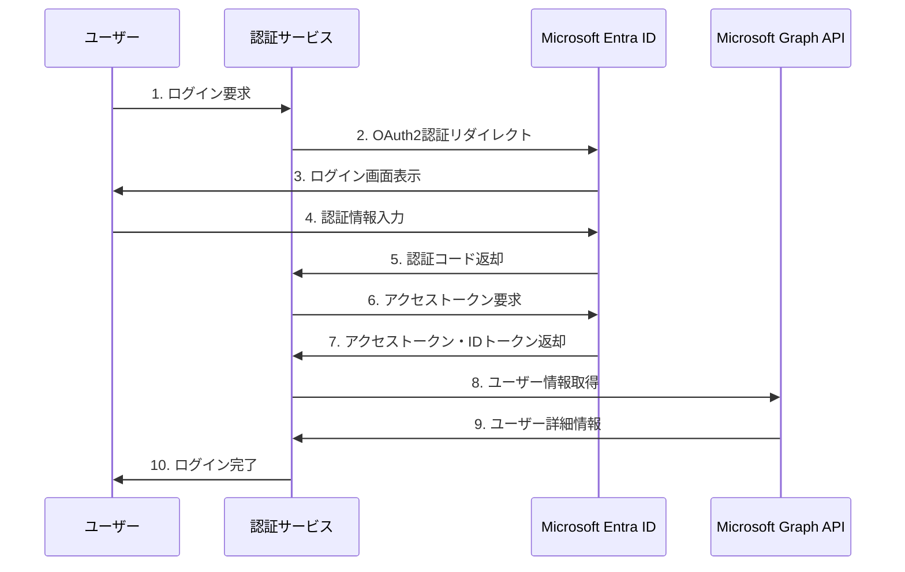
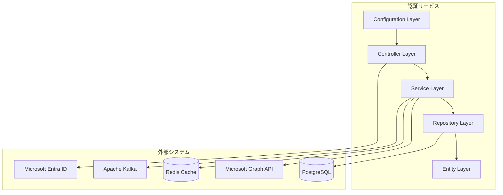
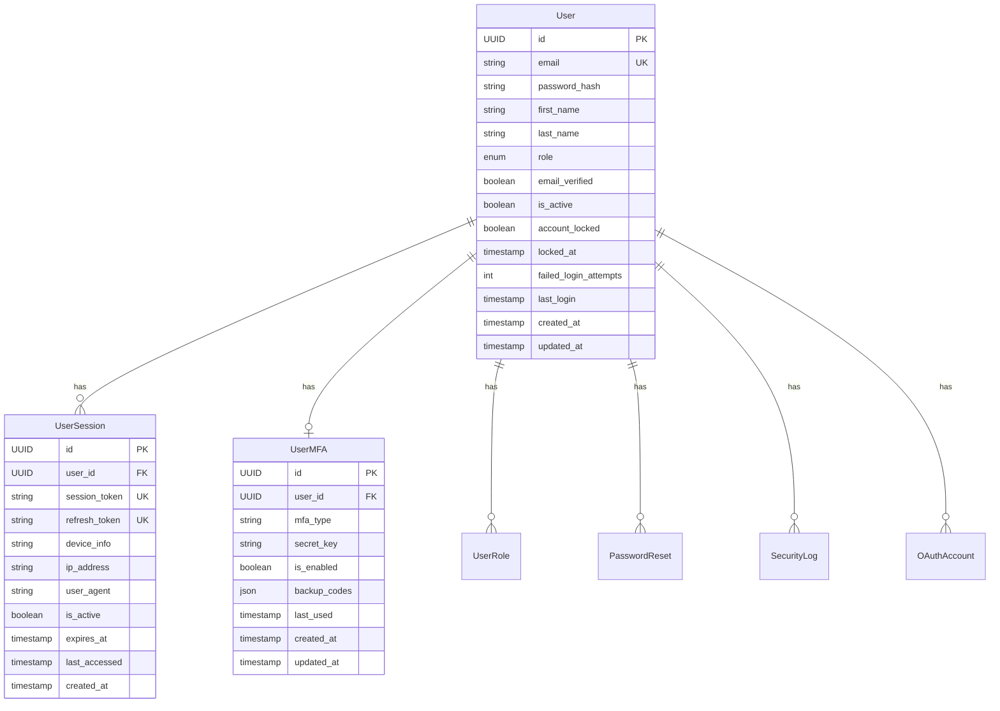
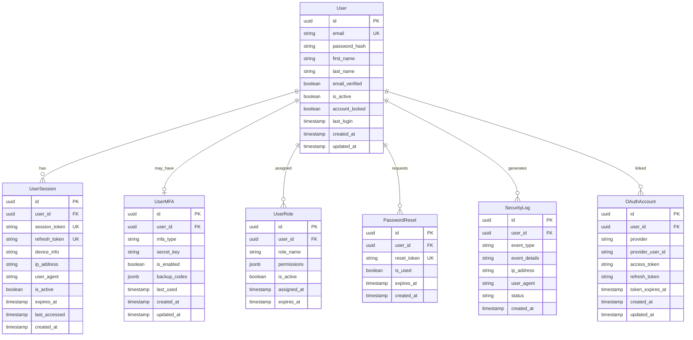
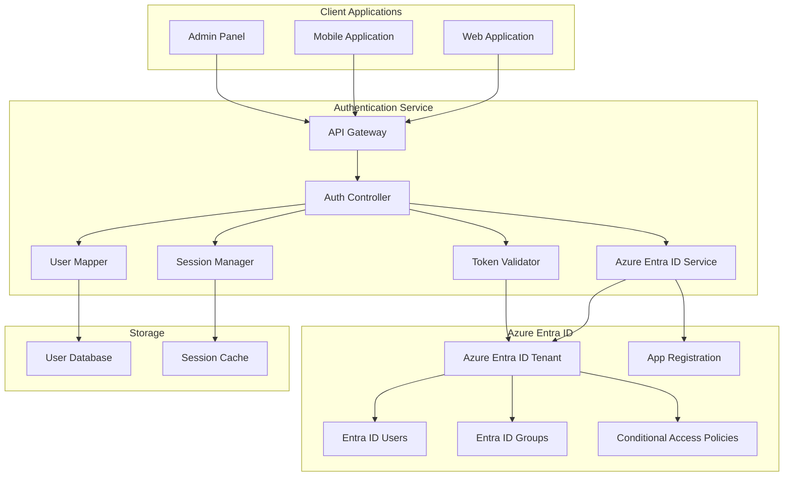

# 認証サービス設計書

## 1. 概要

### 1.1 サービス概要

認証サービスは、スキーショップ電子商取引プラットフォームの中核的なアイデンティティ管理システムです。Microsoft Entra ID（旧Azure Active Directory）との統合により、セキュアで拡張性の高い認証・認可機能を提供します。

### 1.2 主要機能

- **Microsoft Entra ID統合認証**: OAuth2/OpenID Connect を使用したシングルサインオン（SSO）
- **Microsoft Graph API連携**: ユーザープロファイル、プロフィール写真、メール情報の取得
- **JWT トークン管理**: アクセストークン・リフレッシュトークンの生成と検証
- **セッション管理**: セキュアなユーザーセッション管理
- **ロールベースアクセス制御**: 権限に基づくリソースアクセス制御
- **多要素認証（MFA）**: TOTP、SMS、バックアップコードによる追加認証
- **セキュリティ監査**: ログイン試行、アクセス履歴の記録

### 1.3 技術アーキテクチャ

本サービスはマイクロサービスアーキテクチャを採用し、Spring Boot 3.2.3とJava 21を基盤として構築されています。Microsoft Graph SDKを活用してEntra IDとの密接な統合を実現しています。

## 2. 技術スタック

### 2.1 開発環境

| 技術 | バージョン | 用途 |
|------|-----------|------|
| Java | 21 (LTS) | 主要開発言語 |
| Spring Boot | 3.2.3 | アプリケーションフレームワーク |
| Maven | 3.9.x | ビルド管理 |
| Docker | 25.x | コンテナ化 |

### 2.2 主要ライブラリ

| ライブラリ | バージョン | 用途 |
|-----------|-----------|------|
| spring-cloud-azure-starter-active-directory | 5.8.0 | Microsoft Entra ID統合 |
| microsoft-graph | 5.68.0 | Microsoft Graph SDK |
| spring-boot-starter-security | 3.2.3 | セキュリティ設定 |
| spring-boot-starter-oauth2-client | 3.2.3 | OAuth2クライアント |
| spring-boot-starter-thymeleaf | 3.2.3 | テンプレートエンジン |
| jjwt-api | 0.12.3 | JWT処理 |
| bcrypt | 0.10.2 | パスワードハッシュ化 |
| lombok | - | コード簡略化 |

### 2.3 データベース・インフラ

| コンポーネント | 用途 |
|---------------|------|
| PostgreSQL | メインデータベース |
| Redis | セッション管理・キャッシュ |
| Apache Kafka | イベント駆動通信 |

## 3. Microsoft Entra ID統合

### 3.1 認証フロー



### 3.2 設定パラメータ

```yaml
spring:
  cloud:
    azure:
      active-directory:
        enabled: true
        profile:
          tenant-id: ${AZURE_TENANT_ID}
        credential:
          client-id: ${AZURE_CLIENT_ID}
          client-secret: ${AZURE_CLIENT_SECRET}
        authorization-clients:
          graph:
            scopes: https://graph.microsoft.com/User.Read
  
  security:
    oauth2:
      client:
        registration:
          azure:
            client-id: ${AZURE_CLIENT_ID}
            client-secret: ${AZURE_CLIENT_SECRET}
            scope: openid,profile,User.Read
        provider:
          azure:
            issuer-uri: https://login.microsoftonline.com/${AZURE_TENANT_ID}/v2.0
```

## 4. アーキテクチャ設計

### 4.1 コンポーネント構成



### 4.2 ディレクトリ構造

```
authentication-service/
├── src/main/java/com/skishop/auth/
│   ├── controller/          # コントローラーレイヤー
│   │   └── AuthController.java
│   ├── service/             # サービスレイヤー
│   │   ├── AuthenticationService.java
│   │   ├── GraphService.java
│   │   ├── MfaService.java
│   │   ├── SecurityLogService.java
│   │   └── EventPublishingService.java
│   ├── repository/          # データアクセスレイヤー
│   │   ├── UserRepository.java
│   │   ├── UserSessionRepository.java
│   │   └── PasswordResetRepository.java
│   ├── entity/              # エンティティクラス
│   │   ├── User.java
│   │   ├── UserSession.java
│   │   ├── UserMFA.java
│   │   ├── SecurityLog.java
│   │   ├── OAuthAccount.java
│   │   ├── UserRole.java
│   │   └── PasswordReset.java
│   ├── dto/                 # データ転送オブジェクト
│   │   ├── UserDto.java
│   │   ├── LoginRequest.java
│   │   ├── AuthenticationResponse.java
│   │   ├── TokenRefreshRequest.java
│   │   └── MfaVerificationRequest.java
│   ├── config/              # 設定クラス
│   │   └── SecurityConfig.java
│   ├── exception/           # 例外処理
│   │   ├── AuthenticationException.java
│   │   ├── InvalidTokenException.java
│   │   ├── GlobalExceptionHandler.java
│   │   └── ErrorResponse.java
│   └── util/                # ユーティリティ
│       └── JwtUtil.java
├── src/main/resources/
│   ├── application.yml      # アプリケーション設定
│   └── templates/           # Thymeleafテンプレート
│       ├── index.html
│       ├── home.html
│       ├── call_graph.html
│       ├── token_details.html
│       └── profile.html
└── pom.xml                  # Maven設定
```
## 5. APIエンドポイント仕様

### 5.1 認証エンドポイント

| エンドポイント | メソッド | 説明 | 認証要否 |
|-------------|---------|------|----------|
| `/` | GET | ホームページ（未認証） | 不要 |
| `/home` | GET | ホームページ（認証後） | 必要 |
| `/oauth2/authorization/azure` | GET | Microsoft Entra ID認証開始 | 不要 |
| `/token_details` | GET | IDトークン詳細表示 | 必要 |
| `/call_graph` | GET | Microsoft Graph API呼び出し | 必要 |
| `/profile` | GET | ユーザープロファイル表示 | 必要 |
| `/logout` | POST | ログアウト | 必要 |

### 5.2 Microsoft Graph API連携

#### ユーザー詳細取得
- **エンドポイント**: `/call_graph`
- **説明**: Microsoft Graph APIを使用してユーザー詳細情報を取得
- **取得データ**:
  - 表示名（displayName）
  - メールアドレス（mail）
  - 職位（jobTitle）
  - 携帯電話（mobilePhone）
  - オフィス所在地（officeLocation）

#### プロフィール写真取得
- **機能**: `GraphService.getUserPhoto()`
- **説明**: ユーザーのプロフィール写真をバイナリデータで取得

#### メッセージ取得
- **機能**: `GraphService.getUserMessages()`
- **説明**: ユーザーのメールメッセージ（最初の10件）を取得

## 6. データモデル

### 6.1 エンティティ関係図



### 6.2 主要エンティティ

#### User エンティティ
```java
@Entity
@Table(name = "users")
@Data
@Builder
@NoArgsConstructor
@AllArgsConstructor
public class User {
    @Id
    @GeneratedValue(strategy = GenerationType.UUID)
    private UUID id;
    
    @Column(unique = true, nullable = false)
    private String email;
    
    @Column(name = "password_hash")
    private String passwordHash;
    
    // その他のフィールド...
}
```

#### UserSession エンティティ
```java
@Entity
@Table(name = "user_sessions")
@Data
@Builder
@NoArgsConstructor
@AllArgsConstructor
public class UserSession {
    @Id
    @GeneratedValue(strategy = GenerationType.UUID)
    private UUID id;
    
    @ManyToOne(fetch = FetchType.LAZY)
    @JoinColumn(name = "user_id", nullable = false)
    private User user;
    
    // その他のフィールド...
}
```

## 7. セキュリティ設定

### 7.1 Spring Security設定

```java
@Configuration
@EnableWebSecurity
@EnableMethodSecurity(prePostEnabled = true)
public class SecurityConfig {
    
    @Bean
    public SecurityFilterChain filterChain(HttpSecurity http) throws Exception {
        http.authorizeHttpRequests(authz -> authz
                .requestMatchers("/token_details", "/call_graph", "/profile").authenticated()
                .requestMatchers("/admin/**").hasRole("ADMIN")
                .requestMatchers("/", "/home", "/public/**").permitAll()
                .anyRequest().authenticated()
            )
            .oauth2Login(oauth2 -> oauth2
                .loginPage("/oauth2/authorization/azure")
                .defaultSuccessUrl("/home", true)
                .userInfoEndpoint(userInfo -> userInfo.oidcUserService(oidcUserService()))
            );
        return http.build();
    }
}
```

### 7.2 JWT ユーティリティ

```java
@Component
@Slf4j
public class JwtUtil {
    
    public String generateToken(String userId, String role) {
        return Jwts.builder()
                .subject(userId)
                .claim("role", role)
                .issuedAt(Date.from(Instant.now()))
                .expiration(Date.from(Instant.now().plus(jwtExpirationInMinutes, ChronoUnit.MINUTES)))
                .signWith(jwtSecret, Jwts.SIG.HS512)
                .compact();
    }
    
    public boolean isTokenValid(String token) {
        try {
            Claims claims = getClaimsFromToken(token);
            return !isTokenExpired(claims);
        } catch (JwtException | IllegalArgumentException e) {
            return false;
        }
    }
}
```

## 8. 環境設定

### 8.1 必要な環境変数

| 変数名 | 説明 | 例 |
|-------|------|---|
| `AZURE_TENANT_ID` | Azure テナントID | `xxxxxxxx-xxxx-xxxx-xxxx-xxxxxxxxxxxx` |
| `AZURE_CLIENT_ID` | Azure アプリケーションID | `xxxxxxxx-xxxx-xxxx-xxxx-xxxxxxxxxxxx` |
| `AZURE_CLIENT_SECRET` | Azure クライアントシークレット | `xxxxxxxxxxxxxxxxxxxxxxxxxxxxx` |
| `DB_URL` | データベース接続URL | `jdbc:postgresql://localhost:5432/skishop_auth` |
| `DB_USERNAME` | データベースユーザー名 | `postgres` |
| `DB_PASSWORD` | データベースパスワード | `password` |
| `JWT_SECRET` | JWT署名用秘密鍵 | `your-256-bit-secret-key` |

### 8.2 application.yml設定例

```yaml
server:
  port: 8080

spring:
  application:
    name: authentication-service
  
  cloud:
    azure:
      active-directory:
        enabled: true
        profile:
          tenant-id: ${AZURE_TENANT_ID}
        credential:
          client-id: ${AZURE_CLIENT_ID}
          client-secret: ${AZURE_CLIENT_SECRET}
        authorization-clients:
          graph:
            scopes: https://graph.microsoft.com/User.Read
  
  security:
    oauth2:
      client:
        registration:
          azure:
            client-id: ${AZURE_CLIENT_ID}
            client-secret: ${AZURE_CLIENT_SECRET}
            scope: openid,profile,User.Read
        provider:
          azure:
            issuer-uri: https://login.microsoftonline.com/${AZURE_TENANT_ID}/v2.0

  datasource:
    url: ${DB_URL:jdbc:postgresql://localhost:5432/skishop_auth}
    username: ${DB_USERNAME:postgres}
    password: ${DB_PASSWORD:password}
  
  jpa:
    hibernate:
      ddl-auto: ${DDL_AUTO:update}
    show-sql: ${SHOW_SQL:false}

jwt:
  secret: ${JWT_SECRET:your-256-bit-secret-key}
  expiration: 60
  refresh-expiration: 1440
```

## 9. ビルド・デプロイ

### 9.1 ローカル開発環境

```bash
# 1. リポジトリクローン
git clone <repository-url>
cd authentication-service

# 2. 環境変数設定
export AZURE_TENANT_ID="your-tenant-id"
export AZURE_CLIENT_ID="your-client-id"
export AZURE_CLIENT_SECRET="your-client-secret"

# 3. ビルド・起動
mvn clean compile
mvn spring-boot:run
```

### 9.2 Dockerビルド

```bash
# Dockerイメージ作成
docker build -t authentication-service:latest .

# コンテナ起動
docker run -p 8080:8080 \
  -e AZURE_TENANT_ID="your-tenant-id" \
  -e AZURE_CLIENT_ID="your-client-id" \
  -e AZURE_CLIENT_SECRET="your-client-secret" \
  authentication-service:latest
```

## 10. Microsoft Entra ID アプリケーション設定

### 10.1 Azure ポータルでの設定手順

1. **Azure ポータル**にログイン
2. **Microsoft Entra ID** > **アプリの登録** > **新規登録**
3. 以下の設定を行う：
   - **名前**: `Authentication Service`
   - **サポートされているアカウントの種類**: 組織のディレクトリ内のアカウントのみ
   - **リダイレクトURI**: `http://localhost:8080/login/oauth2/code/azure`

4. **認証** > **リダイレクトURI** に以下を追加：
   - `http://localhost:8080/login/oauth2/code/azure`
   - `https://your-domain.com/login/oauth2/code/azure` (本番環境)

5. **APIのアクセス許可** > **アクセス許可の追加**：
   - Microsoft Graph > 委任されたアクセス許可
   - `User.Read` を選択

6. **証明書とシークレット** > **新しいクライアントシークレット**

### 10.2 必要なスコープ

- `openid`: OpenID Connect認証
- `profile`: ユーザープロファイル情報
- `User.Read`: Microsoft Graph ユーザー情報読み取り

## 11. テスト

### 11.1 単体テスト

```bash
mvn test
```

### 11.2 統合テスト

```bash
mvn verify
```

### 11.3 手動テスト手順

1. アプリケーション起動: `http://localhost:8080`
2. **ログイン**リンクをクリック
3. Microsoft Entra ID認証画面でログイン
4. 認証成功後、ホーム画面に遷移
5. **Microsoft Graph呼び出し**でユーザー情報確認
6. **ログアウト**で認証解除

## 12. トラブルシューティング

### 12.1 よくある問題

#### 認証エラー
- **現象**: OAuth2認証が失敗する
- **原因**: Azure アプリ設定の不備
- **解決**: リダイレクトURI、クライアントID/シークレットを確認

#### Graph API エラー
- **現象**: ユーザー情報取得に失敗
- **原因**: スコープ設定の不備
- **解決**: `User.Read`スコープの追加確認

#### JWT トークンエラー
- **現象**: トークン検証に失敗
- **原因**: JWT秘密鍵の設定不備
- **解決**: `JWT_SECRET`環境変数の確認

### 12.2 ログ設定

```yaml
logging:
  level:
    com.skishop.auth: DEBUG
    org.springframework.security: DEBUG
    com.microsoft.graph: DEBUG
```

### 12.3 監視・メトリクス

- **Actuator Health Check**: `/actuator/health`
- **Prometheus Metrics**: `/actuator/prometheus`
- **ログ集約**: Elasticsearch + Kibana
- **分散トレーシング**: Zipkin/Jaeger

---

**ドキュメント更新日**: 2025年6月19日  
**バージョン**: 1.0.0  
**実装状況**: Microsoft Entra ID統合完了、コンパイル成功
    
    class UserRepository {
        +findByEmail(email)
        +findById(id)
        +create(userData)
        +update(id, data)
        +updateLastLogin(id)
    }
    
    AuthController --> AuthService
    OAuthController --> AuthService
    MFAController --> AuthService
    AuthService --> PasswordService
    AuthService --> SessionService
    AuthService --> SecurityService
    AuthService --> UserRepository
```

## 4. Data Models

### 4.1 Entity Relationship Diagram



### 4.2 Data Schema

#### User Table

```sql
CREATE TABLE users (
    id UUID PRIMARY KEY DEFAULT gen_random_uuid(),
    email VARCHAR(255) UNIQUE NOT NULL,
    password_hash VARCHAR(255),
    first_name VARCHAR(100),
    last_name VARCHAR(100),
    email_verified BOOLEAN DEFAULT false,
    is_active BOOLEAN DEFAULT true,
    account_locked BOOLEAN DEFAULT false,
    failed_login_attempts INTEGER DEFAULT 0,
    last_login TIMESTAMP,
    created_at TIMESTAMP DEFAULT CURRENT_TIMESTAMP,
    updated_at TIMESTAMP DEFAULT CURRENT_TIMESTAMP,
    CONSTRAINT email_format CHECK (email ~* '^[A-Za-z0-9._%-]+@[A-Za-z0-9.-]+[.][A-Za-z]+$')
);
```

#### UserSession Table

```sql
CREATE TABLE user_sessions (
    id UUID PRIMARY KEY DEFAULT gen_random_uuid(),
    user_id UUID NOT NULL,
    session_token VARCHAR(255) UNIQUE NOT NULL,
    refresh_token VARCHAR(255) UNIQUE NOT NULL,
    device_info JSONB DEFAULT '{}',
    ip_address INET,
    user_agent TEXT,
    is_active BOOLEAN DEFAULT true,
    expires_at TIMESTAMP NOT NULL,
    last_accessed TIMESTAMP DEFAULT CURRENT_TIMESTAMP,
    created_at TIMESTAMP DEFAULT CURRENT_TIMESTAMP,
    CONSTRAINT fk_session_user FOREIGN KEY (user_id) REFERENCES users(id) ON DELETE CASCADE,
    INDEX idx_session_token (session_token),
    INDEX idx_refresh_token (refresh_token),
    INDEX idx_user_active (user_id, is_active),
    INDEX idx_expires_at (expires_at)
);
```

#### UserMFA Table

```sql
CREATE TABLE user_mfa (
    id UUID PRIMARY KEY DEFAULT gen_random_uuid(),
    user_id UUID UNIQUE NOT NULL,
    mfa_type VARCHAR(20) NOT NULL DEFAULT 'totp',
    secret_key VARCHAR(255) NOT NULL,
    is_enabled BOOLEAN DEFAULT false,
    backup_codes JSONB DEFAULT '[]',
    last_used TIMESTAMP,
    created_at TIMESTAMP DEFAULT CURRENT_TIMESTAMP,
    updated_at TIMESTAMP DEFAULT CURRENT_TIMESTAMP,
    CONSTRAINT fk_mfa_user FOREIGN KEY (user_id) REFERENCES users(id) ON DELETE CASCADE
);
```

#### SecurityLog Table

```sql
CREATE TABLE security_logs (
    id UUID PRIMARY KEY DEFAULT gen_random_uuid(),
    user_id UUID,
    event_type VARCHAR(50) NOT NULL,
    event_details JSONB DEFAULT '{}',
    ip_address INET,
    user_agent TEXT,
    status VARCHAR(20) NOT NULL,
    created_at TIMESTAMP DEFAULT CURRENT_TIMESTAMP,
    CONSTRAINT fk_security_user FOREIGN KEY (user_id) REFERENCES users(id),
    INDEX idx_user_event (user_id, event_type),
    INDEX idx_event_time (event_type, created_at),
    INDEX idx_ip_time (ip_address, created_at)
);
```

## 5. API Design

### 5.1 Authentication Endpoints

#### User Login

```http
POST /api/v1/auth/login
Content-Type: application/json

{
  "email": "user@example.com",
  "password": "securePassword123",
  "rememberMe": true,
  "deviceInfo": {
    "deviceType": "web",
    "deviceName": "Chrome on MacOS"
  }
}

Response: 200 OK
{
  "success": true,
  "data": {
    "user": {
      "id": "uuid",
      "email": "user@example.com",
      "firstName": "John",
      "lastName": "Doe",
      "emailVerified": true,
      "roles": ["customer"]
    },
    "tokens": {
      "accessToken": "eyJhbGciOiJIUzI1NiIs...",
      "refreshToken": "eyJhbGciOiJIUzI1NiIs...",
      "expiresAt": "2024-01-15T11:30:00Z"
    },
    "session": {
      "sessionId": "uuid",
      "expiresAt": "2024-01-22T10:30:00Z"
    },
    "mfaRequired": false
  }
}
```

#### MFA Challenge (if enabled)

```http
POST /api/v1/auth/mfa/verify
Content-Type: application/json

{
  "sessionId": "uuid",
  "code": "123456",
  "backupCode": null
}

Response: 200 OK
{
  "success": true,
  "data": {
    "tokens": {
      "accessToken": "eyJhbGciOiJIUzI1NiIs...",
      "refreshToken": "eyJhbGciOiJIUzI1NiIs...",
      "expiresAt": "2024-01-15T11:30:00Z"
    },
    "mfaVerified": true
  }
}
```

#### Token Refresh

```http
POST /api/v1/auth/refresh
Content-Type: application/json

{
  "refreshToken": "eyJhbGciOiJIUzI1NiIs..."
}

Response: 200 OK
{
  "success": true,
  "data": {
    "accessToken": "eyJhbGciOiJIUzI1NiIs...",
    "refreshToken": "eyJhbGciOiJIUzI1NiIs...",
    "expiresAt": "2024-01-15T11:30:00Z"
  }
}
```

#### User Logout

```http
POST /api/v1/auth/logout
Authorization: Bearer <token>

Response: 200 OK
{
  "success": true,
  "message": "Successfully logged out"
}
```

### 5.2 OAuth Endpoints

#### OAuth Initiation

```http
GET /api/v1/auth/oauth/{provider}/redirect
Query: ?redirect_uri=https://app.example.com/callback

Response: 302 Redirect
Location: https://accounts.google.com/oauth/authorize?...
```

#### OAuth Callback

```http
POST /api/v1/auth/oauth/{provider}/callback
Content-Type: application/json

{
  "code": "oauth_code_from_provider",
  "state": "csrf_token"
}

Response: 200 OK
{
  "success": true,
  "data": {
    "user": {
      "id": "uuid",
      "email": "user@gmail.com",
      "firstName": "John",
      "lastName": "Doe",
      "emailVerified": true,
      "oauthProvider": "google"
    },
    "tokens": {
      "accessToken": "eyJhbGciOiJIUzI1NiIs...",
      "refreshToken": "eyJhbGciOiJIUzI1NiIs...",
      "expiresAt": "2024-01-15T11:30:00Z"
    },
    "isNewUser": false
  }
}
```

### 5.3 Password Management Endpoints

#### Reset Password Request

```http
POST /api/v1/auth/password/reset-request
Content-Type: application/json

{
  "email": "user@example.com"
}

Response: 200 OK
{
  "success": true,
  "message": "Password reset instructions sent to your email"
}
```

#### Reset Password

```http
POST /api/v1/auth/password/reset
Content-Type: application/json

{
  "token": "reset_token_from_email",
  "newPassword": "newSecurePassword123"
}

Response: 200 OK
{
  "success": true,
  "message": "Password successfully reset"
}
```

## 6. Event Design

### 6.1 Published Events

#### User Authenticated Event

```json
{
  "eventType": "user.authenticated",
  "version": "1.0",
  "timestamp": "2024-01-15T10:30:00Z",
  "data": {
    "userId": "uuid",
    "sessionId": "uuid",
    "authMethod": "password",
    "deviceInfo": {
      "deviceType": "web",
      "ipAddress": "192.168.1.100",
      "userAgent": "Mozilla/5.0..."
    },
    "mfaUsed": false
  }
}
```

#### Security Event

```json
{
  "eventType": "security.event",
  "version": "1.0",
  "timestamp": "2024-01-15T10:30:00Z",
  "data": {
    "eventType": "failed_login_attempt",
    "userId": "uuid",
    "severity": "medium",
    "details": {
      "reason": "invalid_password",
      "attemptCount": 3,
      "ipAddress": "192.168.1.100",
      "userAgent": "Mozilla/5.0..."
    }
  }
}
```

#### Account Locked Event

```json
{
  "eventType": "account.locked",
  "version": "1.0",
  "timestamp": "2024-01-15T10:30:00Z",
  "data": {
    "userId": "uuid",
    "reason": "multiple_failed_attempts",
    "lockDuration": 1800,
    "automaticUnlock": true
  }
}
```

### 6.2 Consumed Events

#### User Created Event

```json
{
  "eventType": "user.created",
  "version": "1.0",
  "timestamp": "2024-01-15T10:30:00Z",
  "data": {
    "userId": "uuid",
    "email": "user@example.com",
    "registrationMethod": "direct",
    "emailVerificationRequired": true
  }
}
```

## 7. Security

### 7.1 Authentication Security

- **Password Hashing**: bcrypt with salt rounds (12+)
- **JWT Security**: RS256 signing, short expiration times
- **Rate Limiting**: Login attempt limiting per IP/user
- **Account Lockout**: Automatic lockout after failed attempts
- **Session Security**: Secure session tokens, proper invalidation

### 7.2 Password Policies

```typescript
const passwordPolicy = {
  minLength: 8,
  maxLength: 128,
  requireUppercase: true,
  requireLowercase: true,
  requireNumbers: true,
  requireSpecialChars: true,
  forbiddenPasswords: ['password', '123456', 'qwerty'],
  maxReuse: 5 // Cannot reuse last 5 passwords
};
```

### 7.3 MFA Security

- **TOTP**: Time-based One-Time Passwords (Google Authenticator compatible)
- **Backup Codes**: Single-use recovery codes
- **SMS**: Optional SMS-based second factor
- **Security Keys**: Future support for WebAuthn/FIDO2

### 7.4 OAuth Security

- **State Parameters**: CSRF protection for OAuth flows
- **Scope Limitation**: Minimal required permissions
- **Token Storage**: Encrypted OAuth tokens
- **Provider Validation**: Verify OAuth provider responses

## 8. Error Handling

### 8.1 Error Categories

#### Authentication Errors

```typescript
export enum AuthErrorCode {
  INVALID_CREDENTIALS = 'INVALID_CREDENTIALS',
  ACCOUNT_LOCKED = 'ACCOUNT_LOCKED',
  EMAIL_NOT_VERIFIED = 'EMAIL_NOT_VERIFIED',
  MFA_REQUIRED = 'MFA_REQUIRED',
  INVALID_MFA_CODE = 'INVALID_MFA_CODE',
  SESSION_EXPIRED = 'SESSION_EXPIRED',
  INVALID_TOKEN = 'INVALID_TOKEN'
}
```

#### Security Errors

```typescript
export enum SecurityErrorCode {
  RATE_LIMIT_EXCEEDED = 'RATE_LIMIT_EXCEEDED',
  SUSPICIOUS_ACTIVITY = 'SUSPICIOUS_ACTIVITY',
  INVALID_PASSWORD_POLICY = 'INVALID_PASSWORD_POLICY',
  OAUTH_ERROR = 'OAUTH_ERROR',
  CSRF_TOKEN_INVALID = 'CSRF_TOKEN_INVALID'
}
```

### 8.2 Error Response Format

```json
{
  "success": false,
  "error": {
    "code": "ACCOUNT_LOCKED",
    "message": "Account has been locked due to multiple failed login attempts.",
    "details": {
      "lockReason": "multiple_failed_attempts",
      "unlockTime": "2024-01-15T11:00:00Z",
      "contactSupport": true
    },
    "timestamp": "2024-01-15T10:30:00Z"
  }
}
```

## 9. Performance

### 9.1 Performance Requirements

- **Authentication**: < 200ms response time
- **Token Validation**: < 50ms response time
- **OAuth Flows**: < 3s end-to-end
- **Concurrent Users**: Support 5000+ concurrent authentications
- **Throughput**: 3000 authentications/minute peak capacity

### 9.2 Optimization Strategies

- **Redis Caching**: Session data and JWT blacklists cached
- **Database Indexing**: Optimized user lookup queries
- **Connection Pooling**: Database connection optimization
- **JWT Optimization**: Minimal payload, efficient validation
- **CDN**: Static OAuth provider information

### 9.3 Caching Strategy

```typescript
// Session caching with Redis
const sessionKey = `session:${sessionId}`;
const userKey = `user:${userId}`;
const ttl = 3600; // 1 hour

// Cache session and user data
await redis.setex(sessionKey, ttl, JSON.stringify(sessionData));
await redis.setex(userKey, ttl, JSON.stringify(userData));

// JWT blacklist caching
const blacklistKey = `jwt:blacklist:${tokenId}`;
await redis.setex(blacklistKey, tokenTTL, '1');
```

## 10. Monitoring & Observability

### 10.1 Metrics

- **Business Metrics**: Login success rate, MFA adoption, OAuth usage
- **Technical Metrics**: Response times, error rates, token validation performance
- **Security Metrics**: Failed login attempts, account lockouts, suspicious activity

### 10.2 Logging

```typescript
logger.info('User authenticated', {
  userId,
  sessionId,
  authMethod,
  ipAddress,
  userAgent,
  mfaUsed,
  processingTime: endTime - startTime
});

logger.warn('Security event detected', {
  eventType: 'failed_login_attempt',
  userId,
  ipAddress,
  attemptCount,
  timestamp: new Date().toISOString()
});
```

### 10.3 Health Checks

```typescript
// Health check endpoint
app.get('/health', async (req, res) => {
  const checks = {
    database: await checkDatabase(),
    redis: await checkRedis(),
    oauthProviders: await checkOAuthProviders()
  };
  
  const isHealthy = Object.values(checks).every(check => check);
  res.status(isHealthy ? 200 : 503).json(checks);
});
```

## 11. Testing Strategy

### 11.1 Unit Tests

```typescript
describe('AuthService', () => {
  test('should authenticate user with valid credentials', async () => {
    const authService = new AuthService(mockRepository);
    const result = await authService.authenticate(email, password);
    
    expect(result.success).toBe(true);
    expect(result.user.id).toBeDefined();
    expect(result.tokens.accessToken).toBeDefined();
  });
  
  test('should reject invalid password', async () => {
    const authService = new AuthService(mockRepository);
    const result = await authService.authenticate(email, 'wrongpassword');
    
    expect(result.success).toBe(false);
    expect(result.error.code).toBe('INVALID_CREDENTIALS');
  });
});
```

### 11.2 Integration Tests

```typescript
describe('Auth API', () => {
  test('should complete OAuth flow', async () => {
    // Mock OAuth provider response
    nock('https://oauth2.googleapis.com')
      .post('/token')
      .reply(200, mockOAuthResponse);
    
    const response = await request(app)
      .post('/api/v1/auth/oauth/google/callback')
      .send(oauthCallbackData)
      .expect(200);
      
    expect(response.body.success).toBe(true);
    expect(response.body.data.tokens).toBeDefined();
  });
});
```

### 11.3 Security Tests

- **Penetration Testing**: Regular security assessments
- **Rate Limiting**: Verify rate limiting effectiveness
- **JWT Security**: Token validation and expiration tests
- **OAuth Security**: CSRF and state parameter validation

## 12. Deployment

### 12.1 Container Configuration

```dockerfile
FROM node:18-alpine
WORKDIR /app
COPY package*.json ./
RUN npm ci --only=production
COPY . .
EXPOSE 3000
CMD ["npm", "start"]
```

### 12.2 Kubernetes Deployment

```yaml
apiVersion: apps/v1
kind: Deployment
metadata:
  name: auth-service
spec:
  replicas: 3
  selector:
    matchLabels:
      app: auth-service
  template:
    metadata:
      labels:
        app: auth-service
    spec:
      containers:
      - name: auth-service
        image: auth-service:latest
        ports:
        - containerPort: 3000
        env:
        - name: DATABASE_URL
          valueFrom:
            secretKeyRef:
              name: db-secret
              key: url
        - name: JWT_SECRET
          valueFrom:
            secretKeyRef:
              name: jwt-secret
              key: secret
        - name: OAUTH_GOOGLE_CLIENT_ID
          valueFrom:
            secretKeyRef:
              name: oauth-secrets
              key: google-client-id
```

### 12.3 Environment Configuration

- **Development**: Local PostgreSQL, Redis, mock OAuth providers
- **Staging**: Managed databases, staging OAuth apps
- **Production**: HA databases, live OAuth integrations, security monitoring

## 13. Future Enhancements

### 13.1 Planned Features

- **WebAuthn/FIDO2**: Passwordless authentication support
- **Social Login**: Additional OAuth providers (Apple, Twitter)
- **Enterprise SSO**: SAML and OpenID Connect support
- **Risk-based Authentication**: Adaptive authentication based on risk scoring
- **Biometric Authentication**: Mobile biometric integration

### 13.2 Technical Improvements

- **Zero-Trust Architecture**: Enhanced security model
- **Distributed Sessions**: Cross-region session management
- **GraphQL API**: Alternative to REST endpoints
- **Blockchain Identity**: Decentralized identity exploration
- **Machine Learning**: Anomaly detection for security

### 13.3 Scalability Roadmap

- **Horizontal Scaling**: Auto-scaling based on authentication load
- **Database Sharding**: User-based data partitioning
- **Global Authentication**: Multi-region deployment
- **Edge Authentication**: Authentication at edge locations
- **Microservice Split**: Separate auth and authorization services

## 3. Azure Entra ID 統合設計

### 3.1 Azure Entra ID Overview

Azure Entra ID（旧Azure Active Directory）は、Microsoft の包括的なアイデンティティとアクセス管理サービスです。本認証サービスでは、Azure Entra ID をデフォルトの認証プロバイダーとして統合し、シングルサインオン（SSO）、多要素認証、条件付きアクセスなどの高度なセキュリティ機能を提供します。

### 3.2 Azure Entra ID 統合アーキテクチャ



### 3.3 Azure Entra ID セットアップ手順

#### 3.3.1 Azure ポータルでのアプリケーション登録

1. **Azure ポータルにアクセス**
   - https://portal.azure.com にログイン
   - Azure Entra ID サービスに移動

2. **アプリケーション登録**
   ```bash
   # Azure CLI を使用した登録例
   az ad app create \
     --display-name "SkiShop-Authentication-Service" \
     --web-redirect-uris "https://skishop.com/auth/callback" \
     --web-home-page-url "https://skishop.com" \
     --required-resource-accesses @app-permissions.json
   ```

3. **アプリケーション設定**
   - **アプリケーション（クライアント）ID**: 取得して環境変数に設定
   - **ディレクトリ（テナント）ID**: 取得して環境変数に設定
   - **クライアントシークレット**: 生成して安全に保存

4. **API 権限の設定**
   ```json
   {
     "requiredResourceAccess": [
       {
         "resourceAppId": "00000003-0000-0000-c000-000000000000",
         "resourceAccess": [
           {
             "id": "e1fe6dd8-ba31-4d61-89e7-88639da4683d",
             "type": "Scope"
           },
           {
             "id": "14dad69e-099b-42c9-810b-d002981feec1",
             "type": "Scope"
           }
         ]
       }
     ]
   }
   ```

#### 3.3.2 認証フローの設定

1. **認証方法の設定**
   - 認証コードフロー（Authorization Code Flow）
   - デバイスコードフロー（Device Code Flow）- モバイルアプリ用
   - PKCE（Proof Key for Code Exchange）の有効化

2. **リダイレクトURIの設定**
   ```yaml
   redirect-uris:
     - https://skishop.com/auth/callback
     - https://admin.skishop.com/auth/callback
     - skieshop://auth/callback  # モバイルアプリ用
   ```

3. **トークン設定**
   - アクセストークンの有効期限: 1時間
   - リフレッシュトークンの有効期限: 90日
   - ID トークンの発行を有効化

### 3.4 Spring Boot 実装

#### 3.4.1 Maven 依存関係

```xml
<dependencies>
    <!-- Azure Spring Boot Starter -->
    <dependency>
        <groupId>com.azure.spring</groupId>
        <artifactId>spring-cloud-azure-starter-active-directory</artifactId>
        <version>5.8.0</version>
    </dependency>
    
    <!-- Microsoft Authentication Library -->
    <dependency>
        <groupId>com.microsoft.azure</groupId>
        <artifactId>msal4j</artifactId>
        <version>1.14.3</version>
    </dependency>
    
    <!-- Azure Identity -->
    <dependency>
        <groupId>com.azure</groupId>
        <artifactId>azure-identity</artifactId>
        <version>1.11.1</version>
    </dependency>
</dependencies>
```

#### 3.4.2 アプリケーション設定

```yaml
# application.yml
spring:
  cloud:
    azure:
      active-directory:
        enabled: true
        profile:
          tenant-id: ${AZURE_TENANT_ID}
        credential:
          client-id: ${AZURE_CLIENT_ID}
          client-secret: ${AZURE_CLIENT_SECRET}
        app-id-uri: api://skishop-auth-service
        authorization-clients:
          graph:
            scopes:
              - https://graph.microsoft.com/User.Read
              - https://graph.microsoft.com/Directory.Read.All
        user-group:
          allowed-group-names:
            - SkiShop-Users
            - SkiShop-Admins
        post-logout-redirect-uri: https://skishop.com/logout-success

# セキュリティ設定
security:
  oauth2:
    client:
      registration:
        azure:
          client-id: ${AZURE_CLIENT_ID}
          client-secret: ${AZURE_CLIENT_SECRET}
          scope:
            - openid
            - profile
            - email
            - User.Read
          redirect-uri: "{baseUrl}/login/oauth2/code/{registrationId}"
      provider:
        azure:
          authorization-uri: https://login.microsoftonline.com/${AZURE_TENANT_ID}/oauth2/v2.0/authorize
          token-uri: https://login.microsoftonline.com/${AZURE_TENANT_ID}/oauth2/v2.0/token
          user-info-uri: https://graph.microsoft.com/v1.0/me
          jwk-set-uri: https://login.microsoftonline.com/${AZURE_TENANT_ID}/discovery/v2.0/keys
          user-name-attribute: sub
```

#### 3.4.3 セキュリティ設定クラス

```java
@Configuration
@EnableWebSecurity
@EnableAzureActiveDirectoryResourceServerBearerTokenFlow
public class AzureAdSecurityConfig {

    @Bean
    public SecurityFilterChain filterChain(HttpSecurity http) throws Exception {
        http
            .authorizeHttpRequests(authz -> authz
                .requestMatchers("/auth/login", "/auth/callback", "/health").permitAll()
                .requestMatchers("/auth/admin/**").hasRole("ADMIN")
                .anyRequest().authenticated()
            )
            .oauth2Login(oauth2 -> oauth2
                .loginPage("/auth/login")
                .defaultSuccessUrl("/auth/success")
                .failureUrl("/auth/failure")
                .userInfoEndpoint(userInfo -> userInfo
                    .userService(azureAdOAuth2UserService())
                )
            )
            .oauth2ResourceServer(oauth2 -> oauth2
                .jwt(jwt -> jwt
                    .jwtAuthenticationConverter(jwtAuthenticationConverter())
                )
            )
            .logout(logout -> logout
                .logoutUrl("/auth/logout")
                .logoutSuccessUrl("/auth/logout-success")
                .invalidateHttpSession(true)
                .clearAuthentication(true)
            )
            .sessionManagement(session -> session
                .sessionCreationPolicy(SessionCreationPolicy.IF_REQUIRED)
                .maximumSessions(5)
                .maxSessionsPreventsLogin(false)
            );
        
        return http.build();
    }

    @Bean
    public OAuth2UserService<OAuth2UserRequest, OAuth2User> azureAdOAuth2UserService() {
        return new AzureAdOAuth2UserService();
    }

    @Bean
    public JwtAuthenticationConverter jwtAuthenticationConverter() {
        JwtGrantedAuthoritiesConverter authoritiesConverter = new JwtGrantedAuthoritiesConverter();
        authoritiesConverter.setAuthorityPrefix("ROLE_");
        authoritiesConverter.setAuthoritiesClaimName("roles");

        JwtAuthenticationConverter jwtConverter = new JwtAuthenticationConverter();
        jwtConverter.setJwtGrantedAuthoritiesConverter(authoritiesConverter);
        return jwtConverter;
    }
}
```

#### 3.4.4 Azure Entra ID OAuth2 ユーザーサービス

```java
@Service
public class AzureAdOAuth2UserService implements OAuth2UserService<OAuth2UserRequest, OAuth2User> {

    @Autowired
    private UserRepository userRepository;

    @Autowired
    private UserMapper userMapper;

    @Override
    public OAuth2User loadUser(OAuth2UserRequest userRequest) throws OAuth2AuthenticationException {
        OAuth2UserService<OAuth2UserRequest, OAuth2User> delegate = new DefaultOAuth2UserService();
        OAuth2User oAuth2User = delegate.loadUser(userRequest);

        try {
            return processOAuth2User(userRequest, oAuth2User);
        } catch (Exception e) {
            throw new OAuth2AuthenticationException("azure_ad_processing_error", e.getMessage());
        }
    }

    private OAuth2User processOAuth2User(OAuth2UserRequest oAuth2UserRequest, OAuth2User oAuth2User) {
        Map<String, Object> attributes = oAuth2User.getAttributes();
        
        // Azure Entra ID ユーザー情報の取得
        String email = (String) attributes.get("mail");
        if (email == null) {
            email = (String) attributes.get("userPrincipalName");
        }
        String name = (String) attributes.get("displayName");
        String objectId = (String) attributes.get("oid");
        String tenantId = (String) attributes.get("tid");

        // ローカルユーザーの検索または作成
        Optional<User> userOptional = userRepository.findByEmail(email);
        User user;

        if (userOptional.isPresent()) {
            user = userOptional.get();
            // 既存ユーザーの Azure Entra ID 情報を更新
            updateUserEntraIdInfo(user, objectId, tenantId);
        } else {
            // 新規ユーザーの作成
            user = createNewUserFromEntraId(email, name, objectId, tenantId);
        }

        // OAuth アカウント情報の保存/更新
        saveOrUpdateOAuthAccount(user, oAuth2UserRequest, attributes);

        // カスタム OAuth2User の返却
        return new CustomOAuth2User(oAuth2User, user);
    }

    private void updateUserEntraIdInfo(User user, String objectId, String tenantId) {
        user.setEntraIdObjectId(objectId);
        user.setEntraIdTenantId(tenantId);
        user.setEmailVerified(true); // Azure Entra ID ユーザーは検証済み
        userRepository.save(user);
    }

    private User createNewUserFromEntraId(String email, String name, String objectId, String tenantId) {
        User user = new User();
        user.setEmail(email);
        user.setDisplayName(name);
        user.setEntraIdObjectId(objectId);
        user.setEntraIdTenantId(tenantId);
        user.setEmailVerified(true);
        user.setIsActive(true);
        user.setAuthProvider(AuthProvider.AZURE_ENTRA_ID);
        
        // デフォルトロールの設定
        user.setRoles(Set.of("USER"));
        
        return userRepository.save(user);
    }

    private void saveOrUpdateOAuthAccount(User user, OAuth2UserRequest request, Map<String, Object> attributes) {
        String accessToken = request.getAccessToken().getTokenValue();
        Instant expiresAt = request.getAccessToken().getExpiresAt();
        
        OAuthAccount oauthAccount = user.getOAuthAccounts().stream()
            .filter(account -> account.getProvider().equals("azure"))
            .findFirst()
            .orElse(new OAuthAccount());

        oauthAccount.setUser(user);
        oauthAccount.setProvider("azure");
        oauthAccount.setProviderUserId((String) attributes.get("oid"));
        oauthAccount.setAccessToken(accessToken);
        oauthAccount.setTokenExpiresAt(expiresAt);
        
        if (oauthAccount.getId() == null) {
            user.getOAuthAccounts().add(oauthAccount);
        }
        
        userRepository.save(user);
    }
}
```

#### 3.4.5 カスタム OAuth2User 実装

```java
public class CustomOAuth2User implements OAuth2User, UserDetails {
    
    private OAuth2User oauth2User;
    private User user;
    
    public CustomOAuth2User(OAuth2User oauth2User, User user) {
        this.oauth2User = oauth2User;
        this.user = user;
    }

    @Override
    public Map<String, Object> getAttributes() {
        return oauth2User.getAttributes();
    }

    @Override
    public Collection<? extends GrantedAuthority> getAuthorities() {
        Set<GrantedAuthority> authorities = new HashSet<>();
        
        // ローカルロールの追加
        user.getRoles().forEach(role -> 
            authorities.add(new SimpleGrantedAuthority("ROLE_" + role))
        );
        
        // Azure Entra ID グループの追加（必要に応じて）
        List<String> groups = (List<String>) getAttributes().get("groups");
        if (groups != null) {
            groups.forEach(group -> 
                authorities.add(new SimpleGrantedAuthority("GROUP_" + group))
            );
        }
        
        return authorities;
    }

    @Override
    public String getName() {
        return oauth2User.getName();
    }

    @Override
    public String getUsername() {
        return user.getEmail();
    }

    @Override
    public String getPassword() {
        return ""; // OAuth ユーザーはパスワード不要
    }

    @Override
    public boolean isAccountNonExpired() {
        return user.getIsActive();
    }

    @Override
    public boolean isAccountNonLocked() {
        return !user.getAccountLocked();
    }

    @Override
    public boolean isCredentialsNonExpired() {
        return true;
    }

    @Override
    public boolean isEnabled() {
        return user.getIsActive();
    }

    public User getUser() {
        return user;
    }
}
```

### 3.5 認証フロー実装

#### 3.5.1 認証コントローラー

```java
@RestController
@RequestMapping("/auth")
@Validated
public class AuthenticationController {

    @Autowired
    private AzureAdAuthenticationService azureAdAuthService;

    @Autowired
    private JwtTokenService jwtTokenService;

    @Autowired
    private UserService userService;

    /**
     * Azure Entra ID ログインページへのリダイレクト
     */
    @GetMapping("/login")
    public RedirectView initiateLogin() {
        return new RedirectView("/oauth2/authorization/azure");
    }

    /**
     * Azure Entra ID からのコールバック処理
     */
    @GetMapping("/callback")
    public ResponseEntity<AuthenticationResponse> handleCallback(
            Authentication authentication,
            HttpServletRequest request) {
        
        CustomOAuth2User oAuth2User = (CustomOAuth2User) authentication.getPrincipal();
        User user = oAuth2User.getUser();
        
        // JWT トークンの生成
        String accessToken = jwtTokenService.generateAccessToken(user);
        String refreshToken = jwtTokenService.generateRefreshToken(user);
        
        // セッション情報の保存
        UserSession session = azureAdAuthService.createUserSession(
            user, accessToken, refreshToken, request);
        
        // 認証イベントの発行
        azureAdAuthService.publishAuthenticationEvent(user, "AZURE_AD_LOGIN", request);
        
        AuthenticationResponse response = AuthenticationResponse.builder()
            .accessToken(accessToken)
            .refreshToken(refreshToken)
            .tokenType("Bearer")
            .expiresIn(3600)
            .user(UserDto.from(user))
            .build();
        
        return ResponseEntity.ok(response);
    }

    /**
     * デバイスコードフロー開始（モバイルアプリ用）
     */
    @PostMapping("/device/code")
    public ResponseEntity<DeviceCodeResponse> initiateDeviceCode() {
        try {
            DeviceCodeResponse deviceCode = azureAdAuthService.initiateDeviceCodeFlow();
            return ResponseEntity.ok(deviceCode);
        } catch (Exception e) {
            return ResponseEntity.status(HttpStatus.INTERNAL_SERVER_ERROR)
                .body(DeviceCodeResponse.error("Failed to initiate device code flow"));
        }
    }

    /**
     * デバイスコードによるトークン取得
     */
    @PostMapping("/device/token")
    public ResponseEntity<AuthenticationResponse> getDeviceToken(
            @RequestBody @Valid DeviceTokenRequest request) {
        
        try {
            AuthenticationResponse response = azureAdAuthService
                .authenticateWithDeviceCode(request.getDeviceCode());
            return ResponseEntity.ok(response);
        } catch (AuthenticationException e) {
            return ResponseEntity.status(HttpStatus.UNAUTHORIZED)
                .body(AuthenticationResponse.error(e.getMessage()));
        }
    }

    /**
     * Microsoft Graph APIを使用したユーザー情報取得
     */
    @GetMapping("/profile")
    public ResponseEntity<UserProfileResponse> getUserProfile(Authentication authentication) {
        CustomOAuth2User oAuth2User = (CustomOAuth2User) authentication.getPrincipal();
        User user = oAuth2User.getUser();
        
        try {
            // Microsoft Graph からの追加ユーザー情報取得
            GraphUserInfo graphUserInfo = azureAdAuthService.getUserInfoFromGraph(user);
            
            UserProfileResponse profile = UserProfileResponse.builder()
                .user(UserDto.from(user))
                .azureProfile(graphUserInfo)
                .build();
            
            return ResponseEntity.ok(profile);
        } catch (Exception e) {
            return ResponseEntity.status(HttpStatus.INTERNAL_SERVER_ERROR)
                .body(UserProfileResponse.error("Failed to get user profile"));
        }
    }

    /**
     * ユーザーのグループ情報取得
     */
    @GetMapping("/groups")
    public ResponseEntity<List<GroupInfo>> getUserGroups(Authentication authentication) {
        CustomOAuth2User oAuth2User = (CustomOAuth2User) authentication.getPrincipal();
        User user = oAuth2User.getUser();
        
        try {
            List<GroupInfo> groups = azureAdAuthService.getUserGroups(user);
            return ResponseEntity.ok(groups);
        } catch (Exception e) {
            return ResponseEntity.status(HttpStatus.INTERNAL_SERVER_ERROR).build();
        }
    }

    /**
     * ログアウト
     */
    @PostMapping("/logout")
    public ResponseEntity<LogoutResponse> logout(
            Authentication authentication,
            HttpServletRequest request) {
        
        CustomOAuth2User oAuth2User = (CustomOAuth2User) authentication.getPrincipal();
        User user = oAuth2User.getUser();
        
        // セッションの無効化
        azureAdAuthService.invalidateUserSession(user, request);
        
        // Azure Entra ID からのログアウト URL
        String logoutUrl = azureAdAuthService.getAzureAdLogoutUrl();
        
        LogoutResponse response = LogoutResponse.builder()
            .success(true)
            .logoutUrl(logoutUrl)
            .build();
        
        return ResponseEntity.ok(response);
    }
}
```

#### 3.5.2 Azure Entra ID 認証サービス

```java
@Service
@Transactional
public class AzureAdAuthenticationService {

    @Value("${spring.cloud.azure.active-directory.credential.client-id}")
    private String clientId;

    @Value("${spring.cloud.azure.active-directory.credential.client-secret}")
    private String clientSecret;

    @Value("${spring.cloud.azure.active-directory.profile.tenant-id}")
    private String tenantId;

    @Autowired
    private UserSessionRepository sessionRepository;

    @Autowired
    private ApplicationEventPublisher eventPublisher;

    private ConfidentialClientApplication msalApp;

    @PostConstruct
    public void initializeMsalApp() throws MalformedURLException {
        this.msalApp = ConfidentialClientApplication.builder(clientId,
                ClientCredentialFactory.createFromSecret(clientSecret))
                .authority("https://login.microsoftonline.com/" + tenantId)
                .build();
    }

    /**
     * デバイスコードフローの開始
     */
    public DeviceCodeResponse initiateDeviceCodeFlow() throws Exception {
        Set<String> scopes = Set.of("https://graph.microsoft.com/User.Read");
        
        Consumer<DeviceCode> deviceCodeConsumer = (DeviceCode deviceCode) -> {
            // デバイスコード情報をクライアントに返すため、一時的に保存
        };

        DeviceCodeFlowParameters parameters = DeviceCodeFlowParameters
                .builder(scopes, deviceCodeConsumer)
                .build();

        CompletableFuture<IAuthenticationResult> future = msalApp.acquireToken(parameters);
        
        // デバイスコード情報の取得（実際にはコールバックから取得）
        return DeviceCodeResponse.builder()
            .deviceCode("device_code_placeholder")
            .userCode("user_code_placeholder")
            .verificationUri("https://microsoft.com/devicelogin")
            .expiresIn(900)
            .interval(5)
            .message("デバイスコードを使用してサインインしてください")
            .build();
    }

    /**
     * Microsoft Graph API を使用したユーザー情報取得
     */
    public GraphUserInfo getUserInfoFromGraph(User user) throws Exception {
        OAuthAccount azureAccount = user.getOAuthAccounts().stream()
            .filter(account -> "azure".equals(account.getProvider()))
            .findFirst()
            .orElseThrow(() -> new IllegalStateException("Azure OAuth account not found"));

        // Microsoft Graph API への要求
        String graphEndpoint = "https://graph.microsoft.com/v1.0/me";
        
        HttpHeaders headers = new HttpHeaders();
        headers.setBearerAuth(azureAccount.getAccessToken());
        headers.setContentType(MediaType.APPLICATION_JSON);

        RestTemplate restTemplate = new RestTemplate();
        ResponseEntity<Map> response = restTemplate.exchange(
            graphEndpoint, HttpMethod.GET, new HttpEntity<>(headers), Map.class);

        Map<String, Object> userInfo = response.getBody();
        
        return GraphUserInfo.builder()
            .id((String) userInfo.get("id"))
            .displayName((String) userInfo.get("displayName"))
            .mail((String) userInfo.get("mail"))
            .jobTitle((String) userInfo.get("jobTitle"))
            .department((String) userInfo.get("department"))
            .officeLocation((String) userInfo.get("officeLocation"))
            .build();
    }

    /**
     * ユーザーのグループ情報取得
     */
    public List<GroupInfo> getUserGroups(User user) throws Exception {
        OAuthAccount azureAccount = user.getOAuthAccounts().stream()
            .filter(account -> "azure".equals(account.getProvider()))
            .findFirst()
            .orElseThrow(() -> new IllegalStateException("Azure OAuth account not found"));

        String graphEndpoint = "https://graph.microsoft.com/v1.0/me/memberOf";
        
        HttpHeaders headers = new HttpHeaders();
        headers.setBearerAuth(azureAccount.getAccessToken());
        headers.setContentType(MediaType.APPLICATION_JSON);

        RestTemplate restTemplate = new RestTemplate();
        ResponseEntity<Map> response = restTemplate.exchange(
            graphEndpoint, HttpMethod.GET, new HttpEntity<>(headers), Map.class);

        Map<String, Object> result = response.getBody();
        List<Map<String, Object>> groups = (List<Map<String, Object>>) result.get("value");

        return groups.stream()
            .map(group -> GroupInfo.builder()
                .id((String) group.get("id"))
                .displayName((String) group.get("displayName"))
                .description((String) group.get("description"))
                .build())
            .collect(Collectors.toList());
    }

    /**
     * ユーザーセッションの作成
     */
    public UserSession createUserSession(User user, String accessToken, 
                                       String refreshToken, HttpServletRequest request) {
        UserSession session = new UserSession();
        session.setUser(user);
        session.setSessionToken(UUID.randomUUID().toString());
        session.setRefreshToken(refreshToken);
        session.setDeviceInfo(extractDeviceInfo(request));
        session.setIpAddress(getClientIpAddress(request));
        session.setUserAgent(request.getHeader("User-Agent"));
        session.setIsActive(true);
        session.setExpiresAt(LocalDateTime.now().plusHours(24));
        session.setLastAccessed(LocalDateTime.now());

        return sessionRepository.save(session);
    }

    /**
     * Azure Entra ID ログアウト URL の生成
     */
    public String getAzureAdLogoutUrl() {
        return String.format(
            "https://login.microsoftonline.com/%s/oauth2/v2.0/logout?post_logout_redirect_uri=%s",
            tenantId,
            URLEncoder.encode("https://skishop.com/logout-success", StandardCharsets.UTF_8)
        );
    }

    /**
     * 認証イベントの発行
     */
    public void publishAuthenticationEvent(User user, String eventType, HttpServletRequest request) {
        AuthenticationEvent event = AuthenticationEvent.builder()
            .userId(user.getId())
            .eventType(eventType)
            .ipAddress(getClientIpAddress(request))
            .userAgent(request.getHeader("User-Agent"))
            .timestamp(LocalDateTime.now())
            .build();

        eventPublisher.publishEvent(event);
    }

    private String getClientIpAddress(HttpServletRequest request) {
        String xForwardedFor = request.getHeader("X-Forwarded-For");
        if (xForwardedFor != null && !xForwardedFor.isEmpty()) {
            return xForwardedFor.split(",")[0].trim();
        }
        return request.getRemoteAddr();
    }

    private String extractDeviceInfo(HttpServletRequest request) {
        String userAgent = request.getHeader("User-Agent");
        // User-Agent からデバイス情報を抽出するロジック
        return userAgent != null ? userAgent.substring(0, Math.min(userAgent.length(), 255)) : "Unknown";
    }
}
```

### 3.6 Azure Entra ID テスト・検証

#### 3.6.1 ローカル開発環境でのテスト

1. **環境変数の設定**
   ```bash
   export AZURE_TENANT_ID="your-tenant-id"
   export AZURE_CLIENT_ID="your-client-id"
   export AZURE_CLIENT_SECRET="your-client-secret"
   ```

2. **テスト用アカウントの作成**
   ```bash
   # Azure CLI を使用したテストユーザー作成
   az ad user create \
     --display-name "Test User" \
     --password "TempPassword123!" \
     --user-principal-name "testuser@yourdomain.onmicrosoft.com"
   ```

3. **統合テストの実行**
   ```java
   @SpringBootTest(webEnvironment = SpringBootTest.WebEnvironment.RANDOM_PORT)
   @TestPropertySource(properties = {
       "spring.cloud.azure.active-directory.enabled=true",
       "spring.cloud.azure.active-directory.profile.tenant-id=${AZURE_TENANT_ID}",
       "spring.cloud.azure.active-directory.credential.client-id=${AZURE_CLIENT_ID}"
   })
   class AzureAdIntegrationTest {

       @Autowired
       private TestRestTemplate restTemplate;

       @Test
       void testAzureAdLogin() {
           // Azure Entra ID ログインフローのテスト
           ResponseEntity<String> response = restTemplate.getForEntity("/auth/login", String.class);
           assertThat(response.getStatusCode()).isEqualTo(HttpStatus.FOUND);
           assertThat(response.getHeaders().getLocation().toString())
               .contains("login.microsoftonline.com");
       }

       @Test
       @WithMockUser(authorities = "ROLE_USER")
       void testUserProfile() {
           ResponseEntity<UserProfileResponse> response = restTemplate
               .getForEntity("/auth/profile", UserProfileResponse.class);
           assertThat(response.getStatusCode()).isEqualTo(HttpStatus.OK);
       }
   }
   ```

#### 3.6.2 JWT トークン検証テスト

```java
@Component
@Slf4j
public class AzureAdJwtValidator {

    @Value("${spring.cloud.azure.active-directory.profile.tenant-id}")
    private String tenantId;

    public boolean validateJwtToken(String token) {
        try {
            String jwksUri = String.format(
                "https://login.microsoftonline.com/%s/discovery/v2.0/keys", 
                tenantId
            );

            JwtDecoder jwtDecoder = NimbusJwtDecoder.withJwkSetUri(jwksUri).build();
            Jwt jwt = jwtDecoder.decode(token);

            // 基本的な検証
            validateClaims(jwt);
            
            log.info("JWT token validation successful for subject: {}", jwt.getSubject());
            return true;
            
        } catch (JwtException e) {
            log.error("JWT token validation failed: {}", e.getMessage());
            return false;
        }
    }

    private void validateClaims(Jwt jwt) {
        // Issuer の検証
        String expectedIssuer = String.format("https://login.microsoftonline.com/%s/v2.0", tenantId);
        if (!expectedIssuer.equals(jwt.getIssuer().toString())) {
            throw new JwtValidationException("Invalid issuer");
        }

        // Audience の検証
        List<String> audiences = jwt.getAudience();
        if (!audiences.contains(clientId)) {
            throw new JwtValidationException("Invalid audience");
        }

        // 有効期限の検証
        if (jwt.getExpiresAt().isBefore(Instant.now())) {
            throw new JwtValidationException("Token expired");
        }

        // Not Before の検証
        if (jwt.getNotBefore() != null && jwt.getNotBefore().isAfter(Instant.now())) {
            throw new JwtValidationException("Token not yet valid");
        }
    }
}
```

#### 3.6.3 Graph API テスト

```java
@TestConfiguration
public class GraphApiTestConfig {

    @MockBean
    private RestTemplate restTemplate;

    @Test
    void testGraphApiUserInfo() {
        // Mock response for Microsoft Graph API
        Map<String, Object> mockUserInfo = Map.of(
            "id", "test-object-id",
            "displayName", "Test User",
            "mail", "testuser@example.com",
            "jobTitle", "Software Engineer"
        );

        when(restTemplate.exchange(
            eq("https://graph.microsoft.com/v1.0/me"),
            eq(HttpMethod.GET),
            any(HttpEntity.class),
            eq(Map.class)
        )).thenReturn(ResponseEntity.ok(mockUserInfo));

        AzureAdAuthenticationService service = new AzureAdAuthenticationService();
        User testUser = createTestUser();
        
        GraphUserInfo result = service.getUserInfoFromGraph(testUser);
        
        assertThat(result.getId()).isEqualTo("test-object-id");
        assertThat(result.getDisplayName()).isEqualTo("Test User");
    }
}
```

#### 3.6.4 セキュリティテスト

```java
@TestMethodOrder(OrderAnnotation.class)
class AzureAdSecurityTest {

    @Test
    @Order(1)
    void testUnauthorizedAccess() {
        // 認証なしでのアクセスがブロックされることを確認
        ResponseEntity<String> response = restTemplate.getForEntity("/auth/profile", String.class);
        assertThat(response.getStatusCode()).isEqualTo(HttpStatus.UNAUTHORIZED);
    }

    @Test
    @Order(2)
    void testInvalidJwtToken() {
        HttpHeaders headers = new HttpHeaders();
        headers.setBearerAuth("invalid.jwt.token");
        
        ResponseEntity<String> response = restTemplate.exchange(
            "/auth/profile", HttpMethod.GET, new HttpEntity<>(headers), String.class);
        
        assertThat(response.getStatusCode()).isEqualTo(HttpStatus.UNAUTHORIZED);
    }

    @Test
    @Order(3)
    void testRoleBasedAccess() {
        // 管理者権限が必要なエンドポイントのテスト
        String adminToken = generateTestJwtToken("ROLE_ADMIN");
        HttpHeaders headers = new HttpHeaders();
        headers.setBearerAuth(adminToken);
        
        ResponseEntity<String> response = restTemplate.exchange(
            "/auth/admin/users", HttpMethod.GET, new HttpEntity<>(headers), String.class);
        
        assertThat(response.getStatusCode()).isEqualTo(HttpStatus.OK);
    }
}
```

### 3.7 Azure Entra ID 運用・監視

#### 3.7.1 監視とメトリクス

```java
@Component
@Slf4j
public class AzureAdMetricsCollector {

    private final MeterRegistry meterRegistry;
    private final Counter azureAdLoginAttempts;
    private final Counter azureAdLoginSuccesses;
    private final Counter azureAdLoginFailures;
    private final Timer azureAdAuthenticationTime;

    public AzureAdMetricsCollector(MeterRegistry meterRegistry) {
        this.meterRegistry = meterRegistry;
        this.azureAdLoginAttempts = Counter.builder("azure_ad_login_attempts_total")
            .description("Total number of Azure AD login attempts")
            .register(meterRegistry);
        this.azureAdLoginSuccesses = Counter.builder("azure_ad_login_successes_total")
            .description("Total number of successful Azure AD logins")
            .register(meterRegistry);
        this.azureAdLoginFailures = Counter.builder("azure_ad_login_failures_total")
            .description("Total number of failed Azure AD logins")
            .register(meterRegistry);
        this.azureAdAuthenticationTime = Timer.builder("azure_ad_authentication_duration_seconds")
            .description("Time taken for Azure AD authentication")
            .register(meterRegistry);
    }

    public void recordLoginAttempt() {
        azureAdLoginAttempts.increment();
    }

    public void recordLoginSuccess() {
        azureAdLoginSuccesses.increment();
    }

    public void recordLoginFailure(String reason) {
        azureAdLoginFailures.increment(
            Tags.of("reason", reason)
        );
    }

    public Timer.Sample startAuthenticationTimer() {
        return Timer.start(meterRegistry);
    }

    public void recordAuthenticationTime(Timer.Sample sample) {
        sample.stop(azureAdAuthenticationTime);
    }
}
```

#### 3.7.2 ログ設定

```yaml
# logback-spring.xml 用の Azure Entra ID ログ設定
logging:
  level:
    com.azure.spring.cloud.autoconfigure.aad: DEBUG
    org.springframework.security.oauth2: DEBUG
    com.microsoft.aad: DEBUG
    com.skishop.auth.azure: DEBUG
  pattern:
    console: "%d{yyyy-MM-dd HH:mm:ss} [%thread] %-5level [%logger{36}] - %msg%n"
    file: "%d{yyyy-MM-dd HH:mm:ss} [%thread] %-5level [%logger{36}] - %msg%n"

# 構造化ログ（JSON形式）
appender:
  azure-ad-audit:
    type: RollingFile
    fileName: logs/azure-ad-audit.log
    filePattern: logs/azure-ad-audit.%d{yyyy-MM-dd}.%i.log.gz
    encoder:
      pattern: '{"timestamp":"%d{yyyy-MM-dd HH:mm:ss.SSS}","level":"%level","logger":"%logger","thread":"%thread","message":"%message","exception":"%ex"}%n'
```

#### 3.7.3 ヘルスチェック

```java
@Component
public class AzureAdHealthIndicator implements HealthIndicator {

    @Value("${spring.cloud.azure.active-directory.profile.tenant-id}")
    private String tenantId;

    private final RestTemplate restTemplate;

    public AzureAdHealthIndicator() {
        this.restTemplate = new RestTemplate();
        this.restTemplate.setRequestFactory(new SimpleClientHttpRequestFactory());
        ((SimpleClientHttpRequestFactory) this.restTemplate.getRequestFactory()).setConnectTimeout(5000);
        ((SimpleClientHttpRequestFactory) this.restTemplate.getRequestFactory()).setReadTimeout(5000);
    }

    @Override
    public Health health() {
        try {
            // Azure Entra ID の OpenID Connect メタデータエンドポイントをチェック
            String metadataUrl = String.format(
                "https://login.microsoftonline.com/%s/v2.0/.well-known/openid_configuration", 
                tenantId
            );

            ResponseEntity<Map> response = restTemplate.getForEntity(metadataUrl, Map.class);
            
            if (response.getStatusCode().is2xxSuccessful()) {
                Map<String, Object> metadata = response.getBody();
                return Health.up()
                    .withDetail("status", "Azure Entra ID is accessible")
                    .withDetail("tenant_id", tenantId)
                    .withDetail("issuer", metadata.get("issuer"))
                    .withDetail("authorization_endpoint", metadata.get("authorization_endpoint"))
                    .withDetail("token_endpoint", metadata.get("token_endpoint"))
                    .build();
            } else {
                return Health.down()
                    .withDetail("status", "Azure Entra ID metadata endpoint returned error")
                    .withDetail("http_status", response.getStatusCode())
                    .build();
            }
        } catch (Exception e) {
            return Health.down()
                .withDetail("status", "Cannot connect to Azure Entra ID")
                .withDetail("error", e.getMessage())
                .build();
        }
    }
}
```

#### 3.7.4 アラート設定

```yaml
# Prometheus アラート設定例
groups:
  - name: azure_ad_alerts
    rules:
      - alert: AzureAdHighFailureRate
        expr: rate(azure_ad_login_failures_total[5m]) > 0.1
        for: 2m
        labels:
          severity: warning
        annotations:
          summary: "Azure AD login failure rate is high"
          description: "Azure AD login failure rate has been above 10% for more than 2 minutes"

      - alert: AzureAdServiceDown
        expr: up{job="auth-service"} == 0
        for: 1m
        labels:
          severity: critical
        annotations:
          summary: "Authentication service is down"
          description: "Authentication service has been down for more than 1 minute"

      - alert: AzureAdSlowAuthentication
        expr: azure_ad_authentication_duration_seconds{quantile="0.95"} > 5
        for: 3m
        labels:
          severity: warning
        annotations:
          summary: "Azure AD authentication is slow"
          description: "95th percentile of Azure AD authentication time has been above 5 seconds for more than 3 minutes"
```

### 3.8 Azure Entra ID トラブルシューティング

#### 3.8.1 よくある問題と解決方法

| 問題 | 症状 | 解決方法 |
|------|------|----------|
| **設定エラー** | `AADSTS50011: リダイレクト URI が一致しません` | Azure ポータルでリダイレクト URI を確認・追加 |
| **権限不足** | `AADSTS65001: ユーザーまたは管理者がアプリケーションの使用に同意していません` | Azure ポータルで API 権限に管理者の同意を付与 |
| **トークン期限切れ** | `AADSTS70011: 提供された値のスコープが無効です` | リフレッシュトークンを使用してアクセストークンを更新 |
| **グループ取得エラー** | `AADSTS50105: サインインしているユーザーがロールに割り当てられていません` | Azure Entra ID でユーザーを適切なグループに追加 |

#### 3.8.2 デバッグ用ツール

```java
@RestController
@RequestMapping("/auth/debug")
@Profile("dev") // 開発環境でのみ有効
public class AzureAdDebugController {

    @Autowired
    private AzureAdAuthenticationService azureAdService;

    /**
     * JWT トークンのデコードと検証
     */
    @PostMapping("/jwt/decode")
    public ResponseEntity<Map<String, Object>> decodeJwt(@RequestBody Map<String, String> request) {
        String token = request.get("token");
        
        try {
            // JWT をデコード（検証なし）
            String[] chunks = token.split("\\.");
            Base64.Decoder decoder = Base64.getUrlDecoder();
            
            String header = new String(decoder.decode(chunks[0]));
            String payload = new String(decoder.decode(chunks[1]));
            
            ObjectMapper mapper = new ObjectMapper();
            Map<String, Object> headerMap = mapper.readValue(header, Map.class);
            Map<String, Object> payloadMap = mapper.readValue(payload, Map.class);
            
            Map<String, Object> result = Map.of(
                "header", headerMap,
                "payload", payloadMap,
                "valid", azureAdJwtValidator.validateJwtToken(token)
            );
            
            return ResponseEntity.ok(result);
        } catch (Exception e) {
            return ResponseEntity.badRequest().body(Map.of("error", e.getMessage()));
        }
    }

    /**
     * Azure Entra ID メタデータ取得
     */
    @GetMapping("/metadata")
    public ResponseEntity<Map<String, Object>> getAzureAdMetadata() {
        try {
            String metadataUrl = String.format(
                "https://login.microsoftonline.com/%s/v2.0/.well-known/openid_configuration",
                tenantId
            );
            
            RestTemplate restTemplate = new RestTemplate();
            ResponseEntity<Map> response = restTemplate.getForEntity(metadataUrl, Map.class);
            
            return ResponseEntity.ok(response.getBody());
        } catch (Exception e) {
            return ResponseEntity.status(HttpStatus.INTERNAL_SERVER_ERROR)
                .body(Map.of("error", e.getMessage()));
        }
    }

    /**
     * 現在のユーザー情報とトークン情報
     */
    @GetMapping("/user-info")
    public ResponseEntity<Map<String, Object>> getCurrentUserInfo(Authentication authentication) {
        if (authentication == null || !authentication.isAuthenticated()) {
            return ResponseEntity.status(HttpStatus.UNAUTHORIZED)
                .body(Map.of("error", "Not authenticated"));
        }

        CustomOAuth2User oAuth2User = (CustomOAuth2User) authentication.getPrincipal();
        User user = oAuth2User.getUser();

        Map<String, Object> userInfo = Map.of(
            "user_id", user.getId(),
            "email", user.getEmail(),
            "display_name", user.getDisplayName(),
            "roles", user.getRoles(),
            "entra_id_object_id", user.getEntraIdObjectId(),
            "entra_id_tenant_id", user.getEntraIdTenantId(),
            "oauth_attributes", oAuth2User.getAttributes(),
            "authorities", authentication.getAuthorities().stream()
                .map(GrantedAuthority::getAuthority)
                .collect(Collectors.toList())
        );

        return ResponseEntity.ok(userInfo);
    }
}
```

#### 3.8.3 ログ分析クエリ

```sql
-- Azure Monitor / Log Analytics 用のクエリ例

-- 失敗したログイン試行の分析
AppServiceConsoleLogs
| where Message contains "AZURE_AD_LOGIN_FAILED"
| extend ErrorReason = extract("reason:(\\w+)", 1, Message)
| summarize Count = count() by ErrorReason, bin(TimeGenerated, 1h)
| order by TimeGenerated desc

-- ユーザーごとの認証失敗回数
AppServiceConsoleLogs
| where Message contains "authentication failed"
| extend UserId = extract("user_id:(\\w+-\\w+-\\w+-\\w+-\\w+)", 1, Message)
| where UserId != ""
| summarize FailureCount = count() by UserId
| where FailureCount > 5
| order by FailureCount desc

-- 認証時間の分析
AppServiceConsoleLogs
| where Message contains "authentication_duration"
| extend Duration = todouble(extract("duration:(\\d+\\.\\d+)", 1, Message))
| summarize 
    AvgDuration = avg(Duration),
    P95Duration = percentile(Duration, 95),
    P99Duration = percentile(Duration, 99)
    by bin(TimeGenerated, 5m)
| order by TimeGenerated desc
```

### 3.9 Azure Entra ID ベストプラクティス

#### 3.9.1 セキュリティ設定

1. **アプリケーション権限の最小化**
   - 必要最小限の API 権限のみ付与
   - ユーザー委任権限とアプリケーション権限の適切な選択

2. **条件付きアクセス ポリシー**
   ```json
   {
     "displayName": "SkiShop Application Access Policy",
     "state": "enabled",
     "conditions": {
       "applications": {
         "includeApplications": ["your-app-client-id"]
       },
       "users": {
         "includeGroups": ["SkiShop-Users"]
       },
       "locations": {
         "includeLocations": ["trusted-locations"]
       }
     },
     "grantControls": {
       "operator": "AND",
       "builtInControls": ["mfa", "compliantDevice"]
     }
   }
   ```

3. **トークン有効期限の設定**
   - アクセストークン: 1時間
   - リフレッシュトークン: 90日（非アクティブ時は24時間で無効化）
   - セッション: 8時間（アクティビティベース）

#### 3.9.2 パフォーマンス最適化

1. **トークンキャッシュの活用**
   ```java
   @Configuration
   public class TokenCacheConfig {
       
       @Bean
       public ITokenCacheAccessAspect tokenCacheAccessAspect() {
           return new ITokenCacheAccessAspect() {
               @Override
               public void beforeCacheAccess(ITokenCacheAccessContext iTokenCacheAccessContext) {
                   // Redis からキャッシュを読み込み
               }
               
               @Override
               public void afterCacheAccess(ITokenCacheAccessContext iTokenCacheAccessContext) {
                   // Redis にキャッシュを保存
               }
           };
             }
   }
   ```

2. **Graph API 呼び出しの最適化**
   - バッチ要求の使用
   - 必要なプロパティのみ選択（$select）
   - 適切なキャッシュ戦略

3. **非同期処理の活用**
   ```java
   @Async
   public CompletableFuture<GraphUserInfo> getUserInfoAsync(User user) {
       return CompletableFuture.completedFuture(getUserInfoFromGraph(user));
   }
   ```

#### 3.9.3 災害復旧・事業継続

1. **フォールバック認証**
   - Azure Entra ID が利用できない場合のローカル認証
   - 緊急時管理者アカウント

2. **マルチリージョン対応**
   - Azure Entra ID は自動的にマルチリージョン
   - アプリケーションレベルでのフェイルオーバー設定

3. **監査ログの保存**
   - Azure Entra ID サインインログの長期保存
   - アプリケーションレベルでの詳細監査ログ

## 15. Microsoft Entra ID 実装詳細

### 15.1 実装アーキテクチャ

#### 15.1.1 コンポーネント構成

```
├── src/main/java/com/skishop/auth/
│   ├── config/
│   │   └── SecurityConfig.java              # Microsoft Entra ID セキュリティ設定
│   ├── controller/
│   │   └── AuthController.java              # 認証・Microsoft Graph API コントローラー
│   ├── service/
│   │   ├── GraphService.java                # Microsoft Graph API サービス
│   │   ├── AuthenticationService.java       # 認証サービス
│   │   ├── SecurityLogService.java          # セキュリティログサービス
│   │   ├── MfaService.java                  # MFA サービス
│   │   └── EventPublishingService.java      # イベント発行サービス
│   ├── entity/
│   │   ├── User.java                        # ユーザーエンティティ
│   │   ├── UserSession.java                 # ユーザーセッションエンティティ
│   │   ├── UserMFA.java                     # MFA エンティティ
│   │   ├── SecurityLog.java                 # セキュリティログエンティティ
│   │   └── ...
│   ├── dto/
│   │   ├── UserDto.java                     # ユーザーDTO
│   │   ├── LoginRequest.java                # ログインリクエストDTO
│   │   ├── AuthenticationResponse.java      # 認証レスポンスDTO
│   │   └── ...
│   ├── repository/
│   │   ├── UserRepository.java              # ユーザーリポジトリ
│   │   ├── UserSessionRepository.java       # セッションリポジトリ
│   │   └── ...
│   └── util/
│       └── JwtUtil.java                     # JWT ユーティリティ
├── src/main/resources/
│   ├── application.yml                      # アプリケーション設定
│   └── templates/
│       ├── index.html                       # メインページ
│       ├── call_graph.html                  # Microsoft Graph 結果表示
│       ├── token_details.html               # トークン詳細表示
│       └── profile.html                     # ユーザープロファイル
```

#### 15.1.2 SecurityConfig 設定

```java
@Configuration
@EnableWebSecurity
@EnableMethodSecurity(prePostEnabled = true)
public class SecurityConfig {

    @Value("${app.protect.authenticated:/token_details,/call_graph,/profile,/admin/**}")
    private String[] protectedRoutes;

    private final AadWebSecurityConfigurer aadWebSecurityConfigurer;

    @Bean
    public SecurityFilterChain filterChain(HttpSecurity http) throws Exception {
        // Microsoft Entra ID 設定を適用
        aadWebSecurityConfigurer.configure(http);

        // カスタムセキュリティ設定
        http.authorizeHttpRequests(authz -> authz
                .requestMatchers(protectedRoutes).authenticated()
                .requestMatchers("/admin/**").hasRole("ADMIN")
                .requestMatchers("/api/auth/**").authenticated()
                .requestMatchers("/", "/home", "/public/**").permitAll()
                .anyRequest().authenticated()
            )
            .oauth2Login(oauth2 -> oauth2
                .loginPage("/oauth2/authorization/azure")
                .defaultSuccessUrl("/home", true)
                .failureUrl("/login?error=true")
            );

        return http.build();
    }
}
```

#### 15.1.3 Microsoft Graph API 統合

```java
@Service
@Slf4j
public class GraphService {

    public User getUserDetails(OAuth2AuthorizedClient graphAuthorizedClient) {
        GraphServiceClient graphServiceClient = createGraphServiceClient(graphAuthorizedClient);
        return graphServiceClient.me().get();
    }

    private GraphServiceClient createGraphServiceClient(OAuth2AuthorizedClient graphAuthorizedClient) {
        String accessToken = graphAuthorizedClient.getAccessToken().getTokenValue();
        
        return GraphServiceClient.builder()
            .authenticationProvider(request -> {
                request.addHeader("Authorization", "Bearer " + accessToken);
            })
            .build();
    }
}
```

### 15.2 アプリケーション設定

#### 15.2.1 application.yml 設定

```yaml
server:
  port: 8080

spring:
  application:
    name: authentication-service
  
  # Microsoft Entra ID 設定
  cloud:
    azure:
      active-directory:
        enabled: true
        profile:
          tenant-id: ${AZURE_TENANT_ID:your-tenant-id-here}
        credential:
          client-id: ${AZURE_CLIENT_ID:your-client-id-here}
          client-secret: ${AZURE_CLIENT_SECRET:your-client-secret-here}
        app-id-uri: ${AZURE_APP_ID_URI:api://your-app-id-here}
        authorization-clients:
          graph:
            scopes: https://graph.microsoft.com/User.Read
  
  # OAuth2 Client 設定
  security:
    oauth2:
      client:
        registration:
          azure:
            client-id: ${AZURE_CLIENT_ID:your-client-id-here}
            client-secret: ${AZURE_CLIENT_SECRET:your-client-secret-here}
            scope: openid,profile,User.Read
        provider:
          azure:
            issuer-uri: https://login.microsoftonline.com/${AZURE_TENANT_ID:your-tenant-id-here}/v2.0

  # データベース設定
  datasource:
    url: ${DB_URL:jdbc:postgresql://localhost:5432/skishop_auth}
    username: ${DB_USERNAME:postgres}
    password: ${DB_PASSWORD:password}
    driver-class-name: org.postgresql.Driver
  
  jpa:
    hibernate:
      ddl-auto: ${DDL_AUTO:update}
    show-sql: ${SHOW_SQL:false}
    properties:
      hibernate:
        dialect: org.hibernate.dialect.PostgreSQLDialect
        '[format_sql]': true

# アプリケーション固有設定
app:
  protect:
    authenticated: /token_details,/call_graph,/profile,/admin/**

# JWT 設定（内部トークン管理用）
jwt:
  secret: ${JWT_SECRET:your-jwt-secret-key-here-must-be-at-least-256-bits}
  issuer: ${JWT_ISSUER:SkiShop-Auth}
  access-token-expiration: ${JWT_ACCESS_EXPIRATION:3600}
  refresh-token-expiration: ${JWT_REFRESH_EXPIRATION:604800}
```

### 15.3 環境設定手順

#### 15.3.1 Azure App Registration

1. **Azure Portal でのアプリケーション登録**:
   ```bash
   # Azure Portal (https://portal.azure.com) にアクセス
   # Azure Entra ID > App registrations > New registration
   ```

2. **必要な情報**:
   - Application Name: `ski-shop-authentication-service`
   - Supported account types: `Accounts in this organizational directory only`
   - Redirect URI: `http://localhost:8080/login/oauth2/code/azure`

3. **API Permissions 設定**:
   - Microsoft Graph > Delegated permissions
   - `User.Read` を追加
   - Admin consent を付与

4. **Client Secret 生成**:
   - Certificates & secrets > New client secret
   - 生成されたシークレットを安全に保存

#### 15.3.2 環境変数設定

```bash
# 開発環境
export AZURE_TENANT_ID=your-tenant-id-from-azure-portal
export AZURE_CLIENT_ID=your-client-id-from-app-registration  
export AZURE_CLIENT_SECRET=your-client-secret-generated
export DB_URL=jdbc:postgresql://localhost:5432/skishop_auth
export DB_USERNAME=postgres
export DB_PASSWORD=your-database-password
export JWT_SECRET=your-very-secure-jwt-secret-key-256-bits-minimum
```

```bash
# 本番環境（Azure Container Apps）
az containerapp env set-vars \
  --name skishop-auth-env \
  --resource-group skishop-rg \
  AZURE_TENANT_ID=$AZURE_TENANT_ID \
  AZURE_CLIENT_ID=$AZURE_CLIENT_ID \
  AZURE_CLIENT_SECRET=$AZURE_CLIENT_SECRET \
  DB_URL=$PROD_DB_URL \
  JWT_SECRET=$PROD_JWT_SECRET
```

### 15.4 使用方法

#### 15.4.1 アプリケーション起動

```bash
# 開発環境での起動
mvn spring-boot:run

# Docker での起動
docker build -t skishop-auth .
docker run -p 8080:8080 \
  -e AZURE_TENANT_ID=$AZURE_TENANT_ID \
  -e AZURE_CLIENT_ID=$AZURE_CLIENT_ID \
  -e AZURE_CLIENT_SECRET=$AZURE_CLIENT_SECRET \
  skishop-auth
```

#### 15.4.2 API エンドポイント

| エンドポイント | 説明 | 認証要求 |
|-------------|------|---------|
| `GET /` | メインページ | 不要 |
| `GET /home` | 認証後ホーム | 必要 |
| `GET /oauth2/authorization/azure` | Microsoft ログイン | 不要 |
| `GET /token_details` | ID Token 詳細 | 必要 |
| `GET /call_graph` | Microsoft Graph API 呼び出し | 必要 |
| `GET /profile` | ユーザープロファイル | 必要 |
| `GET /api/user/me` | ユーザー情報（JSON） | 必要 |
| `GET /api/graph/user` | Microsoft Graph ユーザー情報（JSON） | 必要 |
| `POST /logout` | ログアウト | 必要 |

#### 15.4.3 認証フロー

1. **初回アクセス**: `http://localhost:8080`
2. **ログイン**: "Sign in with Microsoft" をクリック
3. **Microsoft 認証**: Azure Entra ID でログイン
4. **アクセストークン取得**: Microsoft Graph API 用スコープ取得
5. **ユーザー情報表示**: 認証後のダッシュボード表示
6. **Microsoft Graph 呼び出し**: "/call_graph" でユーザー詳細取得

### 15.5 トラブルシューティング

#### 15.5.1 よくある問題

1. **CORS エラー**:
   ```yaml
   # application.yml に追加
   spring:
     web:
       cors:
         allowed-origins: "*"
         allowed-methods: "*"
   ```

2. **Token 期限切れ**:
   - 自動リフレッシュ機能は Spring Security OAuth2 が処理
   - セッションタイムアウト設定で調整可能

3. **Microsoft Graph API エラー**:
   - スコープ権限の確認
   - Admin consent の実行
   - ネットワークファイアウォール設定

#### 15.5.2 ログ設定

```yaml
logging:
  level:
    '[com.skishop.auth]': DEBUG
    '[org.springframework.security]': DEBUG
    '[com.azure.spring]': DEBUG
    '[com.microsoft.graph]': DEBUG
```
