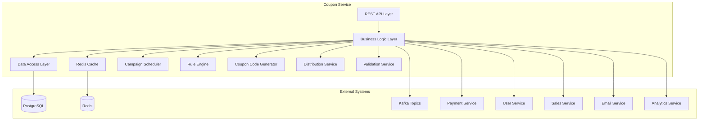
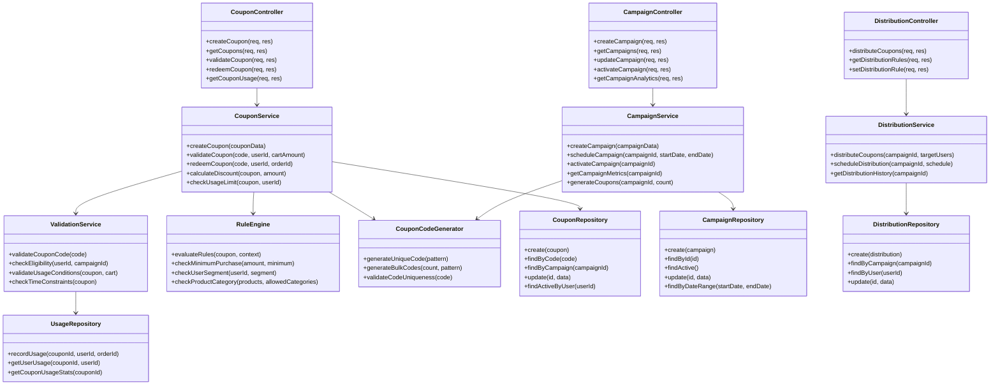
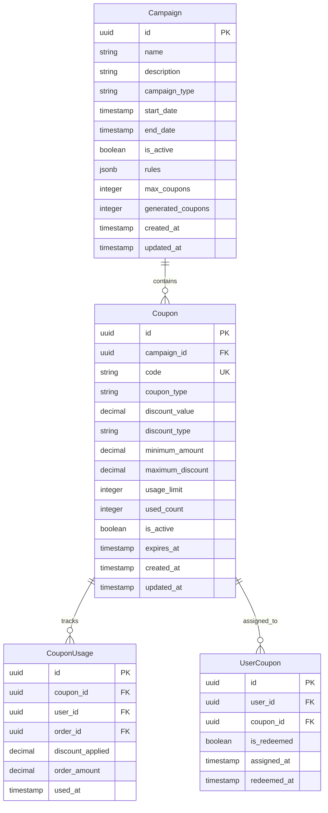

# クーポンサービス 詳細設計書

## 1. 概要

### 1.1 サービスの目的

クーポンサービスは、スキーショップ電子商取引プラットフォームのプロモーションキャンペーン、割引クーポン、およびバウチャーシステムを管理します。作成、検証、引き換え、分析を含む包括的なクーポンライフサイクル管理を提供します。

### 1.2 サービスの責務

- クーポンの作成と管理（パーセンテージ、固定金額、BOGO）
- キャンペーン管理とスケジューリング
- クーポン検証と引き換えロジック
- 使用状況追跡と分析
- 有効期限とライフサイクル管理
- ユーザー固有およびグローバルプロモーション
- 決済処理との統合
- 不正防止と濫用検出

### 1.3 ビジネスコンテキスト

このサービスは、マーケティングチームがプロモーションキャンペーンを作成・管理し、ターゲット割引とインセンティブを通じて顧客獲得、維持、売上を促進することを可能にします。

## 2. 技術スタック

### 2.1 開発環境

- **言語**: Java 21 (LTS)
- **フレームワーク**: Spring Boot 3.2.3
- **ビルドツール**: Maven 3.9.x
- **Message Queue**: Apache Kafka
- **Authentication**: JWT tokens
- **API Documentation**: OpenAPI 3.0/Swagger

### 2.2 本番環境

- Azure Container Apps
- Azure Database for PostgreSQL
- Azure Cache for Redis
- Azure Service Bus (Kafka)

### 2.3 主要ライブラリとバージョン

| ライブラリ | バージョン | 用途 |
|----------|----------|------|
| spring-boot-starter-web | 3.2.3 | REST API エンドポイント |
| spring-boot-starter-data-jpa | 3.2.3 | JPA データアクセス |
| spring-boot-starter-data-redis | 3.2.3 | Redis キャッシュ |
| spring-boot-starter-validation | 3.2.3 | 入力バリデーション |
| spring-boot-starter-security | 3.2.3 | セキュリティ設定 |
| spring-boot-starter-actuator | 3.2.3 | ヘルスチェック、メトリクス |
| spring-cloud-starter-stream-kafka | 4.1.0 | イベント発行・購読 |
| postgresql | 42.7.1 | PostgreSQL ドライバー |
| mapstruct | 1.5.5.Final | オブジェクトマッピング |
| lombok | 1.18.30 | ボイラープレートコード削減 |
| micrometer-registry-prometheus | 1.12.2 | メトリクス収集 |
| springdoc-openapi-starter-webmvc-ui | 2.3.0 | API 文書化 |
| azure-identity | 1.11.1 | Azure 認証 |
| azure-security-keyvault-secrets | 4.6.2 | Azure Key Vault 連携 |
| azure-monitor-opentelemetry | 1.0.0-beta.15 | Azure 監視連携 |
| logback-json-classic | 0.1.5 | JSON 形式ログ出力 |

### 2.4 開発・テストツール

- **テスト**: JUnit 5.10.1、Spring Boot Test、Testcontainers 1.19.3
- **コンテナ化**: Docker 25.x
- **CI/CD**: GitHub Actions、Azure DevOps

## 3. System Architecture

### 3.1 Component Diagram



### 3.2 Class Diagram



## 4. Data Models

### 4.1 Entity Relationship Diagram



### 4.2 Data Schema

#### Campaign Table

```sql
CREATE TABLE campaigns (
    id UUID PRIMARY KEY DEFAULT gen_random_uuid(),
    name VARCHAR(255) NOT NULL,
    description TEXT,
    campaign_type VARCHAR(50) NOT NULL, -- 'percentage', 'fixed', 'bogo', 'free_shipping'
    start_date TIMESTAMP NOT NULL,
    end_date TIMESTAMP NOT NULL,
    is_active BOOLEAN DEFAULT false,
    rules JSONB DEFAULT '{}',
    max_coupons INTEGER,
    generated_coupons INTEGER DEFAULT 0,
    created_at TIMESTAMP DEFAULT CURRENT_TIMESTAMP,
    updated_at TIMESTAMP DEFAULT CURRENT_TIMESTAMP
);
```

#### Coupon Table

```sql
CREATE TABLE coupons (
    id UUID PRIMARY KEY DEFAULT gen_random_uuid(),
    campaign_id UUID NOT NULL,
    code VARCHAR(50) UNIQUE NOT NULL,
    coupon_type VARCHAR(50) NOT NULL, -- 'percentage', 'fixed_amount', 'free_shipping'
    discount_value DECIMAL(10,2) NOT NULL,
    discount_type VARCHAR(20) NOT NULL, -- 'percentage', 'fixed'
    minimum_amount DECIMAL(10,2) DEFAULT 0,
    maximum_discount DECIMAL(10,2),
    usage_limit INTEGER DEFAULT 1,
    used_count INTEGER DEFAULT 0,
    is_active BOOLEAN DEFAULT true,
    expires_at TIMESTAMP NOT NULL,
    created_at TIMESTAMP DEFAULT CURRENT_TIMESTAMP,
    updated_at TIMESTAMP DEFAULT CURRENT_TIMESTAMP,
    CONSTRAINT fk_coupon_campaign FOREIGN KEY (campaign_id) REFERENCES campaigns(id),
    CONSTRAINT check_usage_limit CHECK (used_count <= usage_limit)
);
```

#### CouponUsage Table

```sql
CREATE TABLE coupon_usage (
    id UUID PRIMARY KEY DEFAULT gen_random_uuid(),
    coupon_id UUID NOT NULL,
    user_id UUID NOT NULL,
    order_id UUID NOT NULL,
    discount_applied DECIMAL(10,2) NOT NULL,
    order_amount DECIMAL(10,2) NOT NULL,
    used_at TIMESTAMP DEFAULT CURRENT_TIMESTAMP,
    CONSTRAINT fk_usage_coupon FOREIGN KEY (coupon_id) REFERENCES coupons(id),
    CONSTRAINT fk_usage_user FOREIGN KEY (user_id) REFERENCES users(id),
    UNIQUE(coupon_id, order_id)
);
```

## 5. API Design

### 5.1 Coupon Endpoints

| メソッド | パス | 説明 | 認証要件 |
|---------|-----|------|---------|
| POST | /api/v1/coupons | クーポン作成 | 要認証（管理者） |
| GET | /api/v1/coupons | クーポン一覧取得 | 要認証（管理者） |
| POST | /api/v1/coupons/validate | クーポン検証 | 要認証 |
| POST | /api/v1/coupons/redeem | クーポン使用 | 要認証 |
| GET | /api/v1/coupons/usage/{couponId} | クーポン使用状況 | 要認証（管理者） |
| POST | /api/v1/coupons/bulk-generate | 一括クーポン生成 | 要認証（管理者） |

### 5.2 Campaign Endpoints

| メソッド | パス | 説明 | 認証要件 |
|---------|-----|------|---------|
| POST | /api/v1/campaigns | キャンペーン作成 | 要認証（管理者） |
| GET | /api/v1/campaigns | キャンペーン一覧取得 | 要認証（管理者） |
| PUT | /api/v1/campaigns/{campaignId} | キャンペーン更新 | 要認証（管理者） |
| POST | /api/v1/campaigns/{campaignId}/activate | キャンペーン有効化 | 要認証（管理者） |
| GET | /api/v1/campaigns/{campaignId}/analytics | キャンペーン分析 | 要認証（管理者） |

### 5.3 Distribution Endpoints

| メソッド | パス | 説明 | 認証要件 |
|---------|-----|------|---------|
| POST | /api/v1/distributions/rules | 配布ルール設定 | 要認証（管理者） |
| GET | /api/v1/distributions/rules/{campaignId} | 配布ルール取得 | 要認証（管理者） |
| POST | /api/v1/distributions/execute | クーポン配布実行 | 要認証（管理者） |
| GET | /api/v1/distributions/history/{campaignId} | 配布履歴取得 | 要認証（管理者） |

### 5.4 Request/Response Examples

#### Create Coupon

```http
POST /api/v1/coupons
Authorization: Bearer <admin-token>
Content-Type: application/json

{
  "campaignId": "uuid",
  "code": "WINTER2024",
  "couponType": "percentage",
  "discountValue": 20,
  "minimumAmount": 5000,
  "maximumDiscount": 3000,
  "usageLimit": 100,
  "expiresAt": "2024-03-31T23:59:59Z"
}

Response: 201 Created
{
  "success": true,
  "data": {
    "id": "uuid",
    "code": "WINTER2024",
    "couponType": "percentage",
    "discountValue": 20,
    "minimumAmount": 5000,
    "maximumDiscount": 3000,
    "usageLimit": 100,
    "usedCount": 0,
    "expiresAt": "2024-03-31T23:59:59Z"
  }
}
```

#### Validate Coupon

```http
POST /api/v1/coupons/validate
Authorization: Bearer <token>
Content-Type: application/json

{
  "code": "WINTER2024",
  "cartAmount": 10000
}

Response: 200 OK
{
  "success": true,
  "data": {
    "isValid": true,
    "coupon": {
      "id": "uuid",
      "code": "WINTER2024",
      "discountType": "percentage",
      "discountValue": 20
    },
    "discount": {
      "amount": 2000,
      "finalAmount": 8000
    }
  }
}
```

#### Redeem Coupon

```http
POST /api/v1/coupons/redeem
Authorization: Bearer <token>
Content-Type: application/json

{
  "code": "WINTER2024",
  "orderId": "uuid",
  "orderAmount": 10000
}

Response: 200 OK
{
  "success": true,
  "data": {
    "usageId": "uuid",
    "discountApplied": 2000,
    "finalAmount": 8000,
    "redeemedAt": "2024-01-15T10:30:00Z"
  }
}
```

#### Create Campaign

```http
POST /api/v1/campaigns
Authorization: Bearer <admin-token>
Content-Type: application/json

{
  "name": "Winter Sale 2024",
  "description": "Winter ski equipment sale",
  "campaignType": "percentage",
  "startDate": "2024-01-01T00:00:00Z",
  "endDate": "2024-03-31T23:59:59Z",
  "rules": {
    "userSegment": "all",
    "productCategories": ["ski", "snowboard"],
    "minOrderAmount": 5000
  },
  "maxCoupons": 1000
}

Response: 201 Created
{
  "success": true,
  "data": {
    "id": "uuid",
    "name": "Winter Sale 2024",
    "campaignType": "percentage",
    "startDate": "2024-01-01T00:00:00Z",
    "endDate": "2024-03-31T23:59:59Z",
    "isActive": false,
    "generatedCoupons": 0,
    "maxCoupons": 1000
  }
}
```

#### Get Campaign Analytics

```http
GET /api/v1/campaigns/{campaignId}/analytics
Authorization: Bearer <admin-token>

Response: 200 OK
{
  "success": true,
  "data": {
    "campaignId": "uuid",
    "totalCoupons": 1000,
    "usedCoupons": 156,
    "usageRate": 15.6,
    "totalDiscount": 156000,
    "averageDiscount": 1000,
    "totalOrders": 156,
    "revenue": 2340000,
    "conversionRate": 78.5
  }
}
```

#### Set Distribution Rule

```http
POST /api/v1/distributions/rules
Authorization: Bearer <admin-token>
Content-Type: application/json

{
  "campaignId": "uuid",
  "distributionType": "user_segment",
  "rules": {
    "userSegment": {
      "criteria": "purchase_history",
      "minPurchaseAmount": 50000,
      "timeFrame": "90_days"
    },
    "schedule": {
      "startDate": "2024-01-01T00:00:00Z",
      "endDate": "2024-01-31T23:59:59Z",
      "frequency": "once"
    },
    "eligibility": {
      "firstTimeCustomer": false,
      "loyaltyTier": ["SILVER", "GOLD", "PLATINUM"],
      "excludeRecentCouponUsers": true
    }
  },
  "maxDistribution": 500
}

Response: 201 Created
{
  "success": true,
  "data": {
    "ruleId": "uuid",
    "campaignId": "uuid",
    "distributionType": "user_segment",
    "estimatedTargetUsers": 1250,
    "maxDistribution": 500,
    "status": "scheduled"
  }
}
```

#### Execute Coupon Distribution

```http
POST /api/v1/distributions/execute
Authorization: Bearer <admin-token>
Content-Type: application/json

{
  "campaignId": "uuid",
  "ruleId": "uuid",
  "dryRun": false
}

Response: 200 OK
{
  "success": true,
  "data": {
    "distributionId": "uuid",
    "campaignId": "uuid",
    "targetUsersCount": 1250,
    "actualDistributed": 500,
    "distributedCoupons": [
      {
        "userId": "uuid",
        "couponCode": "WINTER2024-ABC123",
        "distributedAt": "2024-01-15T10:30:00Z"
      }
    ],
    "status": "completed"
  }
}
```

#### Bulk Coupon Generation

```http
POST /api/v1/coupons/bulk-generate
Authorization: Bearer <admin-token>
Content-Type: application/json

{
  "campaignId": "uuid",
  "count": 100,
  "codePattern": "WINTER2024-{random:6}",
  "couponConfig": {
    "couponType": "percentage",
    "discountValue": 15,
    "minimumAmount": 3000,
    "maximumDiscount": 2000,
    "usageLimit": 1,
    "expiresAt": "2024-03-31T23:59:59Z"
  }
}

Response: 201 Created
{
  "success": true,
  "data": {
    "batchId": "uuid",
    "campaignId": "uuid",
    "requestedCount": 100,
    "generatedCount": 100,
    "generatedCodes": [
      "WINTER2024-A1B2C3",
      "WINTER2024-X9Y8Z7",
      "..."
    ],
    "status": "completed"
  }
}
```

## 6. Rule Engine Specification

### 6.1 Rule Types

#### User Segment Rules

- **新規顧客**: 初回購入者向けクーポン
- **ロイヤルティ層**: VIP顧客向け特別割引
- **休眠顧客**: 一定期間未購入者への復帰促進クーポン
- **購入履歴**: 過去の購入金額・頻度に基づく配布

#### Product Category Rules

- **カテゴリ限定**: 特定商品カテゴリのみ適用
- **ブランド限定**: 指定ブランド商品のみ適用
- **価格帯限定**: 一定価格以上の商品のみ適用

#### Time-based Rules

- **期間限定**: 特定期間内のみ有効
- **曜日・時間帯**: 特定の曜日・時間帯のみ適用
- **イベント連動**: 特定イベント期間中のみ有効

#### Usage Rules

- **使用回数制限**: ユーザーあたりの使用回数制限
- **併用制限**: 他クーポンとの併用可否
- **最小購入金額**: 適用に必要な最小購入金額

### 6.2 Rule Evaluation Engine

```java
@Component
public class CouponRuleEngine {
    
    public ValidationResult evaluateRules(CouponValidationContext context) {
        List<Rule> rules = context.getCoupon().getRules();
        
        for (Rule rule : rules) {
            RuleResult result = evaluateRule(rule, context);
            if (!result.isValid()) {
                return ValidationResult.failure(result.getErrorMessage());
            }
        }
        
        return ValidationResult.success();
    }
    
    private RuleResult evaluateRule(Rule rule, CouponValidationContext context) {
        switch (rule.getType()) {
            case USER_SEGMENT:
                return evaluateUserSegmentRule((UserSegmentRule) rule, context);
            case PRODUCT_CATEGORY:
                return evaluateProductCategoryRule((ProductCategoryRule) rule, context);
            case TIME_BASED:
                return evaluateTimeBasedRule((TimeBasedRule) rule, context);
            case USAGE_LIMIT:
                return evaluateUsageLimitRule((UsageLimitRule) rule, context);
            default:
                return RuleResult.failure("Unknown rule type: " + rule.getType());
        }
    }
}
```
## 7. Error Handling

### 7.1 Error Categories

#### Business Errors

```typescript
export enum CouponErrorCode {
  COUPON_NOT_FOUND = 'COUPON_NOT_FOUND',
  COUPON_EXPIRED = 'COUPON_EXPIRED',
  COUPON_EXHAUSTED = 'COUPON_EXHAUSTED',
  MINIMUM_AMOUNT_NOT_MET = 'MINIMUM_AMOUNT_NOT_MET',
  ALREADY_USED = 'ALREADY_USED',
  CAMPAIGN_INACTIVE = 'CAMPAIGN_INACTIVE'
}
```

#### System Errors

```typescript
export enum SystemErrorCode {
  DATABASE_ERROR = 'DATABASE_ERROR',
  CACHE_ERROR = 'CACHE_ERROR',
  VALIDATION_ERROR = 'VALIDATION_ERROR',
  NETWORK_ERROR = 'NETWORK_ERROR'
}
```

### 7.2 Error Response Format

```json
{
  "success": false,
  "error": {
    "code": "COUPON_EXPIRED",
    "message": "This coupon has expired and can no longer be used.",
    "details": {
      "couponCode": "WINTER2024",
      "expiredAt": "2024-03-31T23:59:59Z"
    },
    "timestamp": "2024-01-15T10:30:00Z"
  }
}
```

## 8. Event Design

### 8.1 Published Events

#### Coupon Created Event

```json
{
  "eventType": "coupon.created",
  "version": "1.0",
  "timestamp": "2024-01-15T10:30:00Z",
  "source": "coupon-service",
  "data": {
    "couponId": "uuid",
    "couponCode": "WINTER2024",
    "campaignId": "uuid",
    "couponType": "percentage",
    "discountValue": 20,
    "minimumAmount": 5000,
    "expiresAt": "2024-03-31T23:59:59Z",
    "createdBy": "admin-user-id"
  }
}
```

#### Coupon Redeemed Event

```json
{
  "eventType": "coupon.redeemed",
  "version": "1.0",
  "timestamp": "2024-01-15T10:30:00Z",
  "source": "coupon-service",
  "data": {
    "usageId": "uuid",
    "couponId": "uuid",
    "couponCode": "WINTER2024",
    "userId": "uuid",
    "orderId": "uuid",
    "discountApplied": 2000,
    "orderAmount": 10000,
    "finalAmount": 8000,
    "campaignId": "uuid"
  }
}
```

#### Coupon Used Event

```json
{
  "eventType": "coupon.used",
  "version": "1.0",
  "timestamp": "2024-01-15T10:30:00Z",
  "source": "coupon-service",
  "data": {
    "couponId": "uuid",
    "couponCode": "WINTER2024",
    "userId": "uuid",
    "orderId": "uuid",
    "usageCount": 1,
    "totalUsageCount": 45,
    "campaignId": "uuid"
  }
}
```

#### Campaign Activated Event

```json
{
  "eventType": "campaign.activated",
  "version": "1.0",
  "timestamp": "2024-01-15T10:30:00Z",
  "source": "coupon-service",
  "data": {
    "campaignId": "uuid",
    "campaignName": "Winter Sale 2024",
    "startDate": "2024-01-01T00:00:00Z",
    "endDate": "2024-03-31T23:59:59Z",
    "totalCoupons": 1000,
    "campaignType": "percentage",
    "rules": {
      "productCategories": ["ski", "snowboard"],
      "minOrderAmount": 5000
    }
  }
}
```

#### Coupon Distribution Event

```json
{
  "eventType": "coupon.distributed",
  "version": "1.0",
  "timestamp": "2024-01-15T10:30:00Z",
  "source": "coupon-service",
  "data": {
    "distributionId": "uuid",
    "campaignId": "uuid",
    "targetUsers": ["uuid1", "uuid2", "uuid3"],
    "distributedCoupons": [
      {
        "userId": "uuid1",
        "couponCode": "WINTER2024-ABC123"
      },
      {
        "userId": "uuid2", 
        "couponCode": "WINTER2024-DEF456"
      }
    ],
    "distributionRule": "user_segment",
    "distributedCount": 500
  }
}
```

#### Coupon Expired Event

```json
{
  "eventType": "coupon.expired",
  "version": "1.0",
  "timestamp": "2024-03-31T23:59:59Z",
  "source": "coupon-service",
  "data": {
    "couponId": "uuid",
    "couponCode": "WINTER2024",
    "campaignId": "uuid",
    "expiresAt": "2024-03-31T23:59:59Z",
    "wasUsed": false,
    "totalUsageCount": 0
  }
}
```

### 8.2 Consumed Events

#### Order Created Event

```json
{
  "eventType": "order.created",
  "version": "1.0",
  "timestamp": "2024-01-15T10:30:00Z",
  "source": "sales-service",
  "data": {
    "orderId": "uuid",
    "userId": "uuid",
    "amount": 10000,
    "couponCode": "WINTER2024",
    "discountApplied": 2000,
    "items": [
      {
        "productId": "uuid",
        "category": "ski",
        "quantity": 1,
        "price": 10000
      }
    ]
  }
}
```

#### User Registration Event

```json
{
  "eventType": "user.registered",
  "version": "1.0",
  "timestamp": "2024-01-15T10:30:00Z",
  "source": "user-service",
  "data": {
    "userId": "uuid",
    "email": "user@example.com",
    "registrationDate": "2024-01-15T10:30:00Z",
    "isFirstTime": true
  }
}
```

### 8.3 Event Processing

```java
@EventListener
@Component
public class CouponEventHandler {
    
    @Autowired
    private CouponService couponService;
    
    @Autowired
    private DistributionService distributionService;
    
    @KafkaListener(topics = "user.registered")
    public void handleUserRegistration(UserRegisteredEvent event) {
        // 新規ユーザー向けウェルカムクーポンの配布
        distributionService.distributeWelcomeCoupon(event.getUserId());
    }
    
    @KafkaListener(topics = "order.created")
    public void handleOrderCreated(OrderCreatedEvent event) {
        // クーポン使用確定処理
        if (event.getCouponCode() != null) {
            couponService.confirmCouponUsage(
                event.getCouponCode(), 
                event.getUserId(), 
                event.getOrderId()
            );
        }
    }
    
    @KafkaListener(topics = "order.cancelled")
    public void handleOrderCancelled(OrderCancelledEvent event) {
        // クーポン使用取消処理
        if (event.getCouponCode() != null) {
            couponService.revertCouponUsage(
                event.getCouponCode(), 
                event.getUserId(), 
                event.getOrderId()
            );
        }
    }
}
```
## 9. Performance

### 9.1 Performance Requirements

- **Validation**: < 100ms response time
- **Redemption**: < 200ms response time
- **Concurrent Users**: Support 2000+ concurrent validations
- **Throughput**: 1000 validations/second peak capacity

### 9.2 Optimization Strategies

- **Redis Caching**: Active coupons cached for fast lookup
- **Database Indexing**: Optimized queries with proper indexes
- **Batch Processing**: Bulk coupon generation and updates
- **CDN**: Static campaign content caching
- **Connection Pooling**: Database connection optimization

### 9.3 Caching Strategy

```typescript
// Coupon caching with Redis
const cacheKey = `coupon:${code}`;
const ttl = 1800; // 30 minutes

// Cache active coupon data
await redis.setex(cacheKey, ttl, JSON.stringify(couponData));

// Cache invalidation on updates
await redis.del(`coupon:${code}`);
```

## 10. Monitoring & Observability

### 10.1 Metrics

- **Business Metrics**: Redemption rate, campaign effectiveness, fraud detection
- **Technical Metrics**: Response times, error rates, cache hit ratio
- **Usage Metrics**: Popular coupons, user engagement, conversion rates

### 10.2 Logging

```typescript
logger.info('Coupon redeemed', {
  couponId,
  userId,
  orderId,
  discountApplied,
  processingTime: endTime - startTime
});

logger.warn('Suspicious coupon activity', {
  userId,
  couponCode,
  ipAddress,
  attemptCount,
  timestamp: new Date().toISOString()
});
```

### 10.3 Health Checks

```typescript
// Health check endpoint
app.get('/health', async (req, res) => {
  const checks = {
    database: await checkDatabase(),
    redis: await checkRedis(),
    campaignScheduler: await checkScheduler()
  };
  
  const isHealthy = Object.values(checks).every(check => check);
  res.status(isHealthy ? 200 : 503).json(checks);
});
```

## 11. Testing Strategy

### 11.1 Unit Tests

```typescript
describe('CouponService', () => {
  test('should validate active coupon', async () => {
    const couponService = new CouponService(mockRepository);
    const result = await couponService.validateCoupon('WINTER2024', userId, 10000);
    
    expect(result.isValid).toBe(true);
    expect(result.discount.amount).toBe(2000);
  });
  
  test('should reject expired coupon', async () => {
    const expiredCoupon = createExpiredCoupon();
    const result = await couponService.validateCoupon(expiredCoupon.code, userId, 10000);
    
    expect(result.isValid).toBe(false);
    expect(result.error.code).toBe('COUPON_EXPIRED');
  });
});
```

### 11.2 Integration Tests

```typescript
describe('Coupon API', () => {
  test('should create and validate coupon', async () => {
    // Create coupon
    const createResponse = await request(app)
      .post('/api/v1/coupons')
      .set('Authorization', `Bearer ${adminToken}`)
      .send(couponData)
      .expect(201);
    
    // Validate coupon
    const validateResponse = await request(app)
      .post('/api/v1/coupons/validate')
      .set('Authorization', `Bearer ${userToken}`)
      .send({ code: couponData.code, cartAmount: 10000 })
      .expect(200);
      
    expect(validateResponse.body.data.isValid).toBe(true);
  });
});
```

### 11.3 E2E Tests

- **Campaign Flow**: Create campaign → Generate coupons → Activate → Track usage
- **User Journey**: Discover coupon → Validate → Apply → Redeem
- **Edge Cases**: Expired coupons, usage limits, fraud scenarios

## 12. Deployment

### 12.1 Container Configuration

```dockerfile
FROM node:18-alpine
WORKDIR /app
COPY package*.json ./
RUN npm ci --only=production
COPY . .
EXPOSE 3000
CMD ["npm", "start"]
```

### 12.2 Kubernetes Deployment

```yaml
apiVersion: apps/v1
kind: Deployment
metadata:
  name: coupon-service
spec:
  replicas: 3
  selector:
    matchLabels:
      app: coupon-service
  template:
    metadata:
      labels:
        app: coupon-service
    spec:
      containers:
      - name: coupon-service
        image: coupon-service:latest
        ports:
        - containerPort: 3000
        env:
        - name: DATABASE_URL
          valueFrom:
            secretKeyRef:
              name: db-secret
              key: url
        - name: REDIS_URL
          valueFrom:
            secretKeyRef:
              name: redis-secret
              key: url
```

### 12.3 Environment Configuration

- **Development**: Local PostgreSQL, Redis, mock external services
- **Staging**: Managed databases, staging campaign data
- **Production**: HA databases, live campaigns, monitoring

## 13. Future Enhancements

### 13.1 Planned Features

- **Dynamic Pricing**: AI-driven coupon value optimization
- **Personalized Coupons**: User behavior-based coupon generation
- **Social Sharing**: Referral and viral coupon campaigns
- **Geo-targeting**: Location-based coupon distribution
- **A/B Testing**: Campaign optimization experiments

### 13.2 Technical Improvements

- **GraphQL API**: Alternative to REST endpoints
- **Event Sourcing**: Complete campaign history tracking
- **Machine Learning**: Fraud detection and optimization
- **Real-time Analytics**: Live campaign performance dashboard
- **Multi-tenant**: Support for multiple brand campaigns

### 13.3 Scalability Roadmap

- **Horizontal Scaling**: Auto-scaling based on campaign load
- **Database Sharding**: Campaign-based data partitioning
- **Edge Computing**: Coupon validation at edge locations
- **Global Campaigns**: Multi-region campaign support
- **Predictive Analytics**: Demand forecasting for campaigns
