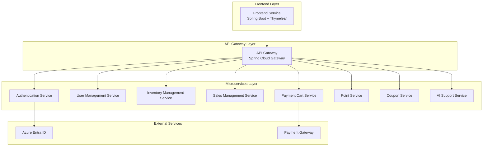
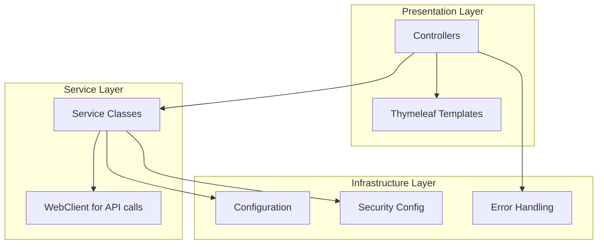
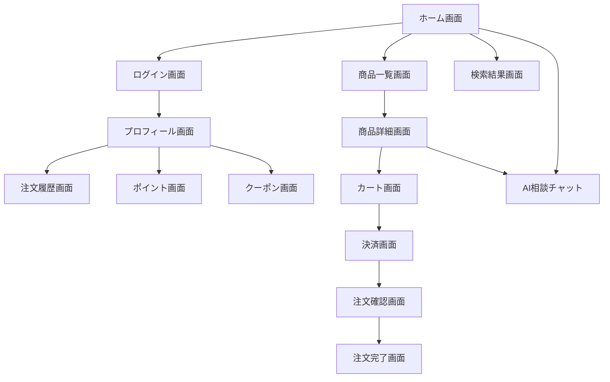
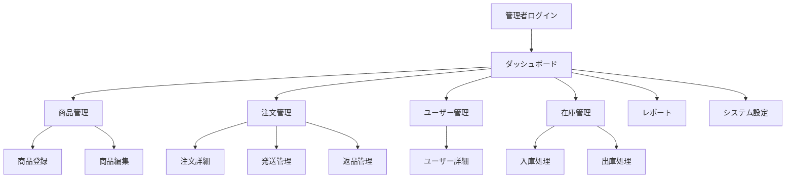

# フロントエンドサービス 詳細設計書

## 1. 概要

### 1.1 サービス概要

Azure SkiShop のフロントエンドサービスは、マイクロサービスアーキテクチャで構築されたバックエンドサービス群を統合し、顧客と管理者に対して統一されたWebインターフェースを提供します。

### 1.2 サービス名

Frontend Service (フロントエンドサービス)

### 1.3 責務

- 顧客向けスキーショップWebサイトの提供
- 管理者向け管理画面の提供
- バックエンドマイクロサービスとの統合
- レスポンシブデザインでの最適なユーザー体験
- 認証・認可の統合管理

## 2. 技術スタック

### 2.1 基盤技術
- **Java**: 21 LTS
- **Spring Boot**: 3.2.x
- **テンプレートエンジン**: Thymeleaf 3.1.x
- **UI フレームワーク**: Bootstrap 5.3.x
- **ビルドツール**: Maven 3.9.x

### 2.2 依存ライブラリ
```xml
<dependency>
    <groupId>org.springframework.boot</groupId>
    <artifactId>spring-boot-starter-web</artifactId>
</dependency>
<dependency>
    <groupId>org.springframework.boot</groupId>
    <artifactId>spring-boot-starter-thymeleaf</artifactId>
</dependency>
<dependency>
    <groupId>org.springframework.boot</groupId>
    <artifactId>spring-boot-starter-security</artifactId>
</dependency>
<dependency>
    <groupId>org.springframework.boot</groupId>
    <artifactId>spring-boot-starter-webflux</artifactId>
</dependency>
<dependency>
    <groupId>org.springframework.boot</groupId>
    <artifactId>spring-boot-starter-actuator</artifactId>
</dependency>
<dependency>
    <groupId>org.springframework.boot</groupId>
    <artifactId>spring-boot-starter-validation</artifactId>
</dependency>
<dependency>
    <groupId>org.webjars</groupId>
    <artifactId>bootstrap</artifactId>
    <version>5.3.2</version>
</dependency>
<dependency>
    <groupId>org.webjars</groupId>
    <artifactId>jquery</artifactId>
    <version>3.7.1</version>
</dependency>
```

### 2.3 外部サービス連携
- **API Gateway**: Spring Cloud Gateway (ローカル) / Azure API Management (本番)
- **認証サービス**: Azure Entra ID OAuth 2.0
- **バックエンドマイクロサービス**: RESTful API経由

## 3. アーキテクチャ設計

### 3.1 システム構成図



### 3.2 レイヤーアーキテクチャ



## 4. デザイン仕様

### 4.1 デザインコンセプト
- **参考サイト**: https://www.websports.co.jp/
- **ブランド名**: Azure SkiShop
- **デザインテーマ**: 現代的でスポーティな雪山をイメージしたデザイン

### 4.2 カラーパレット

#### 一般利用者向けサイト (薄い青色ベース)
```css
:root {
  /* Primary Colors */
  --primary-blue: #4A90E2;
  --light-blue: #E3F2FD;
  --medium-blue: #90CAF9;
  --dark-blue: #1976D2;
  
  /* Secondary Colors */
  --white: #FFFFFF;
  --light-gray: #F5F5F5;
  --gray: #9E9E9E;
  --dark-gray: #424242;
  
  /* Accent Colors */
  --success-green: #4CAF50;
  --warning-orange: #FF9800;
  --error-red: #F44336;
  --info-cyan: #00BCD4;
}
```

#### 管理者向けサイト (薄い赤色ベース)
```css
:root {
  /* Primary Colors */
  --primary-red: #E74C3C;
  --light-red: #FFEBEE;
  --medium-red: #EF9A9A;
  --dark-red: #C62828;
  
  /* Secondary Colors */
  --white: #FFFFFF;
  --light-gray: #F5F5F5;
  --gray: #9E9E9E;
  --dark-gray: #424242;
  
  /* Accent Colors */
  --success-green: #4CAF50;
  --warning-orange: #FF9800;
  --error-red: #D32F2F;
  --info-blue: #2196F3;
}
```

### 4.3 画面構成

#### 一般利用者向けサイト構成
1. **ヘッダー**
   - ロゴ (Azure SkiShop)
   - ナビゲーションメニュー
   - 検索バー
   - ユーザーアカウントエリア
   - カートアイコン

2. **メインナビゲーション**
   - スキー用品
   - スノーボード用品
   - ウェア
   - アクセサリー
   - セール

3. **フッター**
   - 会社情報
   - サポート情報
   - ソーシャルメディアリンク

#### 管理者向けサイト構成
1. **管理者ヘッダー**
   - 管理者ロゴ
   - 管理者名表示
   - ログアウト

2. **サイドバーナビゲーション**
   - ダッシュボード
   - 商品管理
   - 注文管理
   - ユーザー管理
   - 在庫管理
   - レポート
   - システム設定

## 5. 画面遷移図

### 5.1 一般利用者向け画面遷移



### 5.2 管理者向け画面遷移



## 6. 主要画面設計

### 6.1 ホーム画面
- **ヒーローセクション**: 大型バナー画像とキャッチコピー
- **おすすめ商品**: カルーセル形式
- **カテゴリ別商品**: グリッドレイアウト
- **新着商品**: 横スクロール形式
- **セール情報**: 目立つバナー表示

### 6.2 商品一覧画面
- **フィルター機能**: カテゴリ、ブランド、価格帯、評価
- **ソート機能**: 価格、人気度、新着順、評価順
- **グリッドビュー**: 商品画像、名前、価格、評価表示
- **ページネーション**: 無限スクロールまたはページ番号

### 6.3 商品詳細画面
- **商品画像ギャラリー**: メイン画像とサムネイル
- **商品情報**: 名前、価格、説明、仕様
- **在庫状況**: リアルタイム表示
- **カート追加ボタン**: 目立つCTAボタン
- **レビュー表示**: 顧客レビューと評価
- **関連商品**: 類似商品の推奨
- **AI相談ボタン**: 商品に関する質問

### 6.4 カート画面
- **商品リスト**: 商品画像、名前、数量、価格
- **数量変更**: インクリメント/デクリメントボタン
- **削除機能**: 商品削除ボタン
- **合計金額表示**: 小計、税金、送料、総額
- **決済ボタン**: チェックアウトへの誘導

### 6.5 管理者ダッシュボード
- **KPIカード**: 売上、注文数、ユーザー数、在庫アラート
- **売上グラフ**: 時系列チャート
- **注文状況**: 最新注文の一覧
- **在庫アラート**: 低在庫商品の警告
- **システム状況**: マイクロサービスの稼働状況

## 7. API統合設計

### 7.1 APIクライアント設計

```java
@Service
public class ApiClientService {
    
    private final WebClient webClient;
    
    @Value("${app.api-gateway.url}")
    private String apiGatewayUrl;
    
    public ApiClientService(WebClient.Builder webClientBuilder) {
        this.webClient = webClientBuilder
            .baseUrl(apiGatewayUrl)
            .build();
    }
    
    // 商品取得
    public Mono<ProductResponse> getProduct(String productId) {
        return webClient.get()
            .uri("/api/products/{id}", productId)
            .retrieve()
            .bodyToMono(ProductResponse.class);
    }
    
    // カート操作
    public Mono<CartResponse> addToCart(String userId, CartItemRequest request) {
        return webClient.post()
            .uri("/api/v1/cart/items")
            .header("X-User-ID", userId)
            .bodyValue(request)
            .retrieve()
            .bodyToMono(CartResponse.class);
    }
}
```

### 7.2 エラーハンドリング

```java
@Component
public class ApiErrorHandler {
    
    public <T> Mono<T> handleErrors(Mono<T> apiCall, T defaultValue) {
        return apiCall
            .onErrorResume(WebClientResponseException.class, ex -> {
                log.error("API call failed: {}", ex.getMessage());
                return Mono.just(defaultValue);
            })
            .onErrorResume(TimeoutException.class, ex -> {
                log.error("API call timeout: {}", ex.getMessage());
                return Mono.just(defaultValue);
            });
    }
}
```

## 8. セキュリティ設計

### 8.1 認証設定

```java
@Configuration
@EnableWebSecurity
public class SecurityConfig {
    
    @Bean
    public SecurityFilterChain filterChain(HttpSecurity http) throws Exception {
        http
            .authorizeHttpRequests(authz -> authz
                .requestMatchers("/", "/products/**", "/search/**").permitAll()
                .requestMatchers("/admin/**").hasRole("ADMIN")
                .anyRequest().authenticated()
            )
            .oauth2Login(oauth2 -> oauth2
                .loginPage("/login")
                .defaultSuccessUrl("/dashboard")
            )
            .logout(logout -> logout
                .logoutSuccessUrl("/")
            );
        
        return http.build();
    }
}
```

### 8.2 CSRF保護

```java
@Configuration
public class CsrfConfig {
    
    @Bean
    public CsrfTokenRepository csrfTokenRepository() {
        CookieCsrfTokenRepository repository = CookieCsrfTokenRepository.withHttpOnlyFalse();
        repository.setCookieName("XSRF-TOKEN");
        repository.setHeaderName("X-XSRF-TOKEN");
        return repository;
    }
}
```

## 9. パフォーマンス最適化

### 9.1 キャッシュ戦略

```java
@Configuration
@EnableCaching
public class CacheConfig {
    
    @Bean
    public CacheManager cacheManager() {
        CaffeineCacheManager cacheManager = new CaffeineCacheManager();
        cacheManager.setCaffeine(Caffeine.newBuilder()
            .maximumSize(1000)
            .expireAfterWrite(10, TimeUnit.MINUTES));
        return cacheManager;
    }
}
```

### 9.2 静的リソース最適化

```yaml
spring:
  web:
    resources:
      cache:
        cachecontrol:
          max-age: 1h
      chain:
        strategy:
          content:
            enabled: true
        gzipped: true
```

## 10. 監視とログ

### 10.1 ヘルスチェック

```java
@Component
public class CustomHealthIndicator implements HealthIndicator {
    
    @Override
    public Health health() {
        // API Gateway接続チェック
        // 重要なマイクロサービス接続チェック
        return Health.up()
            .withDetail("api-gateway", "UP")
            .withDetail("auth-service", "UP")
            .build();
    }
}
```

### 10.2 メトリクス

```yaml
management:
  endpoints:
    web:
      exposure:
        include: health,info,metrics,prometheus
  metrics:
    export:
      prometheus:
        enabled: true
```

## 11. 国際化対応

### 11.1 多言語設定

```java
@Configuration
public class LocaleConfig implements WebMvcConfigurer {
    
    @Bean
    public LocaleResolver localeResolver() {
        SessionLocaleResolver resolver = new SessionLocaleResolver();
        resolver.setDefaultLocale(Locale.JAPANESE);
        return resolver;
    }
    
    @Bean
    public LocaleChangeInterceptor localeChangeInterceptor() {
        LocaleChangeInterceptor interceptor = new LocaleChangeInterceptor();
        interceptor.setParamName("lang");
        return interceptor;
    }
}
```

## 12. テスト戦略

### 12.1 単体テスト

```java
@WebMvcTest(ProductController.class)
class ProductControllerTest {
    
    @Autowired
    private MockMvc mockMvc;
    
    @MockBean
    private ApiClientService apiClientService;
    
    @Test
    void testGetProduct() throws Exception {
        // テスト実装
    }
}
```

### 12.2 統合テスト

```java
@SpringBootTest(webEnvironment = SpringBootTest.WebEnvironment.RANDOM_PORT)
@TestPropertySource(properties = "app.api-gateway.url=http://localhost:8080")
class FrontendIntegrationTest {
    
    @Autowired
    private TestRestTemplate restTemplate;
    
    @Test
    void testHomePage() {
        // 統合テスト実装
    }
}
```

## 13. デプロイメント

### 13.1 Docker設定

```dockerfile
FROM openjdk:21-jre-slim

WORKDIR /app

COPY target/frontend-service-*.jar app.jar

EXPOSE 8080

ENTRYPOINT ["java", "-jar", "app.jar"]
```

### 13.2 Docker Compose (ローカル開発)

```yaml
version: '3.8'
services:
  frontend-service:
    build: .
    ports:
      - "8080:8080"
    environment:
      - SPRING_PROFILES_ACTIVE=local
      - API_GATEWAY_URL=http://api-gateway:8080
    depends_on:
      - api-gateway
```

### 13.3 Azure Container Apps (本番環境)

```yaml
apiVersion: apps/v1
kind: Deployment
metadata:
  name: frontend-service
spec:
  replicas: 3
  selector:
    matchLabels:
      app: frontend-service
  template:
    metadata:
      labels:
        app: frontend-service
    spec:
      containers:
      - name: frontend-service
        image: acrregistry.azurecr.io/frontend-service:latest
        ports:
        - containerPort: 8080
        env:
        - name: SPRING_PROFILES_ACTIVE
          value: "production"
        - name: API_GATEWAY_URL
          value: "https://api-management.azure-api.net"
```

## 14. 運用手順

### 14.1 ローカル開発環境セットアップ

```bash
# 1. 依存関係のインストール
mvn clean install

# 2. アプリケーション起動
mvn spring-boot:run

# 3. ブラウザでアクセス
open http://localhost:8080
```

### 14.2 本番デプロイ手順

```bash
# 1. Dockerイメージビルド
docker build -t frontend-service:latest .

# 2. Azure Container Registryにプッシュ
az acr login --name acrregistry
docker tag frontend-service:latest acrregistry.azurecr.io/frontend-service:latest
docker push acrregistry.azurecr.io/frontend-service:latest

# 3. Azure Container Appsデプロイ
az containerapp up --name frontend-service --image acrregistry.azurecr.io/frontend-service:latest
```

## 15. 更新履歴

- **作成日**: 2025年06月23日
- **作成者**: システム設計チーム
- **対象バージョン**: v1.0.0
- **最終更新**: 2025年06月23日

---

*このドキュメントは Azure SkiShop フロントエンドサービスの詳細設計を定義し、実装、テスト、デプロイメントの指針を提供します。*
