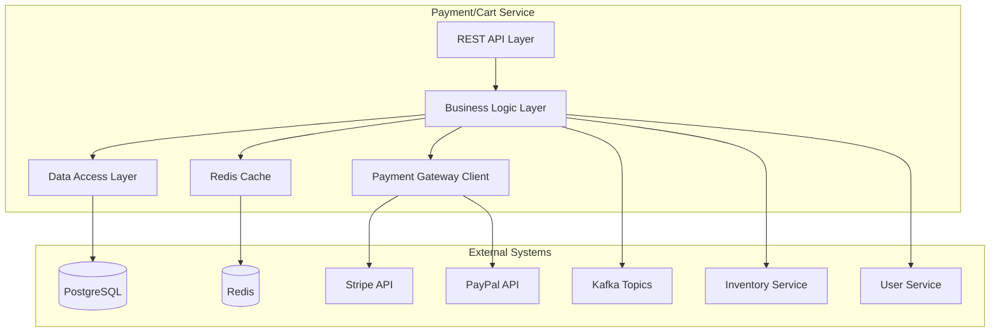
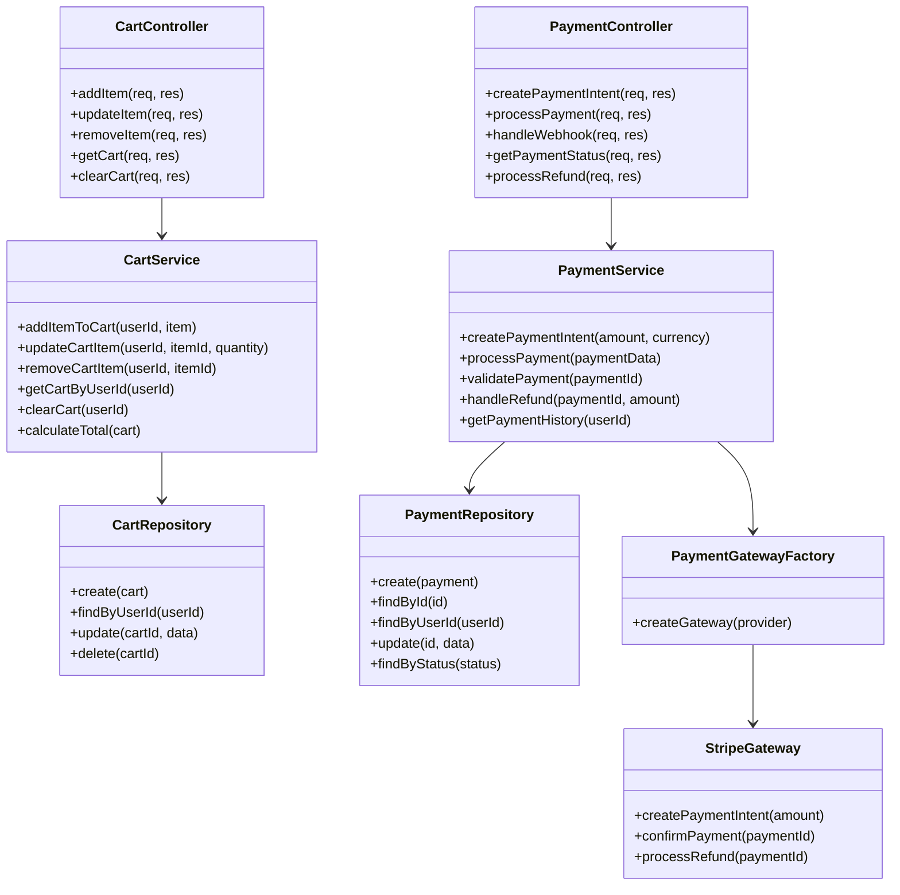
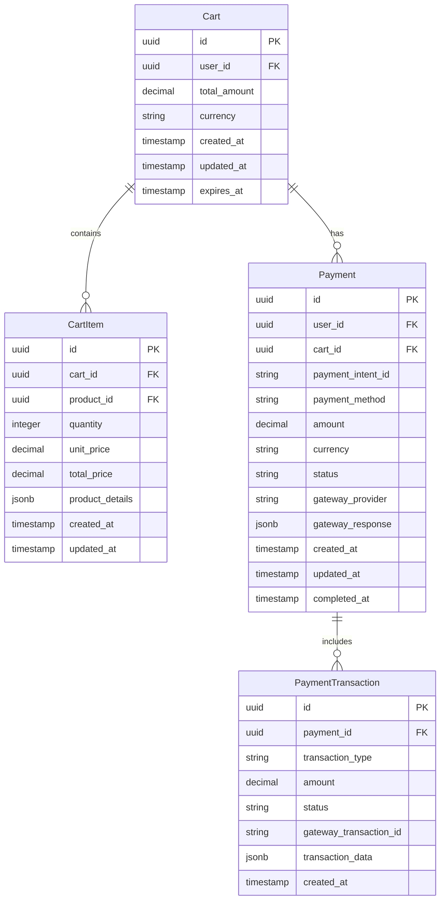

# 決済・カートサービス 詳細設計書

## 1. 概要

### 1.1 サービスの目的

決済・カートサービスは、スキーショップ電子商取引プラットフォームのショッピングカート機能と決済処理を管理します。カート操作、決済ゲートウェイ統合、注文確定、決済ステータス追跡を処理します。

### 1.2 サービスの責務

- ショッピングカート管理（商品追加、更新、削除）
- カート永続化とセッション管理
- 決済ゲートウェイ統合（複数プロバイダー）
- 決済処理と検証
- 注文確定と確認
- 決済ステータス追跡と更新
- 返金とキャンセル処理
- PCI DSS コンプライアンス管理

### 1.3 ビジネスコンテキスト

このサービスは、e-コマースコンバージョンファネルにとって重要であり、カート管理から決済完了までの顧客ジャーニーの最終段階を処理します。

## 2. 技術スタック

### 2.1 開発環境

- **言語**: Java 21 (LTS)
- **フレームワーク**: Spring Boot 3.2.3
- **ビルドツール**: Maven 3.9.x
- **コンテナ化**: Docker 25.x
- **テスト**: JUnit 5.10.1、Spring Boot Test、Testcontainers 1.19.3

### 2.2 本番環境

- Azure Container Apps
- Azure Database for PostgreSQL
- Azure Redis Cache
- Azure Service Bus (Kafka互換)

### 2.3 主要ライブラリとバージョン

| ライブラリ | バージョン | 用途 |
|----------|----------|------|
| spring-boot-starter-data-jpa | 3.2.3 | JPA データアクセス |
| spring-boot-starter-web | 3.2.3 | REST API エンドポイント |
| spring-boot-starter-validation | 3.2.3 | 入力バリデーション |
| spring-boot-starter-security | 3.2.3 | セキュリティ設定 |
| spring-boot-starter-actuator | 3.2.3 | ヘルスチェック、メトリクス |
| spring-boot-starter-data-redis | 3.2.3 | Redis キャッシュ |
| spring-cloud-starter-stream-kafka | 4.1.0 | イベント発行・購読 |
| stripe-java | 24.16.0 | Stripe決済API |

## 3. System Architecture

### 3.1 Component Diagram



### 3.2 Class Diagram



## 4. Data Models

### 4.1 Entity Relationship Diagram



### 4.2 Data Schema

#### Cart Table
```sql
CREATE TABLE carts (
    id UUID PRIMARY KEY DEFAULT gen_random_uuid(),
    user_id UUID NOT NULL,
    total_amount DECIMAL(10,2) DEFAULT 0.00,
    currency VARCHAR(3) DEFAULT 'JPY',
    created_at TIMESTAMP DEFAULT CURRENT_TIMESTAMP,
    updated_at TIMESTAMP DEFAULT CURRENT_TIMESTAMP,
    expires_at TIMESTAMP DEFAULT (CURRENT_TIMESTAMP + INTERVAL '7 days'),
    CONSTRAINT fk_cart_user FOREIGN KEY (user_id) REFERENCES users(id)
);
```

#### CartItem Table
```sql
CREATE TABLE cart_items (
    id UUID PRIMARY KEY DEFAULT gen_random_uuid(),
    cart_id UUID NOT NULL,
    product_id UUID NOT NULL,
    quantity INTEGER NOT NULL CHECK (quantity > 0),
    unit_price DECIMAL(10,2) NOT NULL,
    total_price DECIMAL(10,2) NOT NULL,
    product_details JSONB,
    created_at TIMESTAMP DEFAULT CURRENT_TIMESTAMP,
    updated_at TIMESTAMP DEFAULT CURRENT_TIMESTAMP,
    CONSTRAINT fk_cartitem_cart FOREIGN KEY (cart_id) REFERENCES carts(id) ON DELETE CASCADE,
    UNIQUE(cart_id, product_id)
);
```

#### Payment Table
```sql
CREATE TABLE payments (
    id UUID PRIMARY KEY DEFAULT gen_random_uuid(),
    user_id UUID NOT NULL,
    cart_id UUID,
    payment_intent_id VARCHAR(255) UNIQUE,
    payment_method VARCHAR(50) NOT NULL,
    amount DECIMAL(10,2) NOT NULL,
    currency VARCHAR(3) DEFAULT 'JPY',
    status VARCHAR(20) DEFAULT 'pending',
    gateway_provider VARCHAR(50) NOT NULL,
    gateway_response JSONB,
    created_at TIMESTAMP DEFAULT CURRENT_TIMESTAMP,
    updated_at TIMESTAMP DEFAULT CURRENT_TIMESTAMP,
    completed_at TIMESTAMP,
    CONSTRAINT fk_payment_user FOREIGN KEY (user_id) REFERENCES users(id),
    CONSTRAINT fk_payment_cart FOREIGN KEY (cart_id) REFERENCES carts(id)
);
```

## 5. API Design

### 5.1 Cart Endpoints

#### Add Item to Cart
```http
POST /api/v1/cart/items
Authorization: Bearer <token>
Content-Type: application/json

{
  "productId": "uuid",
  "quantity": 2,
  "productDetails": {
    "name": "Ski Jacket",
    "size": "L",
    "color": "Blue"
  }
}

Response: 201 Created
{
  "success": true,
  "data": {
    "cartId": "uuid",
    "item": {
      "id": "uuid",
      "productId": "uuid",
      "quantity": 2,
      "unitPrice": 15000,
      "totalPrice": 30000
    }
  }
}
```

#### Get Cart
```http
GET /api/v1/cart
Authorization: Bearer <token>

Response: 200 OK
{
  "success": true,
  "data": {
    "id": "uuid",
    "userId": "uuid",
    "items": [
      {
        "id": "uuid",
        "productId": "uuid",
        "quantity": 2,
        "unitPrice": 15000,
        "totalPrice": 30000,
        "productDetails": {
          "name": "Ski Jacket",
          "size": "L",
          "color": "Blue"
        }
      }
    ],
    "totalAmount": 30000,
    "currency": "JPY",
    "itemCount": 1
  }
}
```

### 5.2 Payment Endpoints

#### Create Payment Intent
```http
POST /api/v1/payments/intent
Authorization: Bearer <token>
Content-Type: application/json

{
  "cartId": "uuid",
  "paymentMethod": "card",
  "currency": "JPY"
}

Response: 201 Created
{
  "success": true,
  "data": {
    "paymentId": "uuid",
    "clientSecret": "pi_xxx_secret_xxx",
    "amount": 30000,
    "currency": "JPY",
    "status": "requires_payment_method"
  }
}
```

#### Process Payment
```http
POST /api/v1/payments/{paymentId}/process
Authorization: Bearer <token>
Content-Type: application/json

{
  "paymentMethodId": "pm_xxx",
  "billingDetails": {
    "name": "山田太郎",
    "email": "yamada@example.com",
    "address": {
      "line1": "1-1-1 Shibuya",
      "city": "Tokyo",
      "postal_code": "150-0002",
      "country": "JP"
    }
  }
}

Response: 200 OK
{
  "success": true,
  "data": {
    "paymentId": "uuid",
    "status": "succeeded",
    "amount": 30000,
    "transactionId": "txn_xxx"
  }
}
```

## 6. Event Design

### 6.1 Published Events

#### Cart Updated Event
```json
{
  "eventType": "cart.updated",
  "version": "1.0",
  "timestamp": "2024-01-15T10:30:00Z",
  "data": {
    "cartId": "uuid",
    "userId": "uuid",
    "action": "item_added",
    "item": {
      "productId": "uuid",
      "quantity": 2,
      "unitPrice": 15000
    },
    "totalAmount": 30000,
    "itemCount": 1
  }
}
```

#### Payment Completed Event
```json
{
  "eventType": "payment.completed",
  "version": "1.0",
  "timestamp": "2024-01-15T10:35:00Z",
  "data": {
    "paymentId": "uuid",
    "userId": "uuid",
    "cartId": "uuid",
    "amount": 30000,
    "currency": "JPY",
    "paymentMethod": "card",
    "transactionId": "txn_xxx",
    "items": [
      {
        "productId": "uuid",
        "quantity": 2,
        "unitPrice": 15000
      }
    ]
  }
}
```

### 6.2 Consumed Events

#### Inventory Reserved Event
```json
{
  "eventType": "inventory.reserved",
  "version": "1.0",
  "timestamp": "2024-01-15T10:32:00Z",
  "data": {
    "reservationId": "uuid",
    "productId": "uuid",
    "quantity": 2,
    "cartId": "uuid",
    "expiresAt": "2024-01-15T11:32:00Z"
  }
}
```

## 7. Security

### 7.1 Authentication & Authorization
- **JWT Token Validation**: All endpoints require valid JWT tokens
- **User Context**: Extract user ID from JWT for cart operations
- **Role-Based Access**: Admin endpoints for payment management
- **Session Management**: Cart sessions with expiration

### 7.2 Payment Security
- **PCI DSS Compliance**: No card data storage, tokenization only
- **HTTPS Only**: All payment communications over TLS
- **Webhook Verification**: Verify payment gateway webhooks
- **Data Encryption**: Sensitive data encrypted at rest
- **Rate Limiting**: Payment endpoint rate limiting

### 7.3 Data Protection
- **Input Validation**: Strict validation of all inputs
- **SQL Injection Prevention**: Parameterized queries
- **XSS Protection**: Output encoding
- **CSRF Protection**: CSRF tokens for state-changing operations

## 8. Error Handling

### 8.1 Error Categories

#### Business Errors
```typescript
export enum PaymentErrorCode {
  INSUFFICIENT_FUNDS = 'INSUFFICIENT_FUNDS',
  INVALID_PAYMENT_METHOD = 'INVALID_PAYMENT_METHOD',
  PAYMENT_DECLINED = 'PAYMENT_DECLINED',
  CART_EXPIRED = 'CART_EXPIRED',
  INVENTORY_UNAVAILABLE = 'INVENTORY_UNAVAILABLE'
}
```

#### System Errors
```typescript
export enum SystemErrorCode {
  PAYMENT_GATEWAY_ERROR = 'PAYMENT_GATEWAY_ERROR',
  DATABASE_ERROR = 'DATABASE_ERROR',
  NETWORK_ERROR = 'NETWORK_ERROR',
  TIMEOUT_ERROR = 'TIMEOUT_ERROR'
}
```

### 8.2 Error Response Format
```json
{
  "success": false,
  "error": {
    "code": "PAYMENT_DECLINED",
    "message": "Your payment was declined. Please try a different payment method.",
    "details": {
      "declineCode": "insufficient_funds",
      "paymentId": "uuid"
    },
    "timestamp": "2024-01-15T10:30:00Z"
  }
}
```

## 9. Performance

### 9.1 Performance Requirements
- **Cart Operations**: < 200ms response time
- **Payment Processing**: < 5s end-to-end
- **Concurrent Users**: Support 1000+ concurrent cart operations
- **Throughput**: 500 payments/minute peak capacity

### 9.2 Optimization Strategies
- **Redis Caching**: Cart data cached for fast access
- **Database Indexing**: Optimized queries with proper indexes
- **Connection Pooling**: Database connection optimization
- **Async Processing**: Non-blocking payment processing
- **CDN**: Static content delivery optimization

### 9.3 Caching Strategy
```typescript
// Cart caching with Redis
const cacheKey = `cart:${userId}`;
const ttl = 3600; // 1 hour

// Cache cart data
await redis.setex(cacheKey, ttl, JSON.stringify(cartData));

// Cache invalidation on updates
await redis.del(cacheKey);
```

## 10. Monitoring & Observability

### 10.1 Metrics
- **Business Metrics**: Cart abandonment rate, conversion rate, payment success rate
- **Technical Metrics**: Response times, error rates, throughput
- **Payment Metrics**: Gateway response times, decline rates, refund rates

### 10.2 Logging
```typescript
logger.info('Payment processed', {
  paymentId,
  userId,
  amount,
  currency,
  paymentMethod,
  processingTime: endTime - startTime
});

logger.error('Payment failed', {
  paymentId,
  userId,
  errorCode,
  gatewayError,
  timestamp: new Date().toISOString()
});
```

### 10.3 Health Checks
```typescript
// Health check endpoint
app.get('/health', async (req, res) => {
  const checks = {
    database: await checkDatabase(),
    redis: await checkRedis(),
    paymentGateway: await checkPaymentGateway()
  };
  
  const isHealthy = Object.values(checks).every(check => check);
  res.status(isHealthy ? 200 : 503).json(checks);
});
```

## 11. Testing Strategy

### 11.1 Unit Tests
```typescript
describe('CartService', () => {
  test('should add item to cart', async () => {
    const cartService = new CartService(mockRepository);
    const result = await cartService.addItemToCart(userId, item);
    
    expect(result.success).toBe(true);
    expect(result.data.quantity).toBe(2);
  });
  
  test('should calculate cart total correctly', async () => {
    const cart = createMockCart();
    const total = cartService.calculateTotal(cart);
    
    expect(total).toBe(30000);
  });
});
```

### 11.2 Integration Tests
```typescript
describe('Payment API', () => {
  test('should process payment successfully', async () => {
    const response = await request(app)
      .post('/api/v1/payments/intent')
      .set('Authorization', `Bearer ${token}`)
      .send(paymentData)
      .expect(201);
      
    expect(response.body.success).toBe(true);
    expect(response.body.data.paymentId).toBeDefined();
  });
});
```

### 11.3 E2E Tests
- **Cart Journey**: Add items → Update quantities → Checkout
- **Payment Flow**: Create intent → Process payment → Confirm
- **Error Scenarios**: Declined payments, expired carts

## 12. Deployment

### 12.1 Container Configuration
```dockerfile
FROM node:18-alpine
WORKDIR /app
COPY package*.json ./
RUN npm ci --only=production
COPY . .
EXPOSE 3000
CMD ["npm", "start"]
```

### 12.2 Kubernetes Deployment
```yaml
apiVersion: apps/v1
kind: Deployment
metadata:
  name: payment-cart-service
spec:
  replicas: 3
  selector:
    matchLabels:
      app: payment-cart-service
  template:
    metadata:
      labels:
        app: payment-cart-service
    spec:
      containers:
      - name: payment-cart-service
        image: payment-cart-service:latest
        ports:
        - containerPort: 3000
        env:
        - name: DATABASE_URL
          valueFrom:
            secretKeyRef:
              name: db-secret
              key: url
        - name: REDIS_URL
          valueFrom:
            secretKeyRef:
              name: redis-secret
              key: url
```

### 12.3 Environment Configuration
- **Development**: Local PostgreSQL, Redis, mock payment gateways
- **Staging**: Managed databases, sandbox payment gateways
- **Production**: HA databases, live payment gateways, monitoring

## 13. Future Enhancements

### 13.1 Planned Features
- **Saved Payment Methods**: Store tokenized payment methods
- **Buy Now Pay Later**: Integration with BNPL providers
- **Multi-Currency**: Dynamic currency conversion
- **Subscription Payments**: Recurring payment support
- **Wallet Integration**: Apple Pay, Google Pay support

### 13.2 Technical Improvements
- **GraphQL API**: Alternative to REST endpoints
- **Event Sourcing**: Payment event history tracking
- **A/B Testing**: Payment flow optimization
- **Machine Learning**: Fraud detection integration
- **Microservice Split**: Separate cart and payment services

### 13.3 Scalability Roadmap
- **Horizontal Scaling**: Auto-scaling based on load
- **Database Sharding**: User-based data partitioning
- **Multi-Region**: Global payment processing
- **Edge Computing**: Cart data at edge locations
- **Real-time Analytics**: Payment insights dashboard
