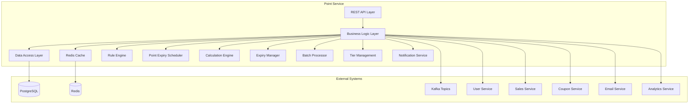
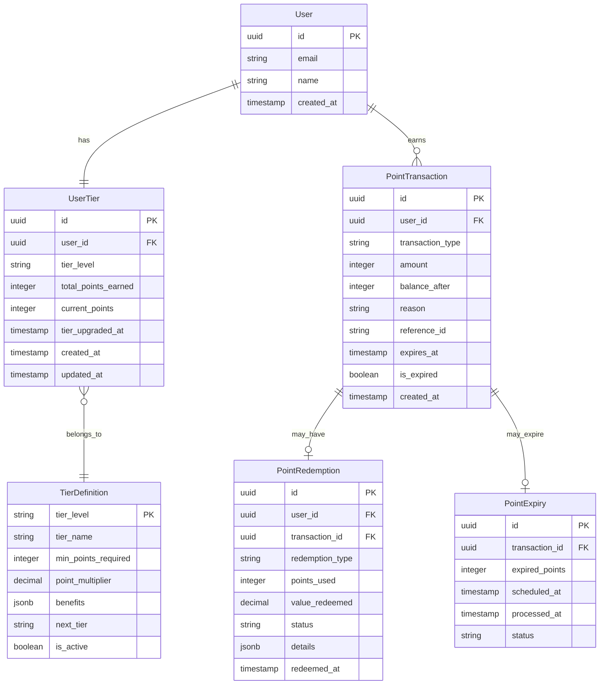

# ポイントサービス 詳細設計書

## 1. 概要

### 1.1 サービスの目的

ポイントサービスは、スキーショップ電子商取引プラットフォームの顧客ロイヤルティポイントシステムを管理します。ポイントの蓄積、引き換え、ティア管理を処理し、顧客維持とエンゲージメントを促進する包括的なロイヤルティプログラム機能を提供します。

### 1.2 サービスの責務

- ポイント獲得と蓄積ロジック
- ポイント引き換えと検証
- 顧客ティアとレベル管理
- ポイント有効期限とライフサイクル管理
- 取引履歴と監査
- ロイヤルティプログラムルールエンジン
- ポイント譲渡とギフト機能
- 購入とプロモーションシステムとの統合

### 1.3 ビジネスコンテキスト

このサービスは、包括的なロイヤルティプログラムを通じて顧客維持を可能にし、ポイントベースの報酬とティア特典を通じてリピート購入と高い顧客生涯価値を促進します。

## 2. 技術スタック

### 2.1 開発環境

- **言語**: Java 21 (LTS)
- **フレームワーク**: Spring Boot 3.2.3
- **ビルドツール**: Maven 3.9.x
- **Message Queue**: Apache Kafka
- **Authentication**: JWT tokens
- **API Documentation**: OpenAPI 3.0/Swagger

### 2.2 本番環境

- Azure Container Apps
- Azure Database for PostgreSQL
- Azure Cache for Redis
- Azure Service Bus (Kafka)

### 2.3 主要ライブラリとバージョン

| ライブラリ | バージョン | 用途 |
|----------|----------|------|
| spring-boot-starter-web | 3.2.3 | REST API エンドポイント |
| spring-boot-starter-data-jpa | 3.2.3 | JPA データアクセス |
| spring-boot-starter-data-redis | 3.2.3 | Redis キャッシュ |
| spring-boot-starter-validation | 3.2.3 | 入力バリデーション |
| spring-boot-starter-security | 3.2.3 | セキュリティ設定 |
| spring-boot-starter-actuator | 3.2.3 | ヘルスチェック、メトリクス |
| spring-cloud-starter-stream-kafka | 4.1.0 | イベント発行・購読 |
| postgresql | 42.7.1 | PostgreSQL ドライバー |
| spring-boot-starter-quartz | 3.2.3 | スケジューラー（ポイント有効期限管理） |
| mapstruct | 1.5.5.Final | オブジェクトマッピング |
| lombok | 1.18.30 | ボイラープレートコード削減 |
| micrometer-registry-prometheus | 1.12.2 | メトリクス収集 |
| springdoc-openapi-starter-webmvc-ui | 2.3.0 | API 文書化 |
| azure-identity | 1.11.1 | Azure 認証 |
| azure-security-keyvault-secrets | 4.6.2 | Azure Key Vault 連携 |
| azure-monitor-opentelemetry | 1.0.0-beta.15 | Azure 監視連携 |
| logback-json-classic | 0.1.5 | JSON 形式ログ出力 |

### 2.4 開発・テストツール

- **テスト**: JUnit 5.10.1、Spring Boot Test、Testcontainers 1.19.3
- **コンテナ化**: Docker 25.x
- **CI/CD**: GitHub Actions、Azure DevOps

## 3. System Architecture

### 3.1 Component Diagram



### 3.2 Class Diagram

```mermaid
classDiagram
    class PointController {
        +getBalance(req, res)
        +getHistory(req, res)
        +redeemPoints(req, res)
        +transferPoints(req, res)
        +getRedemptionOptions(req, res)
        +getExpiringPoints(req, res)
    }
    
    class TierController {
        +getUserTier(req, res)
        +getTierBenefits(req, res)
        +getTierProgress(req, res)
        +getAllTiers(req, res)
        +checkUpgradeEligibility(req, res)
    }
    
    class CampaignController {
        +getActivePointCampaigns(req, res)
        +createPointCampaign(req, res)
        +getCampaignDetails(req, res)
    }
    
    class PointService {
        +awardPoints(userId, amount, reason)
        +redeemPoints(userId, amount, redemptionType)
        +calculatePoints(orderAmount, userTier)
        +validateRedemption(userId, amount)
        +transferPoints(fromUserId, toUserId, amount)
        +getPointBalance(userId)
        +getPointHistory(userId, filter)
    }
    
    class TierService {
        +calculateUserTier(userId)
        +updateUserTier(userId)
        +getTierBenefits(tierLevel)
        +checkTierUpgrade(userId, newPoints)
        +getTierRequirements(tierLevel)
        +processMonthlyTierReview()
    }
    
    class CalculationEngine {
        +calculateBasePoints(amount, rate)
        +calculateBonusPoints(context)
        +calculateTierMultiplier(userTier)
        +calculateCampaignPoints(campaignRules, context)
        +applyPointRules(rules, context)
    }
    
    class ExpiryManager {
        +schedulePointExpiry(pointId, expiryDate)
        +processExpiringPoints(days)
        +getExpiringPoints(userId, days)
        +expirePoints(pointIds)
        +notifyExpiringPoints(userId, points)
    }
    
    class BatchProcessor {
        +processDailyPointExpiry()
        +processMonthlyTierUpdate()
        +processPointAggregation()
        +generatePointsReport()
    }
    
    class TierManager {
        +evaluateTierUpgrade(userId)
        +calculateTierProgress(userId)
        +getTierBenefits(tier)
        +notifyTierUpgrade(userId, newTier)
    }
    
    class NotificationService {
        +sendPointAwardNotification(userId, points)
        +sendTierUpgradeNotification(userId, tier)
        +sendExpiryWarningNotification(userId, points)
        +sendPointRedemptionNotification(userId, redemption)
    }
    
    class PointRepository {
        +create(transaction)
        +findByUserId(userId)
        +getBalance(userId)
        +findByDateRange(userId, startDate, endDate)
        +updateBalance(userId, amount)
        +findExpiringPoints(days)
    }
    
    class TierRepository {
        +findByUserId(userId)
        +updateUserTier(userId, tierLevel)
        +getTierDefinition(tierLevel)
        +getAllTiers()
        +findUsersForTierReview()
    }
    
    class CampaignRepository {
        +findActiveCampaigns()
        +findByUserId(userId)
        +create(campaign)
        +update(campaignId, data)
    }
    
    class ExpiryService {
        +scheduleExpiry(pointId, expiryDate)
        +processExpiredPoints()
        +getExpiringPoints(userId, days)
    }
    
    PointController --> PointService
    TierController --> TierService
    CampaignController --> CampaignRepository
    PointService --> PointRepository
    PointService --> CalculationEngine
    PointService --> ExpiryManager
    PointService --> NotificationService
    TierService --> TierRepository
    TierService --> TierManager
    CalculationEngine --> CampaignRepository
    ExpiryManager --> ExpiryService
    BatchProcessor --> PointRepository
    BatchProcessor --> TierRepository
```



## 4. Data Models

### 4.1 Entity Relationship Diagram



### 4.2 Data Schema

#### UserTier Table

```sql
CREATE TABLE user_tiers (
    id UUID PRIMARY KEY DEFAULT gen_random_uuid(),
    user_id UUID UNIQUE NOT NULL,
    tier_level VARCHAR(20) NOT NULL DEFAULT 'bronze',
    total_points_earned INTEGER DEFAULT 0,
    current_points INTEGER DEFAULT 0,
    tier_upgraded_at TIMESTAMP,
    created_at TIMESTAMP DEFAULT CURRENT_TIMESTAMP,
    updated_at TIMESTAMP DEFAULT CURRENT_TIMESTAMP,
    CONSTRAINT fk_usertier_user FOREIGN KEY (user_id) REFERENCES users(id),
    CONSTRAINT fk_usertier_tier FOREIGN KEY (tier_level) REFERENCES tier_definitions(tier_level)
);
```

#### TierDefinition Table

```sql
CREATE TABLE tier_definitions (
    tier_level VARCHAR(20) PRIMARY KEY,
    tier_name VARCHAR(50) NOT NULL,
    min_points_required INTEGER NOT NULL,
    point_multiplier DECIMAL(3,2) DEFAULT 1.00,
    benefits JSONB DEFAULT '{}',
    next_tier VARCHAR(20),
    is_active BOOLEAN DEFAULT true,
    created_at TIMESTAMP DEFAULT CURRENT_TIMESTAMP,
    CONSTRAINT fk_tier_next FOREIGN KEY (next_tier) REFERENCES tier_definitions(tier_level)
);
```

#### PointTransaction Table

```sql
CREATE TABLE point_transactions (
    id UUID PRIMARY KEY DEFAULT gen_random_uuid(),
    user_id UUID NOT NULL,
    transaction_type VARCHAR(20) NOT NULL, -- 'earned', 'redeemed', 'expired', 'transferred'
    amount INTEGER NOT NULL,
    balance_after INTEGER NOT NULL,
    reason VARCHAR(100) NOT NULL,
    reference_id VARCHAR(100), -- order_id, campaign_id, etc.
    expires_at TIMESTAMP,
    is_expired BOOLEAN DEFAULT false,
    created_at TIMESTAMP DEFAULT CURRENT_TIMESTAMP,
    CONSTRAINT fk_transaction_user FOREIGN KEY (user_id) REFERENCES users(id),
    INDEX idx_user_created (user_id, created_at),
    INDEX idx_expires_at (expires_at) WHERE expires_at IS NOT NULL AND is_expired = false
);
```

#### PointRedemption Table

```sql
CREATE TABLE point_redemptions (
    id UUID PRIMARY KEY DEFAULT gen_random_uuid(),
    user_id UUID NOT NULL,
    transaction_id UUID NOT NULL,
    redemption_type VARCHAR(50) NOT NULL, -- 'discount', 'product', 'cashback'
    points_used INTEGER NOT NULL,
    value_redeemed DECIMAL(10,2) NOT NULL,
    status VARCHAR(20) DEFAULT 'completed',
    details JSONB DEFAULT '{}',
    redeemed_at TIMESTAMP DEFAULT CURRENT_TIMESTAMP,
    CONSTRAINT fk_redemption_user FOREIGN KEY (user_id) REFERENCES users(id),
    CONSTRAINT fk_redemption_transaction FOREIGN KEY (transaction_id) REFERENCES point_transactions(id)
);
```

## 5. API Design

### 5.1 Point Management Endpoints

#### Get Point Balance

```http
GET /api/v1/points/balance
Authorization: Bearer <token>

Response: 200 OK
{
  "success": true,
  "data": {
    "userId": "uuid",
    "currentPoints": 1250,
    "totalEarned": 5670,
    "totalRedeemed": 4420,
    "tier": {
      "level": "silver",
      "name": "Silver Member",
      "pointsToNextTier": 750
    },
    "expiringPoints": {
      "amount": 100,
      "expiryDate": "2024-02-15T23:59:59Z"
    }
  }
}
```

#### Award Points (Internal)

```http
POST /api/v1/points/award
Authorization: Bearer <service-token>
Content-Type: application/json

{
  "userId": "uuid",
  "amount": 100,
  "reason": "Purchase reward",
  "referenceId": "order-uuid",
  "expiryDate": "2025-01-15T23:59:59Z"
}

Response: 201 Created
{
  "success": true,
  "data": {
    "transactionId": "uuid",
    "userId": "uuid",
    "amount": 100,
    "balanceAfter": 1350,
    "reason": "Purchase reward",
    "expiresAt": "2025-01-15T23:59:59Z"
  }
}
```

#### Redeem Points

```http
POST /api/v1/points/redeem
Authorization: Bearer <token>
Content-Type: application/json

{
  "amount": 500,
  "redemptionType": "discount",
  "details": {
    "orderId": "uuid",
    "discountAmount": 500
  }
}

Response: 200 OK
{
  "success": true,
  "data": {
    "redemptionId": "uuid",
    "pointsUsed": 500,
    "valueRedeemed": 500,
    "balanceAfter": 850,
    "redemptionType": "discount",
    "redeemedAt": "2024-01-15T10:30:00Z"
  }
}
```

#### Get Point History

```http
GET /api/v1/points/history?limit=20&offset=0&type=all
Authorization: Bearer <token>

Response: 200 OK
{
  "success": true,
  "data": {
    "transactions": [
      {
        "id": "uuid",
        "type": "earned",
        "amount": 100,
        "balanceAfter": 1350,
        "reason": "Purchase reward",
        "referenceId": "order-uuid",
        "createdAt": "2024-01-15T10:30:00Z",
        "expiresAt": "2025-01-15T23:59:59Z"
      },
      {
        "id": "uuid",
        "type": "redeemed",
        "amount": -500,
        "balanceAfter": 850,
        "reason": "Order discount",
        "redemptionType": "discount",
        "createdAt": "2024-01-14T14:20:00Z"
      }
    ],
    "pagination": {
      "total": 45,
      "limit": 20,
      "offset": 0,
      "hasMore": true
    }
  }
}
```

### 5.2 Tier Management Endpoints

#### Get User Tier

```http
GET /api/v1/tiers/my-tier
Authorization: Bearer <token>

Response: 200 OK
{
  "success": true,
  "data": {
    "currentTier": {
      "level": "silver",
      "name": "Silver Member",
      "minPointsRequired": 1000,
      "pointMultiplier": 1.2,
      "benefits": {
        "freeShipping": true,
        "birthdayBonus": 200,
        "exclusiveAccess": true
      }
    },
    "progress": {
      "currentPoints": 1250,
      "pointsToNextTier": 750,
      "nextTier": {
        "level": "gold",
        "name": "Gold Member",
        "minPointsRequired": 2000
      }
    },
    "totalPointsEarned": 5670
  }
}
```

#### Get All Tiers

```http
GET /api/v1/tiers
Authorization: Bearer <token>

Response: 200 OK
{
  "success": true,
  "data": {
    "tiers": [
      {
        "level": "bronze",
        "name": "Bronze Member",
        "minPointsRequired": 0,
        "pointMultiplier": 1.0,
        "benefits": {
          "freeShipping": false,
          "birthdayBonus": 50
        }
      },
      {
        "level": "silver",
        "name": "Silver Member",
        "minPointsRequired": 1000,
        "pointMultiplier": 1.2,
        "benefits": {
          "freeShipping": true,
          "birthdayBonus": 200,
          "exclusiveAccess": true
        }
      },
      {
        "level": "gold",
        "name": "Gold Member",
        "minPointsRequired": 2000,
        "pointMultiplier": 1.5,
        "benefits": {
          "freeShipping": true,
          "birthdayBonus": 500,
          "exclusiveAccess": true,
          "prioritySupport": true
        }
      }
    ]
  }
}
```

## 6. Event Design

### 6.1 Published Events

#### Points Awarded Event

```json
{
  "eventType": "points.awarded",
  "version": "1.0",
  "timestamp": "2024-01-15T10:30:00Z",
  "data": {
    "transactionId": "uuid",
    "userId": "uuid",
    "amount": 100,
    "balanceAfter": 1350,
    "reason": "Purchase reward",
    "referenceId": "order-uuid",
    "expiresAt": "2025-01-15T23:59:59Z",
    "tierLevel": "silver"
  }
}
```

#### Points Redeemed Event

```json
{
  "eventType": "points.redeemed",
  "version": "1.0",
  "timestamp": "2024-01-15T10:30:00Z",
  "data": {
    "redemptionId": "uuid",
    "transactionId": "uuid",
    "userId": "uuid",
    "pointsUsed": 500,
    "valueRedeemed": 500,
    "balanceAfter": 850,
    "redemptionType": "discount",
    "details": {
      "orderId": "uuid",
      "discountAmount": 500
    }
  }
}
```

#### Tier Upgraded Event

```json
{
  "eventType": "tier.upgraded",
  "version": "1.0",
  "timestamp": "2024-01-15T10:30:00Z",
  "data": {
    "userId": "uuid",
    "previousTier": "bronze",
    "newTier": "silver",
    "totalPointsEarned": 1250,
    "upgradedAt": "2024-01-15T10:30:00Z",
    "newBenefits": {
      "freeShipping": true,
      "birthdayBonus": 200,
      "exclusiveAccess": true
    }
  }
}
```

### 6.2 Consumed Events

#### Order Completed Event

```json
{
  "eventType": "order.completed",
  "version": "1.0",
  "timestamp": "2024-01-15T10:25:00Z",
  "data": {
    "orderId": "uuid",
    "userId": "uuid",
    "amount": 10000,
    "status": "completed",
    "items": [
      {
        "productId": "uuid",
        "quantity": 1,
        "price": 10000
      }
    ]
  }
}
```

#### User Registered Event

```json
{
  "eventType": "user.registered",
  "version": "1.0",
  "timestamp": "2024-01-15T09:00:00Z",
  "data": {
    "userId": "uuid",
    "email": "user@example.com",
    "registeredAt": "2024-01-15T09:00:00Z"
  }
}
```

## 7. Security

### 7.1 Authentication & Authorization

- **JWT Token Validation**: All endpoints require valid JWT tokens
- **User Context**: Extract user ID from JWT for point operations
- **Service Authentication**: Internal point awarding requires service tokens
- **Admin Access**: Administrative endpoints for tier management

### 7.2 Business Rules Security

- **Transaction Validation**: Strict validation of point transactions
- **Balance Verification**: Ensure sufficient points for redemptions
- **Fraud Detection**: Monitor unusual point activity patterns
- **Rate Limiting**: Prevent abuse of point-related operations
- **Audit Trail**: Complete transaction history logging

### 7.3 Data Protection

- **Input Validation**: Strict validation of all inputs
- **SQL Injection Prevention**: Parameterized queries
- **Data Encryption**: Sensitive transaction data encrypted
- **Point Balance Integrity**: Consistency checks and reconciliation

## 8. Error Handling

### 8.1 Error Categories

#### Business Errors

```typescript
export enum PointErrorCode {
  INSUFFICIENT_POINTS = 'INSUFFICIENT_POINTS',
  POINTS_EXPIRED = 'POINTS_EXPIRED',
  INVALID_REDEMPTION_TYPE = 'INVALID_REDEMPTION_TYPE',
  REDEMPTION_LIMIT_EXCEEDED = 'REDEMPTION_LIMIT_EXCEEDED',
  TIER_CALCULATION_ERROR = 'TIER_CALCULATION_ERROR'
}
```

#### System Errors

```typescript
export enum SystemErrorCode {
  DATABASE_ERROR = 'DATABASE_ERROR',
  CACHE_ERROR = 'CACHE_ERROR',
  BALANCE_INCONSISTENCY = 'BALANCE_INCONSISTENCY',
  NETWORK_ERROR = 'NETWORK_ERROR'
}
```

### 8.2 Error Response Format

```json
{
  "success": false,
  "error": {
    "code": "INSUFFICIENT_POINTS",
    "message": "You don't have enough points for this redemption.",
    "details": {
      "requiredPoints": 500,
      "availablePoints": 350,
      "userId": "uuid"
    },
    "timestamp": "2024-01-15T10:30:00Z"
  }
}
```

## 9. Performance

### 9.1 Performance Requirements

- **Balance Queries**: < 50ms response time
- **Point Transactions**: < 100ms response time
- **Tier Calculations**: < 200ms response time
- **Concurrent Users**: Support 3000+ concurrent point operations
- **Throughput**: 2000 transactions/second peak capacity

### 9.2 Optimization Strategies

- **Redis Caching**: User balances and tier info cached
- **Database Indexing**: Optimized queries with proper indexes
- **Batch Processing**: Bulk point expiry processing
- **Async Processing**: Non-blocking tier calculations
- **Connection Pooling**: Database connection optimization

### 9.3 Caching Strategy

```typescript
// Point balance caching with Redis
const balanceCacheKey = `points:balance:${userId}`;
const tierCacheKey = `points:tier:${userId}`;
const ttl = 300; // 5 minutes

// Cache user balance and tier
await redis.setex(balanceCacheKey, ttl, JSON.stringify(balanceData));
await redis.setex(tierCacheKey, ttl, JSON.stringify(tierData));

// Cache invalidation on updates
await redis.del(balanceCacheKey, tierCacheKey);
```

## 10. Monitoring & Observability

### 10.1 Metrics

- **Business Metrics**: Point earning rate, redemption rate, tier distribution
- **Technical Metrics**: Response times, error rates, cache hit ratio
- **Engagement Metrics**: Active point users, tier upgrade rate, expiry rate

### 10.2 Logging

```typescript
logger.info('Points awarded', {
  userId,
  amount,
  reason,
  balanceAfter,
  tierLevel,
  processingTime: endTime - startTime
});

logger.warn('Point balance inconsistency detected', {
  userId,
  expectedBalance,
  actualBalance,
  lastTransactionId,
  timestamp: new Date().toISOString()
});
```

### 10.3 Health Checks

```typescript
// Health check endpoint
app.get('/health', async (req, res) => {
  const checks = {
    database: await checkDatabase(),
    redis: await checkRedis(),
    balanceConsistency: await checkBalanceConsistency()
  };
  
  const isHealthy = Object.values(checks).every(check => check);
  res.status(isHealthy ? 200 : 503).json(checks);
});
```

## 11. Testing Strategy

### 11.1 Unit Tests

```typescript
describe('PointService', () => {
  test('should award points correctly', async () => {
    const pointService = new PointService(mockRepository);
    const result = await pointService.awardPoints(userId, 100, 'Purchase reward');
    
    expect(result.success).toBe(true);
    expect(result.data.amount).toBe(100);
    expect(result.data.balanceAfter).toBe(1350);
  });
  
  test('should calculate tier correctly', async () => {
    const tierService = new TierService(mockRepository);
    const tier = await tierService.calculateUserTier(userId);
    
    expect(tier.level).toBe('silver');
    expect(tier.pointMultiplier).toBe(1.2);
  });
});
```

### 11.2 Integration Tests

```typescript
describe('Point API', () => {
  test('should redeem points successfully', async () => {
    const response = await request(app)
      .post('/api/v1/points/redeem')
      .set('Authorization', `Bearer ${token}`)
      .send(redemptionData)
      .expect(200);
      
    expect(response.body.success).toBe(true);
    expect(response.body.data.pointsUsed).toBe(500);
  });
});
```

### 11.3 E2E Tests

- **Point Lifecycle**: Award → Accumulate → Redeem → Expire
- **Tier Progression**: Bronze → Silver → Gold advancement
- **Integration Flow**: Order completion → Point award → Tier upgrade

## 12. Deployment

### 12.1 Container Configuration

```dockerfile
FROM node:18-alpine
WORKDIR /app
COPY package*.json ./
RUN npm ci --only=production
COPY . .
EXPOSE 3000
CMD ["npm", "start"]
```

### 12.2 Kubernetes Deployment

```yaml
apiVersion: apps/v1
kind: Deployment
metadata:
  name: point-service
spec:
  replicas: 3
  selector:
    matchLabels:
      app: point-service
  template:
    metadata:
      labels:
        app: point-service
    spec:
      containers:
      - name: point-service
        image: point-service:latest
        ports:
        - containerPort: 3000
        env:
        - name: DATABASE_URL
          valueFrom:
            secretKeyRef:
              name: db-secret
              key: url
        - name: REDIS_URL
          valueFrom:
            secretKeyRef:
              name: redis-secret
              key: url
```

### 12.3 Environment Configuration

- **Development**: Local PostgreSQL, Redis, mock external services
- **Staging**: Managed databases, test point scenarios
- **Production**: HA databases, live point system, monitoring

## 13. Future Enhancements

### 13.1 Planned Features

- **Point Pooling**: Family/group point sharing
- **Gamification**: Badges, challenges, leaderboards
- **Social Features**: Point gifting between users
- **Dynamic Tiers**: AI-driven tier benefit optimization
- **Mobile Wallet**: Integration with mobile payment apps

### 13.2 Technical Improvements

- **Blockchain Integration**: Immutable point transaction history
- **Machine Learning**: Personalized point earning predictions
- **Real-time Analytics**: Live point system dashboard
- **GraphQL API**: Alternative to REST endpoints
- **Event Sourcing**: Complete point history reconstruction

### 13.3 Scalability Roadmap

- **Horizontal Scaling**: Auto-scaling based on point activity
- **Database Sharding**: User-based point data partitioning
- **Global Points**: Multi-region point system
- **Edge Computing**: Point balance calculations at edge
- **Predictive Scaling**: ML-driven capacity planning

## 5. Point Calculation Engine & Rules

### 5.1 Point Calculation Rules

#### Base Point Calculation

```java
@Component
public class PointCalculationEngine {
    
    @Autowired
    private TierService tierService;
    
    @Autowired
    private CampaignService campaignService;
    
    public PointCalculationResult calculatePoints(PointCalculationContext context) {
        PointCalculationResult result = new PointCalculationResult();
        
        // 基本ポイント計算
        int basePoints = calculateBasePoints(context.getOrderAmount());
        result.addPoints("base", basePoints);
        
        // ティア乗数適用
        UserTier userTier = tierService.getUserTier(context.getUserId());
        int tierBonusPoints = applyTierMultiplier(basePoints, userTier);
        result.addPoints("tier_bonus", tierBonusPoints);
        
        // キャンペーンポイント計算
        List<Campaign> activeCampaigns = campaignService.getActiveCampaigns(context.getUserId());
        int campaignPoints = calculateCampaignPoints(context, activeCampaigns);
        result.addPoints("campaign", campaignPoints);
        
        // 特別ボーナス計算
        int specialBonus = calculateSpecialBonus(context);
        result.addPoints("special_bonus", specialBonus);
        
        return result;
    }
    
    private int calculateBasePoints(BigDecimal orderAmount) {
        // 100円につき1ポイント
        return orderAmount.divide(new BigDecimal("100"), RoundingMode.DOWN).intValue();
    }
    
    private int applyTierMultiplier(int basePoints, UserTier tier) {
        BigDecimal multiplier = tier.getPointMultiplier();
        return BigDecimal.valueOf(basePoints)
                .multiply(multiplier.subtract(BigDecimal.ONE))
                .intValue();
    }
    
    private int calculateCampaignPoints(PointCalculationContext context, List<Campaign> campaigns) {
        return campaigns.stream()
                .mapToInt(campaign -> evaluateCampaign(campaign, context))
                .sum();
    }
    
    private int calculateSpecialBonus(PointCalculationContext context) {
        int bonus = 0;
        
        // 初回購入ボーナス
        if (context.isFirstPurchase()) {
            bonus += 500;
        }
        
        // 誕生日月ボーナス
        if (context.isBirthdayMonth()) {
            bonus += context.getOrderAmount().multiply(new BigDecimal("0.05")).intValue();
        }
        
        // 高額購入ボーナス
        if (context.getOrderAmount().compareTo(new BigDecimal("50000")) >= 0) {
            bonus += 1000;
        }
        
        return bonus;
    }
}
```

#### Tier-based Point Multipliers

| ティア | 基本倍率 | 特典 |
|-------|---------|------|
| BRONZE | 1.0倍 | 基本ポイント |
| SILVER | 1.2倍 | 20%ボーナス + 誕生日月2倍 |
| GOLD | 1.5倍 | 50%ボーナス + 誕生日月3倍 + 送料無料 |
| PLATINUM | 2.0倍 | 100%ボーナス + 誕生日月5倍 + 優先配送 |

#### Campaign Point Rules

```java
@Component
public class CampaignPointEvaluator {
    
    public int evaluateCampaign(Campaign campaign, PointCalculationContext context) {
        switch (campaign.getType()) {
            case CATEGORY_BONUS:
                return evaluateCategoryBonus(campaign, context);
            case QUANTITY_BONUS:
                return evaluateQuantityBonus(campaign, context);
            case TIME_LIMITED:
                return evaluateTimeLimitedBonus(campaign, context);
            case SEASONAL:
                return evaluateSeasonalBonus(campaign, context);
            default:
                return 0;
        }
    }
    
    private int evaluateCategoryBonus(Campaign campaign, PointCalculationContext context) {
        List<String> targetCategories = campaign.getTargetCategories();
        List<OrderItem> targetItems = context.getOrderItems().stream()
                .filter(item -> targetCategories.contains(item.getCategory()))
                .collect(Collectors.toList());
        
        if (targetItems.isEmpty()) {
            return 0;
        }
        
        BigDecimal targetAmount = targetItems.stream()
                .map(OrderItem::getPrice)
                .reduce(BigDecimal.ZERO, BigDecimal::add);
        
        return targetAmount.multiply(campaign.getBonusRate()).intValue();
    }
    
    private int evaluateQuantityBonus(Campaign campaign, PointCalculationContext context) {
        int totalQuantity = context.getOrderItems().stream()
                .mapToInt(OrderItem::getQuantity)
                .sum();
        
        if (totalQuantity >= campaign.getMinQuantity()) {
            return campaign.getBonusPoints();
        }
        
        return 0;
    }
}
```

### 5.2 Point Expiry Management

#### Expiry Rules

- **有効期限**: ポイント獲得から2年
- **先入先出**: 古いポイントから優先的に使用
- **期限通知**: 有効期限1ヶ月前、1週間前、3日前に通知
- **一括期限処理**: 日次バッチで期限切れポイントを処理

#### Expiry Processing

```java
@Component
public class PointExpiryManager {
    
    @Autowired
    private PointRepository pointRepository;
    
    @Autowired
    private NotificationService notificationService;
    
    @Scheduled(cron = "0 0 1 * * ?") // 毎日午前1時実行
    public void processExpiringPoints() {
        // 期限切れポイントの処理
        List<PointTransaction> expiredPoints = pointRepository.findExpiredPoints();
        for (PointTransaction point : expiredPoints) {
            expirePoint(point);
        }
        
        // 期限切れ通知
        sendExpiryNotifications();
    }
    
    private void expirePoint(PointTransaction point) {
        // ポイント期限切れ処理
        point.setExpired(true);
        pointRepository.save(point);
        
        // ユーザーの総ポイント残高を更新
        updateUserPointBalance(point.getUserId(), -point.getAmount());
        
        // 期限切れイベント発行
        publishPointExpiredEvent(point);
    }
    
    private void sendExpiryNotifications() {
        // 1ヶ月前通知
        List<PointTransaction> pointsExpiring30Days = pointRepository.findPointsExpiringInDays(30);
        pointsExpiring30Days.forEach(point -> 
            notificationService.sendExpiryWarning(point.getUserId(), point, 30));
        
        // 1週間前通知
        List<PointTransaction> pointsExpiring7Days = pointRepository.findPointsExpiringInDays(7);
        pointsExpiring7Days.forEach(point -> 
            notificationService.sendExpiryWarning(point.getUserId(), point, 7));
        
        // 3日前通知
        List<PointTransaction> pointsExpiring3Days = pointRepository.findPointsExpiringInDays(3);
        pointsExpiring3Days.forEach(point -> 
            notificationService.sendExpiryWarning(point.getUserId(), point, 3));
    }
}
```

### 5.3 Tier Management System

#### Tier Upgrade Logic

```java
@Component
public class TierManager {
    
    @Autowired
    private TierRepository tierRepository;
    
    @Autowired
    private PointRepository pointRepository;
    
    public void evaluateTierUpgrade(String userId) {
        UserTier currentTier = tierRepository.findByUserId(userId);
        
        // 過去12ヶ月の獲得ポイント合計を計算
        LocalDateTime oneYearAgo = LocalDateTime.now().minusYears(1);
        int totalPointsEarned = pointRepository.getTotalPointsEarned(userId, oneYearAgo);
        
        // 新しいティアを決定
        TierLevel newTierLevel = determineEligibleTier(totalPointsEarned);
        
        if (newTierLevel.ordinal() > currentTier.getTierLevel().ordinal()) {
            upgradeTier(userId, newTierLevel);
        }
    }
    
    private TierLevel determineEligibleTier(int totalPoints) {
        if (totalPoints >= 50000) return TierLevel.PLATINUM;
        if (totalPoints >= 20000) return TierLevel.GOLD;
        if (totalPoints >= 5000) return TierLevel.SILVER;
        return TierLevel.BRONZE;
    }
    
    private void upgradeTier(String userId, TierLevel newTier) {
        // ティア更新
        tierRepository.updateUserTier(userId, newTier);
        
        // アップグレード通知
        notificationService.sendTierUpgradeNotification(userId, newTier);
        
        // アップグレードボーナスポイント付与
        int bonusPoints = getTierUpgradeBonus(newTier);
        if (bonusPoints > 0) {
            pointService.awardPoints(userId, bonusPoints, "TIER_UPGRADE_BONUS");
        }
        
        // ティアアップグレードイベント発行
        publishTierUpgradeEvent(userId, newTier);
    }
    
    private int getTierUpgradeBonus(TierLevel tier) {
        switch (tier) {
            case SILVER: return 1000;
            case GOLD: return 3000;
            case PLATINUM: return 5000;
            default: return 0;
        }
    }
}
```
