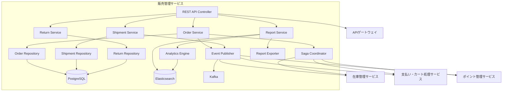
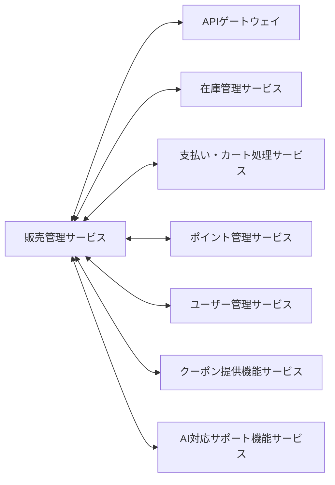
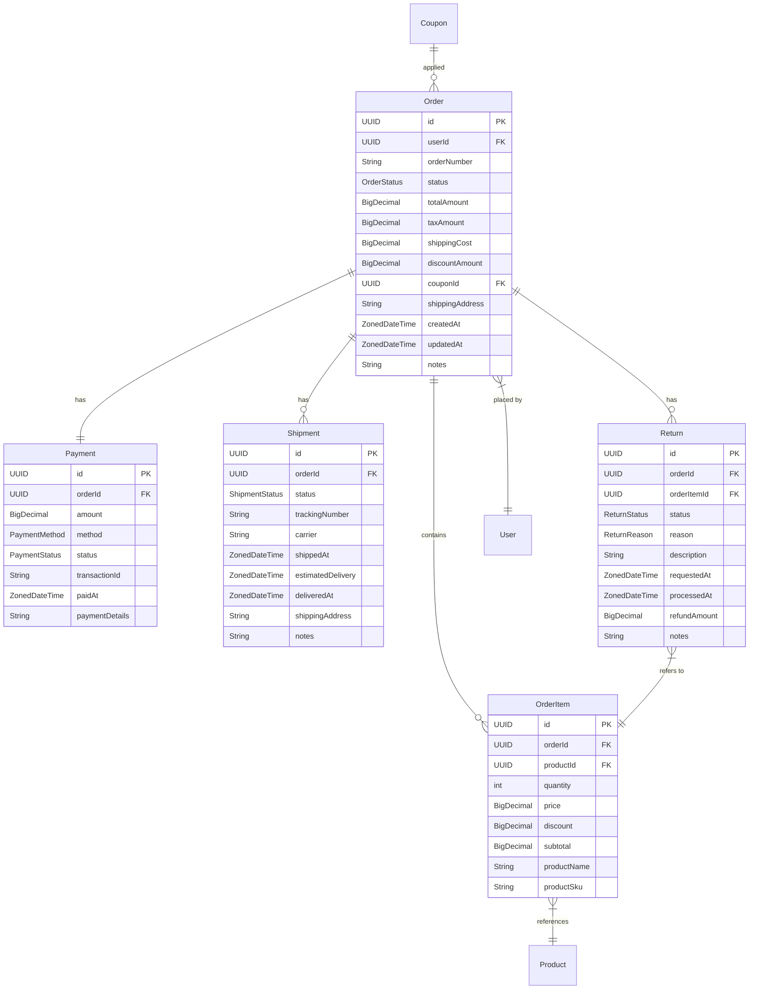
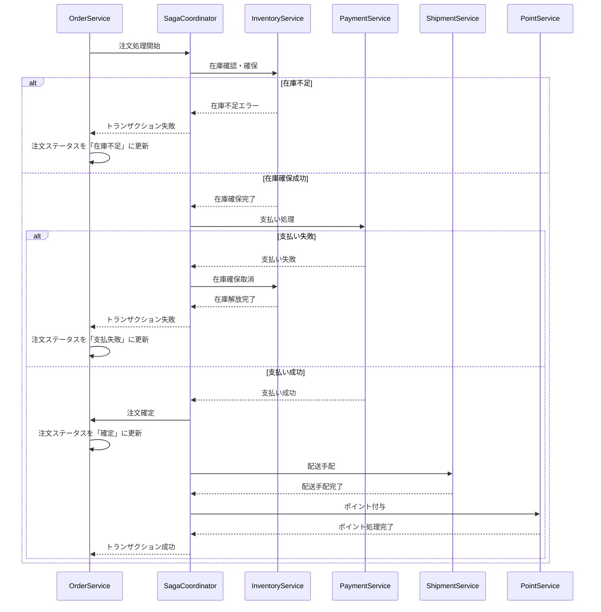

# 販売管理サービス 詳細設計書

## 1. 概要

販売管理サービスは、注文処理と管理、販売分析とレポート、返品・交換処理、配送手配と追跡、販売履歴を管理するマイクロサービスです。顧客からの注文を受け付けてから配送、返品までの一連のプロセスを管理し、販売データの分析と可視化を提供します。

## 2. 技術スタック

### 開発環境
- **言語**: Java 21 (LTS)
- **フレームワーク**: Spring Boot 3.2.3
- **ビルドツール**: Maven 3.9.x
- **コンテナ化**: Docker 25.x
- **テスト**: JUnit 5.10.1、Spring Boot Test、Testcontainers 1.19.3

### 本番環境
- Azure Container Apps
- Azure Database for PostgreSQL
- Elasticsearch 8.12

### 主要ライブラリとバージョン
| ライブラリ | バージョン | 用途 |
|----------|----------|------|
| spring-boot-starter-data-jpa | 3.2.3 | JPA データアクセス |
| spring-boot-starter-web | 3.2.3 | REST API エンドポイント |
| spring-boot-starter-validation | 3.2.3 | 入力バリデーション |
| spring-boot-starter-security | 3.2.3 | セキュリティ設定 |
| spring-boot-starter-actuator | 3.2.3 | ヘルスチェック、メトリクス |
| spring-cloud-starter-stream-kafka | 4.1.0 | イベント発行・購読 |
| spring-cloud-starter-circuitbreaker-resilience4j | 3.0.3 | サーキットブレーカー |
| spring-boot-starter-data-elasticsearch | 3.2.3 | Elasticsearch連携 |
| spring-boot-starter-cache | 3.2.3 | キャッシュ機能 |
| spring-boot-starter-data-redis | 3.2.3 | Redis キャッシュ |
| hibernate-core | 6.4.1 | ORM マッピング |
| postgresql | 42.7.1 | PostgreSQL JDBC ドライバ |
| querydsl-jpa | 5.0.0 | 動的クエリビルダー |
| flyway-core | 9.22.3 | データベースマイグレーション |
| mapstruct | 1.5.5.Final | オブジェクトマッピング |
| lombok | 1.18.30 | ボイラープレートコード削減 |
| micrometer-registry-prometheus | 1.12.2 | メトリクス収集 |
| springdoc-openapi-starter-webmvc-ui | 2.3.0 | API 文書化 |
| azure-identity | 1.11.1 | Azure 認証 |
| azure-security-keyvault-secrets | 4.6.2 | Azure Key Vault 連携 |
| azure-monitor-opentelemetry | 1.0.0-beta.15 | Azure 監視連携 |
| logback-json-classic | 0.1.5 | JSON 形式ログ出力 |
| poi | 5.2.4 | Excelレポート生成 |
| itextpdf | 5.5.13.3 | PDFレポート生成 |

## 3. システム構成

### コンポーネント構成図



### マイクロサービス関連図



## 4. データモデル

### エンティティ関連図



### データベーススキーマ

#### orders テーブル

| カラム名 | データ型 | 制約 | 説明 |
|---------|---------|------|------|
| id | UUID | PK | 注文ID |
| user_id | UUID | FK, NOT NULL | ユーザーID |
| order_number | VARCHAR(50) | UNIQUE, NOT NULL | 注文番号 |
| status | VARCHAR(20) | NOT NULL | 注文ステータス |
| total_amount | DECIMAL(12,2) | NOT NULL | 合計金額 |
| tax_amount | DECIMAL(12,2) | NOT NULL | 税額 |
| shipping_cost | DECIMAL(12,2) | NOT NULL | 送料 |
| discount_amount | DECIMAL(12,2) | NOT NULL | 割引額 |
| coupon_id | UUID | FK, NULL | クーポンID |
| shipping_address | TEXT | NOT NULL | 配送先住所 |
| created_at | TIMESTAMP WITH TZ | NOT NULL | 作成日時 |
| updated_at | TIMESTAMP WITH TZ | NOT NULL | 更新日時 |
| notes | TEXT | NULL | 備考 |

#### order_items テーブル

| カラム名 | データ型 | 制約 | 説明 |
|---------|---------|------|------|
| id | UUID | PK | 注文明細ID |
| order_id | UUID | FK, NOT NULL | 注文ID |
| product_id | UUID | FK, NOT NULL | 商品ID |
| quantity | INT | NOT NULL | 数量 |
| price | DECIMAL(12,2) | NOT NULL | 単価 |
| discount | DECIMAL(12,2) | NOT NULL | 割引額 |
| subtotal | DECIMAL(12,2) | NOT NULL | 小計 |
| product_name | VARCHAR(255) | NOT NULL | 商品名 |
| product_sku | VARCHAR(50) | NOT NULL | 商品SKU |

#### payments テーブル

| カラム名 | データ型 | 制約 | 説明 |
|---------|---------|------|------|
| id | UUID | PK | 支払いID |
| order_id | UUID | FK, NOT NULL | 注文ID |
| amount | DECIMAL(12,2) | NOT NULL | 支払金額 |
| method | VARCHAR(20) | NOT NULL | 支払方法 |
| status | VARCHAR(20) | NOT NULL | 支払ステータス |
| transaction_id | VARCHAR(100) | NULL | トランザクションID |
| paid_at | TIMESTAMP WITH TZ | NULL | 支払日時 |
| payment_details | JSONB | NULL | 支払詳細情報 |

#### shipments テーブル

| カラム名 | データ型 | 制約 | 説明 |
|---------|---------|------|------|
| id | UUID | PK | 配送ID |
| order_id | UUID | FK, NOT NULL | 注文ID |
| status | VARCHAR(20) | NOT NULL | 配送ステータス |
| tracking_number | VARCHAR(100) | NULL | 追跡番号 |
| carrier | VARCHAR(50) | NULL | 配送業者 |
| shipped_at | TIMESTAMP WITH TZ | NULL | 発送日時 |
| estimated_delivery | TIMESTAMP WITH TZ | NULL | 配送予定日 |
| delivered_at | TIMESTAMP WITH TZ | NULL | 配送完了日時 |
| shipping_address | TEXT | NOT NULL | 配送先住所 |
| notes | TEXT | NULL | 備考 |

#### returns テーブル

| カラム名 | データ型 | 制約 | 説明 |
|---------|---------|------|------|
| id | UUID | PK | 返品ID |
| order_id | UUID | FK, NOT NULL | 注文ID |
| order_item_id | UUID | FK, NOT NULL | 注文明細ID |
| status | VARCHAR(20) | NOT NULL | 返品ステータス |
| reason | VARCHAR(50) | NOT NULL | 返品理由 |
| description | TEXT | NULL | 詳細説明 |
| requested_at | TIMESTAMP WITH TZ | NOT NULL | 返品要求日時 |
| processed_at | TIMESTAMP WITH TZ | NULL | 処理日時 |
| refund_amount | DECIMAL(12,2) | NULL | 返金額 |
| notes | TEXT | NULL | 備考 |

## 5. API設計

### REST APIエンドポイント

#### 注文管理 API

| メソッド | パス | 説明 | パラメータ | レスポンス |
|---------|-----|------|------------|------------|
| GET | /api/v1/orders | 注文一覧取得 | page, size, sort, status, fromDate, toDate | OrderListResponse |
| GET | /api/v1/orders/{id} | 注文詳細取得 | id | OrderDetailResponse |
| POST | /api/v1/orders | 注文作成 | OrderCreateRequest | OrderResponse |
| PUT | /api/v1/orders/{id}/status | 注文ステータス更新 | id, OrderStatusUpdateRequest | OrderResponse |
| GET | /api/v1/orders/user/{userId} | ユーザー注文履歴取得 | userId, page, size | OrderListResponse |
| GET | /api/v1/orders/{id}/items | 注文明細取得 | id | OrderItemListResponse |

#### 配送管理 API

| メソッド | パス | 説明 | パラメータ | レスポンス |
|---------|-----|------|------------|------------|
| GET | /api/v1/shipments | 配送一覧取得 | page, size, sort, status | ShipmentListResponse |
| GET | /api/v1/shipments/{id} | 配送詳細取得 | id | ShipmentDetailResponse |
| POST | /api/v1/shipments | 配送情報作成 | ShipmentCreateRequest | ShipmentResponse |
| PUT | /api/v1/shipments/{id}/status | 配送ステータス更新 | id, ShipmentStatusUpdateRequest | ShipmentResponse |
| GET | /api/v1/shipments/order/{orderId} | 注文配送情報取得 | orderId | ShipmentListResponse |
| PUT | /api/v1/shipments/{id}/tracking | 追跡情報更新 | id, TrackingUpdateRequest | ShipmentResponse |

#### 返品管理 API

| メソッド | パス | 説明 | パラメータ | レスポンス |
|---------|-----|------|------------|------------|
| GET | /api/v1/returns | 返品一覧取得 | page, size, sort, status | ReturnListResponse |
| GET | /api/v1/returns/{id} | 返品詳細取得 | id | ReturnDetailResponse |
| POST | /api/v1/returns | 返品申請作成 | ReturnCreateRequest | ReturnResponse |
| PUT | /api/v1/returns/{id}/status | 返品ステータス更新 | id, ReturnStatusUpdateRequest | ReturnResponse |
| GET | /api/v1/returns/order/{orderId} | 注文返品情報取得 | orderId | ReturnListResponse |

#### レポート API

| メソッド | パス | 説明 | パラメータ | レスポンス |
|---------|-----|------|------------|------------|
| GET | /api/v1/reports/sales | 売上レポート取得 | fromDate, toDate, groupBy | SalesReportResponse |
| GET | /api/v1/reports/products | 商品別売上レポート | fromDate, toDate, limit | ProductSalesReportResponse |
| GET | /api/v1/reports/export/sales | 売上レポートエクスポート | fromDate, toDate, format | ファイルダウンロード |
| GET | /api/v1/reports/shipping | 配送実績レポート | fromDate, toDate, carrier | ShippingReportResponse |
| GET | /api/v1/reports/returns | 返品分析レポート | fromDate, toDate, reason | ReturnReportResponse |

### リクエスト・レスポンス例

#### 注文作成リクエスト (OrderCreateRequest)

```json
{
  "userId": "550e8400-e29b-41d4-a716-446655440000",
  "items": [
    {
      "productId": "7b4a85c4-5c5d-44e1-b5f4-98f5b54e7a5a",
      "quantity": 2,
      "price": 24500.00
    },
    {
      "productId": "d2e96a5c-6975-4c1d-8a6b-22e7a11d6c8a",
      "quantity": 1,
      "price": 12800.00
    }
  ],
  "shippingAddress": {
    "recipient": "山田 太郎",
    "zipCode": "100-0001",
    "prefecture": "東京都",
    "city": "千代田区",
    "streetAddress": "千代田1-1-1",
    "building": "千代田マンション101",
    "phoneNumber": "03-1234-5678"
  },
  "couponId": "a1b2c3d4-e5f6-7890-abcd-1234567890ab",
  "paymentMethod": "CREDIT_CARD",
  "paymentDetails": {
    "lastFourDigits": "4242",
    "cardType": "VISA",
    "expiryMonth": "12",
    "expiryYear": "2025"
  },
  "notes": "配達時間は午後を希望します"
}
```

#### 注文レスポンス (OrderResponse)

```json
{
  "id": "f47ac10b-58cc-4372-a567-0e02b2c3d479",
  "orderNumber": "ORD-20230415-00001",
  "status": "PENDING",
  "totalAmount": 61800.00,
  "taxAmount": 5618.18,
  "shippingCost": 1000.00,
  "discountAmount": 2000.00,
  "items": [
    {
      "id": "1a2b3c4d-5e6f-7890-abcd-1234567890ab",
      "productId": "7b4a85c4-5c5d-44e1-b5f4-98f5b54e7a5a",
      "productName": "高性能スキー板 プロモデル",
      "productSku": "SKI-PRO-001",
      "quantity": 2,
      "price": 24500.00,
      "discount": 1000.00,
      "subtotal": 48000.00
    },
    {
      "id": "2b3c4d5e-6f78-90ab-cdef-1234567890ab",
      "productId": "d2e96a5c-6975-4c1d-8a6b-22e7a11d6c8a",
      "productName": "スキーブーツ コンフォートモデル",
      "productSku": "BOOT-COM-003",
      "quantity": 1,
      "price": 12800.00,
      "discount": 0.00,
      "subtotal": 12800.00
    }
  ],
  "shippingAddress": {
    "recipient": "山田 太郎",
    "zipCode": "100-0001",
    "prefecture": "東京都",
    "city": "千代田区",
    "streetAddress": "千代田1-1-1",
    "building": "千代田マンション101",
    "phoneNumber": "03-1234-5678"
  },
  "payment": {
    "method": "CREDIT_CARD",
    "status": "PENDING",
    "amount": 61800.00,
    "details": {
      "lastFourDigits": "4242",
      "cardType": "VISA"
    }
  },
  "createdAt": "2023-04-15T14:30:25.123Z",
  "updatedAt": "2023-04-15T14:30:25.123Z"
}
```

## 6. イベント設計

### 発行イベント

| イベント名 | 説明 | ペイロード | トピック |
|-----------|------|-----------|---------|
| OrderCreated | 注文作成時に発行 | 注文ID、ユーザーID、注文明細、金額情報 | orders |
| OrderStatusChanged | 注文ステータス変更時に発行 | 注文ID、旧ステータス、新ステータス、変更理由 | orders |
| PaymentCompleted | 支払完了時に発行 | 注文ID、支払ID、金額、支払方法 | payments |
| ShipmentCreated | 配送情報作成時に発行 | 配送ID、注文ID、配送先情報 | shipments |
| ShipmentStatusUpdated | 配送ステータス更新時に発行 | 配送ID、注文ID、旧ステータス、新ステータス | shipments |
| ReturnRequested | 返品申請時に発行 | 返品ID、注文ID、商品ID、数量、理由 | returns |
| ReturnProcessed | 返品処理完了時に発行 | 返品ID、注文ID、処理結果、返金額 | returns |

### 購読イベント

| イベント名 | 説明 | ソースサービス | アクション |
|-----------|------|---------------|-----------|
| InventoryReserved | 在庫確保完了時に購読 | 在庫管理サービス | 注文ステータスを「確認済み」に更新 |
| InventoryReservationFailed | 在庫確保失敗時に購読 | 在庫管理サービス | 注文ステータスを「在庫不足」に更新 |
| PaymentProcessed | 支払処理完了時に購読 | 支払いサービス | 支払いステータスを更新、注文ステータスを「支払済み」に更新 |
| PaymentFailed | 支払処理失敗時に購読 | 支払いサービス | 支払いステータスを「失敗」に更新、注文ステータスを「支払失敗」に更新 |
| PointsAwarded | ポイント付与完了時に購読 | ポイント管理サービス | ポイント付与情報を注文に記録 |

### イベントスキーマ例

#### OrderCreated イベント

```json
{
  "eventId": "e8766215-8c62-4bf6-92c5-a9414e456789",
  "eventType": "OrderCreated",
  "timestamp": "2023-04-15T14:30:25.123Z",
  "version": "1.0",
  "payload": {
    "orderId": "f47ac10b-58cc-4372-a567-0e02b2c3d479",
    "orderNumber": "ORD-20230415-00001",
    "userId": "550e8400-e29b-41d4-a716-446655440000",
    "totalAmount": 61800.00,
    "items": [
      {
        "productId": "7b4a85c4-5c5d-44e1-b5f4-98f5b54e7a5a",
        "quantity": 2,
        "price": 24500.00,
        "subtotal": 48000.00
      },
      {
        "productId": "d2e96a5c-6975-4c1d-8a6b-22e7a11d6c8a",
        "quantity": 1,
        "price": 12800.00,
        "subtotal": 12800.00
      }
    ],
    "shippingCost": 1000.00,
    "taxAmount": 5618.18,
    "discountAmount": 2000.00,
    "couponId": "a1b2c3d4-e5f6-7890-abcd-1234567890ab"
  }
}
```

## 7. 分散トランザクション管理 (Saga パターン)

### 注文処理サガ



### 補償トランザクション

| ステップ | 補償アクション |
|---------|--------------|
| 在庫確保 | 在庫確保取消 - InventoryService.releaseReservation() |
| 支払処理 | 支払取消 - PaymentService.cancelPayment() |
| 注文確定 | 注文キャンセル - OrderService.cancelOrder() |
| 配送手配 | 配送キャンセル - ShipmentService.cancelShipment() |
| ポイント付与 | ポイント取消 - PointService.cancelPointAward() |

## 8. エラーハンドリング

### エラーコード定義

| エラーコード | 説明 | HTTPステータス |
|------------|------|---------------|
| ORD-4001 | 無効な注文データ | 400 Bad Request |
| ORD-4002 | 注文アイテムが存在しない | 400 Bad Request |
| ORD-4003 | 無効な支払い情報 | 400 Bad Request |
| ORD-4004 | 配送先情報が不完全 | 400 Bad Request |
| ORD-4005 | 無効なクーポン | 400 Bad Request |
| ORD-4006 | 最小注文金額未満 | 400 Bad Request |
| ORD-4041 | 注文が存在しない | 404 Not Found |
| ORD-4042 | 配送情報が存在しない | 404 Not Found |
| ORD-4043 | 返品情報が存在しない | 404 Not Found |
| ORD-4091 | 重複した注文番号 | 409 Conflict |
| ORD-4092 | 既に処理済みの注文 | 409 Conflict |
| ORD-4221 | 在庫不足 | 422 Unprocessable Entity |
| ORD-4222 | 支払い処理失敗 | 422 Unprocessable Entity |
| ORD-4223 | 注文ステータス変更不可 | 422 Unprocessable Entity |
| ORD-5001 | サーバー内部エラー | 500 Internal Server Error |
| ORD-5002 | 外部サービス連携エラー | 503 Service Unavailable |

### グローバルエラーハンドリング

```java
@RestControllerAdvice
public class GlobalExceptionHandler {

    private static final Logger log = LoggerFactory.getLogger(GlobalExceptionHandler.class);

    @ExceptionHandler(OrderNotFoundException.class)
    public ResponseEntity<ErrorResponse> handleOrderNotFoundException(OrderNotFoundException ex) {
        ErrorResponse error = new ErrorResponse("ORD-4041", ex.getMessage());
        return new ResponseEntity<>(error, HttpStatus.NOT_FOUND);
    }
    
    @ExceptionHandler(InventoryShortageException.class)
    public ResponseEntity<ErrorResponse> handleInventoryShortageException(InventoryShortageException ex) {
        ErrorResponse error = new ErrorResponse("ORD-4221", ex.getMessage());
        return new ResponseEntity<>(error, HttpStatus.UNPROCESSABLE_ENTITY);
    }
    
    @ExceptionHandler(PaymentProcessingException.class)
    public ResponseEntity<ErrorResponse> handlePaymentProcessingException(PaymentProcessingException ex) {
        ErrorResponse error = new ErrorResponse("ORD-4222", ex.getMessage());
        return new ResponseEntity<>(error, HttpStatus.UNPROCESSABLE_ENTITY);
    }
    
    @ExceptionHandler(ValidationException.class)
    public ResponseEntity<ErrorResponse> handleValidationException(ValidationException ex) {
        ErrorResponse error = new ErrorResponse("ORD-4001", ex.getMessage());
        return new ResponseEntity<>(error, HttpStatus.BAD_REQUEST);
    }
    
    @ExceptionHandler(InvalidOrderStatusChangeException.class)
    public ResponseEntity<ErrorResponse> handleInvalidOrderStatusChangeException(InvalidOrderStatusChangeException ex) {
        ErrorResponse error = new ErrorResponse("ORD-4223", ex.getMessage());
        return new ResponseEntity<>(error, HttpStatus.UNPROCESSABLE_ENTITY);
    }
    
    @ExceptionHandler(ExternalServiceException.class)
    public ResponseEntity<ErrorResponse> handleExternalServiceException(ExternalServiceException ex) {
        ErrorResponse error = new ErrorResponse("ORD-5002", ex.getMessage());
        return new ResponseEntity<>(error, HttpStatus.SERVICE_UNAVAILABLE);
    }
    
    @ExceptionHandler(Exception.class)
    public ResponseEntity<ErrorResponse> handleGenericException(Exception ex) {
        log.error("Unhandled exception occurred", ex);
        ErrorResponse error = new ErrorResponse("ORD-5001", "システムエラーが発生しました。しばらく経ってからお試しください。");
        return new ResponseEntity<>(error, HttpStatus.INTERNAL_SERVER_ERROR);
    }
}
```

## 9. パフォーマンスと最適化

### キャッシング戦略

- **Redis キャッシュ**:
  - 頻繁にアクセスされる注文データ (TTL: 1時間)
  - 統計情報とレポートデータ (TTL: 1日)
  - 配送トラッキング情報 (TTL: 30分)

- **キャッシュキー設計**:
  - 注文詳細: `order:{orderId}`
  - ユーザー注文リスト: `orders:user:{userId}`
  - 日次売上レポート: `report:sales:daily:{date}`

### インデックス設計

| テーブル | インデックス | カラム | 説明 |
|---------|-------------|-------|------|
| orders | idx_orders_user_id | user_id | ユーザー別注文検索の高速化 |
| orders | idx_orders_status | status | ステータス別注文検索の高速化 |
| orders | idx_orders_created_at | created_at | 日付範囲検索の高速化 |
| order_items | idx_order_items_product_id | product_id | 商品別注文検索の高速化 |
| shipments | idx_shipments_order_id | order_id | 注文別配送情報検索の高速化 |
| shipments | idx_shipments_status | status | ステータス別配送検索の高速化 |
| returns | idx_returns_order_id | order_id | 注文別返品情報検索の高速化 |
| returns | idx_returns_status | status | ステータス別返品検索の高速化 |

### クエリ最適化

- **ページネーションの実装**:
  - 大量データ取得時のKeyset Paginationの利用
  - 適切な`page`と`size`の制限設定

- **N+1問題の回避**:
  - JPA EntityGraph の活用
  - カスタムJPQLクエリによる一括取得

- **リードレプリカの活用**:
  - レポート生成と分析クエリをリードレプリカにルーティング
  - @Transactional(readOnly = true) の適切な使用

## 10. セキュリティ対策

### データセキュリティ

- **機密データの暗号化**:
  - 支払い情報（クレジットカード部分番号等）のフィールドレベル暗号化
  - 個人識別情報の保管時暗号化

- **データアクセス制御**:
  - Spring Security メソッドセキュリティによる細粒度アクセス制御
  - ユーザーロールに基づく認可制限

### API セキュリティ

- **認証・認可**:
  - JWT トークンベースの認証
  - OAuth 2.0 / OpenID Connect の活用
  - スコープベースの権限管理

- **入力検証**:
  - Bean Validation による入力データの検証
  - サニタイズによるXSS攻撃対策
  - APIレート制限の実装

## 11. 監視とロギング

### 監視指標

| 指標 | 説明 | しきい値 |
|------|------|---------|
| order-creation-rate | 分あたりの注文作成数 | 警告: > 100/分, アラート: > 200/分 |
| order-processing-time | 注文処理所要時間 | 警告: > 2秒, アラート: > 5秒 |
| payment-success-rate | 支払処理成功率 | 警告: < 95%, アラート: < 90% |
| inventory-check-time | 在庫確認応答時間 | 警告: > 500ms, アラート: > 1秒 |
| saga-completion-rate | Sagaトランザクション完了率 | 警告: < 98%, アラート: < 95% |
| api-error-rate | API エラー発生率 | 警告: > 1%, アラート: > 5% |

### ログ設計

- **構造化ロギング**:
  - JSON フォーマットでのログ出力
  - トレース ID、スパン ID の一貫した記録

- **ログレベル**:
  - ERROR: システムエラー、例外発生
  - WARN: 業務警告、システム警告
  - INFO: 通常操作、イベント処理
  - DEBUG: 詳細情報、開発用
  - TRACE: 最も詳細な情報、問題診断用

- **主要ログポイント**:
  - 注文作成開始・完了
  - 支払い処理開始・完了
  - Sagaトランザクションステップ
  - API呼び出し・レスポンス
  - エラー発生と例外スタック

## 12. テスト戦略

### ユニットテスト

- **テスト対象**:
  - サービスレイヤーのビジネスロジック
  - バリデーションルール
  - ヘルパーユーティリティ

- **テストフレームワーク**:
  - JUnit 5
  - Mockito
  - AssertJ

### 統合テスト

- **テスト対象**:
  - リポジトリレイヤーとデータベース連携
  - イベント発行と消費
  - 外部サービス連携

- **テストフレームワーク**:
  - Spring Boot Test
  - Testcontainers
  - WireMock

### API テスト

- **テスト対象**:
  - REST APIエンドポイント
  - リクエスト・レスポンスの検証
  - エラーハンドリング

- **テストフレームワーク**:
  - REST Assured
  - SpringBootTest (WebEnvironment)

### 負荷テスト

- **テスト対象**:
  - 高トラフィック時のAPIパフォーマンス
  - 同時注文処理の並行性
  - Sagaトランザクションのスループット

- **テストフレームワーク**:
  - Gatling
  - JMeter

## 13. デプロイメント

### Dockerコンテナ化

```dockerfile
FROM eclipse-temurin:21-jre-alpine

WORKDIR /app

COPY build/libs/sales-management-service-*.jar app.jar

ENV JAVA_OPTS="-Xms512m -Xmx1024m -XX:+UseG1GC"

EXPOSE 8083

HEALTHCHECK --interval=30s --timeout=3s --retries=3 CMD wget -q --spider http://localhost:8083/actuator/health || exit 1

ENTRYPOINT ["sh", "-c", "java $JAVA_OPTS -jar app.jar"]
```

### Kubernetes / Azure Container Apps 設定

```yaml
apiVersion: apps/v1
kind: Deployment
metadata:
  name: sales-management-service
  labels:
    app: sales-management-service
spec:
  replicas: 2
  selector:
    matchLabels:
      app: sales-management-service
  template:
    metadata:
      labels:
        app: sales-management-service
    spec:
      containers:
      - name: sales-management-service
        image: ${ACR_NAME}.azurecr.io/sales-management-service:${IMAGE_TAG}
        ports:
        - containerPort: 8083
        env:
        - name: SPRING_PROFILES_ACTIVE
          value: "prod"
        - name: DB_HOST
          valueFrom:
            secretKeyRef:
              name: sales-management-secrets
              key: db-host
        - name: DB_NAME
          valueFrom:
            secretKeyRef:
              name: sales-management-secrets
              key: db-name
        - name: DB_USERNAME
          valueFrom:
            secretKeyRef:
              name: sales-management-secrets
              key: db-username
        - name: DB_PASSWORD
          valueFrom:
            secretKeyRef:
              name: sales-management-secrets
              key: db-password
        - name: KAFKA_BOOTSTRAP_SERVERS
          valueFrom:
            configMapKeyRef:
              name: kafka-config
              key: bootstrap-servers
        - name: ELASTICSEARCH_HOSTS
          valueFrom:
            configMapKeyRef:
              name: elasticsearch-config
              key: hosts
        resources:
          limits:
            cpu: "1"
            memory: "1Gi"
          requests:
            cpu: "500m"
            memory: "512Mi"
        readinessProbe:
          httpGet:
            path: /actuator/health/readiness
            port: 8083
          initialDelaySeconds: 30
          periodSeconds: 10
        livenessProbe:
          httpGet:
            path: /actuator/health/liveness
            port: 8083
          initialDelaySeconds: 60
          periodSeconds: 30
---
apiVersion: v1
kind: Service
metadata:
  name: sales-management-service
spec:
  selector:
    app: sales-management-service
  ports:
  - port: 80
    targetPort: 8083
  type: ClusterIP
```

### CI/CD パイプライン (GitHub Actions)

```yaml
name: Sales Management Service CI/CD

on:
  push:
    branches: [ main ]
    paths:
      - 'sales-management-service/**'
  pull_request:
    branches: [ main ]
    paths:
      - 'sales-management-service/**'

jobs:
  build:
    runs-on: ubuntu-latest
    steps:
    - uses: actions/checkout@v3
    
    - name: Set up JDK 21
      uses: actions/setup-java@v3
      with:
        java-version: '21'
        distribution: 'temurin'
        cache: maven
    
    - name: Build with Maven
      run: mvn clean compile
      working-directory: ./sales-management-service
    
    - name: Run tests
      run: mvn test
      working-directory: ./sales-management-service
    
    - name: Build Docker image
      if: github.event_name == 'push' && github.ref == 'refs/heads/main'
      run: |
        docker build -t sales-management-service:${{ github.sha }} .
      working-directory: ./sales-management-service
    
    - name: Login to Azure Container Registry
      if: github.event_name == 'push' && github.ref == 'refs/heads/main'
      uses: azure/docker-login@v1
      with:
        login-server: ${{ secrets.ACR_LOGIN_SERVER }}
        username: ${{ secrets.ACR_USERNAME }}
        password: ${{ secrets.ACR_PASSWORD }}
    
    - name: Push Docker image to ACR
      if: github.event_name == 'push' && github.ref == 'refs/heads/main'
      run: |
        docker tag sales-management-service:${{ github.sha }} ${{ secrets.ACR_LOGIN_SERVER }}/sales-management-service:${{ github.sha }}
        docker tag sales-management-service:${{ github.sha }} ${{ secrets.ACR_LOGIN_SERVER }}/sales-management-service:latest
        docker push ${{ secrets.ACR_LOGIN_SERVER }}/sales-management-service:${{ github.sha }}
        docker push ${{ secrets.ACR_LOGIN_SERVER }}/sales-management-service:latest
    
    - name: Deploy to Azure Container Apps
      if: github.event_name == 'push' && github.ref == 'refs/heads/main'
      uses: azure/CLI@v1
      with:
        inlineScript: |
          az containerapp update \
            --name sales-management-service \
            --resource-group ${{ secrets.RESOURCE_GROUP }} \
            --image ${{ secrets.ACR_LOGIN_SERVER }}/sales-management-service:${{ github.sha }}
```

## 14. 運用とメンテナンス

### バックアップ戦略

- **データベースバックアップ**:
  - Azure Database for PostgreSQLの自動バックアップ (毎日)
  - 手動バックアップ (重要な変更前)
  - バックアップリテンション期間: 35日

- **障害復旧計画**:
  - RPO (目標復旧時点): 1時間以内
  - RTO (目標復旧時間): 4時間以内

### スケーリング戦略

- **水平スケーリング**:
  - CPU使用率 70%以上で自動スケールアウト
  - ピーク時間帯 (10:00-18:00) の予測スケーリング
  - 最小インスタンス数: 2、最大インスタンス数: 10

- **垂直スケーリング**:
  - 月次レビューによるリソース割り当て調整
  - ピークシーズン前のリソース増強計画

### 定期メンテナンス

- **データクリーンアップ**:
  - 古い分析データのアーカイブ (6ヶ月以上)
  - 不要なログの削除 (3ヶ月以上)

- **パフォーマンスチューニング**:
  - 月次のインデックス再構築
  - クエリパフォーマンス分析と最適化

## 15. 開発環境と実行方法

### ローカル開発環境セットアップ

```bash
# リポジトリクローン
git clone https://github.com/example/ski-shop-microservices.git
cd ski-shop-microservices/sales-management-service

# 依存関係のインストール
mvn dependency:resolve

# Docker Composeで依存サービス起動
docker-compose -f docker-compose.dev.yml up -d

# アプリケーション実行（開発モード）
mvn spring-boot:run -Dspring-boot.run.arguments="--spring.profiles.active=dev"
```

### Docker Compose 設定 (開発用)

```yaml
version: '3.8'

services:
  postgres:
    image: postgres:16-alpine
    container_name: sales-db
    environment:
      POSTGRES_DB: sales_db
      POSTGRES_USER: sales_user
      POSTGRES_PASSWORD: sales_pass
    ports:
      - "5434:5432"
    volumes:
      - sales-data:/var/lib/postgresql/data
      - ./src/main/resources/db/init:/docker-entrypoint-initdb.d
    healthcheck:
      test: ["CMD-SHELL", "pg_isready -U sales_user -d sales_db"]
      interval: 10s
      timeout: 5s
      retries: 5

  redis:
    image: redis:7.2-alpine
    container_name: sales-cache
    ports:
      - "6379:6379"
    volumes:
      - redis-data:/data
    command: redis-server --appendonly yes

  elasticsearch:
    image: elasticsearch:8.12.0
    container_name: sales-elasticsearch
    environment:
      - discovery.type=single-node
      - xpack.security.enabled=false
      - "ES_JAVA_OPTS=-Xms512m -Xmx512m"
    ports:
      - "9200:9200"
    volumes:
      - es-data:/usr/share/elasticsearch/data

  kafka:
    image: confluentinc/cp-kafka:7.4.0
    container_name: sales-kafka
    ports:
      - "9092:9092"
    environment:
      KAFKA_BROKER_ID: 1
      KAFKA_ZOOKEEPER_CONNECT: zookeeper:2181
      KAFKA_ADVERTISED_LISTENERS: PLAINTEXT://kafka:29092,PLAINTEXT_HOST://localhost:9092
      KAFKA_LISTENER_SECURITY_PROTOCOL_MAP: PLAINTEXT:PLAINTEXT,PLAINTEXT_HOST:PLAINTEXT
      KAFKA_INTER_BROKER_LISTENER_NAME: PLAINTEXT
      KAFKA_OFFSETS_TOPIC_REPLICATION_FACTOR: 1
    depends_on:
      - zookeeper

  zookeeper:
    image: confluentinc/cp-zookeeper:7.4.0
    container_name: sales-zookeeper
    environment:
      ZOOKEEPER_CLIENT_PORT: 2181
      ZOOKEEPER_TICK_TIME: 2000
    ports:
      - "2181:2181"

  kafka-ui:
    image: provectuslabs/kafka-ui:latest
    container_name: sales-kafka-ui
    ports:
      - "8080:8080"
    environment:
      KAFKA_CLUSTERS_0_NAME: local
      KAFKA_CLUSTERS_0_BOOTSTRAPSERVERS: kafka:29092
    depends_on:
      - kafka

volumes:
  sales-data:
  redis-data:
  es-data:
```

### アプリケーション実行方法

```bash
# 開発環境で実行
mvn spring-boot:run -Dspring-boot.run.arguments="--spring.profiles.active=dev"

# テスト実行
mvn test

# ビルド
mvn clean package

# JAR実行
java -jar target/sales-management-service-0.1.0.jar

# Docker実行
docker build -t sales-management-service .
docker run -p 8083:8083 sales-management-service
```

## 16. 今後の拡張計画

### 短期的な拡張 (3-6ヶ月)

- **分析機能の強化**:
  - 高度な販売予測モデルの実装
  - リアルタイムダッシュボードの提供
  - 商品パフォーマンスレポートの拡充

- **配送連携の強化**:
  - 複数の配送業者APIとの統合
  - リアルタイム配送料計算
  - 配送遅延予測と通知機能

### 中期的な拡張 (6-12ヶ月)

- **返品プロセスの自動化**:
  - 返品理由分析と自動承認ルール
  - 返品ラベル自動生成
  - 返品商品の品質検査と再販判断ワークフロー

- **顧客満足度追跡**:
  - 注文後のフィードバック収集
  - NPS (Net Promoter Score) 統合
  - カスタマージャーニー分析

### 長期的な拡張 (12ヶ月以上)

- **AI駆動の異常検出**:
  - 不正注文検出システム
  - 異常な返品パターンの検出
  - 在庫と販売の不一致検出

- **グローバル展開対応**:
  - 多通貨対応
  - 国際配送と関税計算
  - 地域ごとの規制対応

## 17. トラブルシューティングガイド

### 一般的な問題と解決策

| 問題 | 考えられる原因 | 解決策 |
|------|--------------|-------|
| 注文作成が遅い | 在庫確認サービスのレイテンシが高い | 1. サーキットブレーカーの設定確認<br>2. 在庫サービスのスケーリング<br>3. キャッシュ戦略の見直し |
| 決済処理エラー | 決済ゲートウェイとの接続問題 | 1. 外部サービスの稼働状態確認<br>2. ネットワーク接続のトラブルシューティング<br>3. フォールバック機構の確認 |
| Sagaトランザクション失敗 | 補償トランザクションの実行エラー | 1. イベントログの確認<br>2. 各マイクロサービスの状態確認<br>3. 手動介入による修復 |
| レポート生成に時間がかかる | 大量データに対する非効率なクエリ | 1. クエリの最適化<br>2. インデックス追加<br>3. 集計テーブルの導入 |
| キャッシュ整合性の問題 | イベント処理の遅延や失敗 | 1. キャッシュTTLの調整<br>2. 整合性チェックバッチの実行<br>3. イベント再処理の実施 |

### ログ分析とデバッグ

- **ログ検索クエリ例**:
  ```
  # 特定の注文の処理追跡
  orderId:"f47ac10b-58cc-4372-a567-0e02b2c3d479"
  
  # 失敗したSagaトランザクションの検索
  level:ERROR AND message:"Saga transaction failed" AND service:"sales-management"
  
  # 支払い処理エラーの検索
  level:ERROR AND service:"sales-management" AND component:"PaymentService"
  ```

- **主要なデバッグポイント**:
  - Sagaコーディネーターのステップ遷移ログ
  - 外部サービス呼び出しの応答時間と結果
  - データベーストランザクションのコミットとロールバック
  - イベント発行と消費の確認

## 18. API文書

APIの詳細な文書は、Swaggerを通じてアクセスできます:
- 開発環境: http://localhost:8083/swagger-ui.html
- テスト環境: https://test-sales-api.ski-shop.example.com/swagger-ui.html
- 本番環境: https://sales-api.ski-shop.example.com/swagger-ui.html
